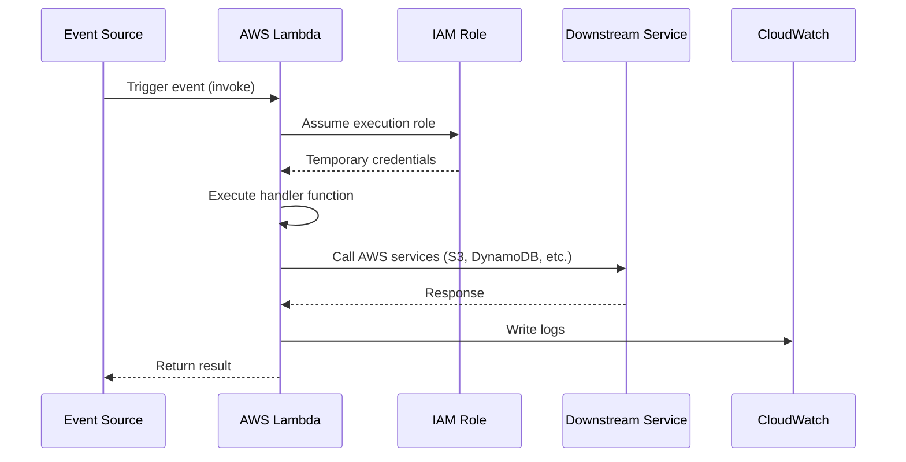

# AWS Lambda Fundamentals

> **AWS Lambda and Python (Boto3) & Serverless — Beginner to Advanced**

A practical guide to understanding AWS Lambda from the ground up. Written in simple English with diagrams, code examples, real-world scenarios, and interview questions.

[← Back to Course Overview](../README.md) | [Advanced Concepts →](../Advanced/README.md) | [Integrations →](../Integrations/README.md) | [Security & Monitoring →](../Security-Monitoring/README.md) | [Deployment →](../Deployment/README.md)

---

## Table of Contents

1. [What is AWS Lambda?](#what-is-aws-lambda)
2. [Serverless Computing](#serverless-computing)
3. [Benefits](#benefits)
4. [Limitations](#limitations)
5. [Use Cases](#use-cases)
6. [Architecture](#architecture)
7. [Runtime](#runtime)
8. [Handler](#handler)
9. [Memory](#memory)
10. [Timeout](#timeout)
11. [Environment Variables](#environment-variables)
12. [Interview Questions](#interview-questions)
13. [Quick Reference](#quick-reference)

---

## What is AWS Lambda?

**AWS Lambda** is a **compute service** that lets you run code **without provisioning or managing servers**.

In plain terms: you write a function, upload it to AWS, and AWS runs it when something triggers it — like a file upload, an HTTP request, or a schedule.

### Official AWS Definition

> Lambda is a compute service that lets you run code without provisioning or managing servers. Lambda runs your code on a high-availability compute infrastructure and performs all of the administration of the compute resources, including server and operating system maintenance, capacity provisioning and automatic scaling, and logging.

### Key Characteristics

| Feature | Description |
|---------|-------------|
| **Compute service** | Runs your business logic (code) on demand |
| **Highly available** | Built on AWS's fault-tolerant infrastructure |
| **Fully managed** | AWS handles servers, OS, patching, and scaling |
| **Pay as you go** | You pay only for the compute time you use |
| **Event-driven** | Runs in response to events (triggers) |
| **Serverless** | No servers for you to manage |


### Simple Analogy

Think of Lambda like a **vending machine**:

- You don't own or maintain the machine (no servers).
- You put in your product (your code).
- It only runs when someone presses a button (an event trigger).
- You pay only when someone buys something (pay per execution).

---

## Serverless Computing

**Serverless** does **not** mean there are no servers. It means **you don't manage them** — AWS does.

### Evolution: From Physical Servers to Lambda

```
Physical Server  →  Virtual Machines (EC2)  →  Containers  →  Serverless (Lambda)
     ↓                      ↓                      ↓                    ↓
You buy hardware      You rent VMs           You manage images      You write code only
You manage OS         You manage OS          You manage orchestration   AWS manages everything
Fixed capacity        Elastic capacity       Elastic capacity       Auto-scales to zero
Pay 24/7              Pay per hour           Pay for running pods   Pay per millisecond
```


### IaaS vs PaaS vs SaaS vs FaaS

| Model | You Manage | AWS Manages | Example |
|-------|-----------|-------------|---------|
| **IaaS** | OS, Runtime, App | Hardware, Network, Storage | EC2 |
| **PaaS** | App, Data | OS, Runtime, Infrastructure | Elastic Beanstalk |
| **SaaS** | Data & Access | Everything else | Gmail, Salesforce |
| **FaaS (Lambda)** | **Function (Code only)** | Runtime, OS, VM, Compute, Network, Storage | **AWS Lambda** |

With Lambda (FaaS — Function as a Service), your only job is to write the **function code**. AWS handles everything below it.

### Why "Serverless" Matters

```
Traditional (EC2):
  Developer → Write Code → Configure Server → Deploy → Monitor → Patch → Scale

Serverless (Lambda):
  Developer → Write Code → Deploy → Done ✅
```

---

## Benefits

### 1. No Server Management
You never SSH into a server, install packages, or apply OS patches. AWS handles all of that.

### 2. Automatic Scaling
Lambda scales **up** when traffic increases and **down to zero** when there is no traffic — without any configuration from you.

```
1 request/min  →  1 Lambda instance
1,000 requests/min  →  1,000 Lambda instances (automatically)
0 requests  →  0 instances (no cost)
```

### 3. Pay Only for What You Use
Billing is based on:
- **Number of invocations** (requests)
- **Duration** (time your code runs, rounded to the nearest millisecond)
- **Memory** allocated to the function

**Free Tier (always free):** 1 million requests and 400,000 GB-seconds of compute per month.

### 4. High Availability
Lambda runs your code across multiple Availability Zones automatically. No extra setup needed.

### 5. Fast Time to Market
Deploy code in minutes. No infrastructure setup, no load balancer configuration, no auto-scaling groups.

### 6. Native AWS Integration
Lambda connects easily with 200+ AWS services — S3, DynamoDB, API Gateway, SNS, SQS, EventBridge, and more.

### 7. Multiple Language Support
Write functions in Python, Node.js, Java, Go, Ruby, .NET, and more.

---

## Limitations

Knowing Lambda's limits helps you choose the right tool for the job.

### When NOT to Use Lambda

| Scenario | Why Not Lambda? | Better Alternative |
|----------|----------------|-------------------|
| Need full OS control | Lambda is sandboxed | EC2, ECS |
| Long-running processes (> 15 min) | Max timeout is 15 minutes | EC2, ECS, Step Functions |
| Steady 24/7 workload | Per-invocation pricing adds up | EC2 Reserved Instances |
| Heavy GPU/compute | Limited CPU, no GPU | EC2 with GPU |
| Large deployment package (> 250 MB unzipped) | Size limit | Container image on Lambda (10 GB) or ECS |
| Stateful applications | Lambda is stateless | EC2, ECS with persistent storage |
| WebSocket long connections | 15-min limit applies | API Gateway WebSocket + DynamoDB |


### AWS Lambda Service Limits (Key Ones)

| Limit | Value |
|-------|-------|
| **Max timeout** | 15 minutes (900 seconds) |
| **Max memory** | 10,240 MB (10 GB) |
| **Min memory** | 128 MB |
| **Deployment package (direct upload)** | 50 MB (zipped), 250 MB (unzipped) |
| **Deployment package (S3/container)** | 250 MB (zipped), 10 GB (container image) |
| **Environment variables** | 4 KB total |
| **Concurrent executions (default)** | 1,000 per region (can be increased) |
| **Ephemeral storage (`/tmp`)** | 512 MB – 10,240 MB |
| **Function layers** | 5 layers max |

### Cold Starts
When Lambda creates a **new execution environment** for your function (first request or after idle time), there is a small delay called a **cold start** (typically 100 ms – 2 seconds depending on runtime and memory).

**Mitigation:** Provisioned Concurrency, keep functions warm, use lighter runtimes (Python/Node.js vs Java).

---

## Use Cases

Lambda works best for **event-driven** workloads with **unpredictable or variable demand**.

### Ideal Use Cases

| Use Case | Trigger | What Lambda Does |
|----------|---------|-----------------|
| **Image processing** | S3 upload event | Resize, watermark, convert images |
| **REST API backend** | API Gateway HTTP request | Process request, query DB, return JSON |
| **Real-time file processing** | S3, Kinesis, DynamoDB Streams | Transform, filter, enrich data |
| **Scheduled tasks** | EventBridge (CloudWatch Events) | Daily reports, cleanup jobs, backups |
| **IoT data processing** | IoT Core | Process sensor data, send alerts |
| **Authentication hooks** | Cognito | Custom sign-up/sign-in logic |
| **Chatbots** | Lex | Process user messages, call APIs |
| **ETL pipelines** | S3, Kinesis | Extract, transform, load data |
| **Notification systems** | SNS, SQS | Send emails, SMS, push notifications |
| **Serverless cron jobs** | EventBridge schedule | Run code on a cron expression |


### Real-World Scenario 1: Photo Upload App

**Problem:** A social media app lets users upload profile photos. Each photo must be resized for web, mobile, and tablet.

**Solution:**

```
User uploads photo
       ↓
  Amazon S3 (stores original)
       ↓  (S3 Event Notification)
  AWS Lambda (resize function)
       ↓
  Amazon S3 (stores web, mobile, tablet versions)
```

**Why Lambda?** Uploads are unpredictable. Lambda scales automatically and you pay only when someone uploads a photo.

### Real-World Scenario 2: E-Commerce Order API

**Problem:** A startup needs a REST API for product catalog. Traffic is low now but may spike during sales.

**Solution:**

```
Mobile/Web App
       ↓  (HTTPS)
  API Gateway
       ↓  (invokes)
  AWS Lambda (Python + Boto3)
       ↓  (reads/writes)
  Amazon DynamoDB
```

**Why Lambda?** No servers to manage. Scales during flash sales. Costs almost nothing when idle.

### Real-World Scenario 3: Log Processing Pipeline

**Problem:** Application logs need to be filtered, formatted, and sent to a monitoring tool every time a new log file arrives.

**Solution:**

```
Application → CloudWatch Logs → Lambda (filter & format) → Elasticsearch / S3
```

**Why Lambda?** Event-driven — runs only when new logs arrive. No always-on log processor needed.

---

## Architecture

### High-Level Lambda Architecture

```
┌─────────────┐     ┌──────────────┐     ┌─────────────────┐
│ Event Source │────▶│ AWS Lambda   │────▶│ Downstream      │
│ (Trigger)    │     │ (Your Code)  │     │ Services        │
└─────────────┘     └──────────────┘     └─────────────────┘
  S3, API GW,          Handler +            S3, DynamoDB,
  DynamoDB,            Runtime +            SNS, SQS,
  EventBridge,         Execution Role       RDS, etc.
  SQS, etc.
```


### Lambda Internal Architecture (Layers)

```
┌─────────────────────────────────────────┐
│           Your Code (Handler)           │  ← You write this
├─────────────────────────────────────────┤
│         Lambda Runtime (Python)         │  ← AWS provides
├─────────────────────────────────────────┤
│              Sandbox (Isolation)        │  ← AWS manages
├─────────────────────────────────────────┤
│     Guest OS  │  Hypervisor  │  Host OS │  ← AWS manages
├─────────────────────────────────────────┤
│                  Hardware               │  ← AWS manages
└─────────────────────────────────────────┘
```

Each function runs in its own **isolated sandbox**. One account can run many functions; AWS shares hardware efficiently across all customers.

### EC2 vs Lambda Architecture

```
EC2 (You manage everything below your app):
┌──────┐ ┌──────┐ ┌──────┐
│ App1 │ │ App2 │ │ App3 │   ← Your apps
│Guest │ │Guest │ │Guest │   ← You manage OS
│  OS  │ │  OS  │ │  OS  │
└──────┘ └──────┘ └──────┘
      Hypervisor / Hardware

Lambda (You manage only your code):
┌────────────────────────────┐
│  Your Code + Runtime       │  ← You manage
├────────────────────────────┤
│  Sandbox / Guest OS / ...  │  ← AWS manages
└────────────────────────────┘
```

### Key Architecture Components

| Component | Role |
|-----------|------|
| **Event Source** | Service that triggers Lambda (S3, API GW, etc.) |
| **Function** | Your code + configuration (memory, timeout, role) |
| **Execution Role (IAM Role)** | Permissions for Lambda to access other AWS services |
| **Environment Variables** | Key-value config passed to your function |
| **Layers** | Shared libraries/code across multiple functions |
| **CloudWatch Logs** | Automatic logging of function output and errors |

### Execution Flow




---

## Runtime

The **runtime** is the language environment that runs your function code. AWS provides and manages the runtime — you choose which one to use.

### Supported Runtimes (Popular)

| Runtime | Identifier | Status |
|---------|-----------|--------|
| Python 3.12 | `python3.12` | Active |
| Python 3.11 | `python3.11` | Active |
| Python 3.10 | `python3.10` | Active |
| Node.js 20.x | `nodejs20.x` | Active |
| Node.js 18.x | `nodejs18.x` | Active |
| Java 21 | `java21` | Active |
| Java 17 | `java17` | Active |
| Go 1.x | `provided.al2023` | Active |
| .NET 8 | `dotnet8` | Active |
| Ruby 3.3 | `ruby3.3` | Active |

> Always check the [AWS Lambda runtimes documentation](https://docs.aws.amazon.com/lambda/latest/dg/lambda-runtimes.html) for the latest supported versions.

### What the Runtime Provides

- Language interpreter (e.g., Python interpreter)
- Standard library
- AWS SDK (boto3 for Python is included)
- Runtime interface for handler invocation
- Lifecycle management (init, invoke, shutdown)

### Runtime Lifecycle

```
1. INIT phase     →  Lambda creates execution environment, loads your code
2. INVOKE phase   →  Handler function runs with the event
3. SHUTDOWN phase →  Environment is destroyed (after idle timeout)
```

### Custom Runtimes

You can bring your own runtime using the **Lambda Runtime API** or deploy as a **container image** (up to 10 GB).

---

## Handler

The **handler** is the entry point of your Lambda function — the function AWS calls when your Lambda is invoked.

### Handler Format

```
<file_name>.<function_name>
```

**Example:** If your file is `lambda_function.py` and your function is `lambda_handler`:

```
Handler: lambda_function.lambda_handler
```

### Python Handler Example

```python
import json

def lambda_handler(event, context):
    """
    event   → Input data from the trigger (dict)
    context → Runtime information (request ID, memory, timeout, etc.)
    """
    name = event.get('name', 'World')

    return {
        'statusCode': 200,
        'body': json.dumps(f'Hello, {name}!')
    }
```

### Understanding `event` and `context`

**`event`** — The input payload. Its structure depends on the trigger:

```python
# API Gateway trigger
event = {
    "httpMethod": "GET",
    "path": "/users",
    "queryStringParameters": {"id": "123"},
    "body": None
}

# S3 trigger
event = {
    "Records": [{
        "s3": {
            "bucket": {"name": "my-bucket"},
            "object": {"key": "photos/image.jpg"}
        }
    }]
}
```

**`context`** — Runtime metadata:

```python
def lambda_handler(event, context):
    print(f"Request ID: {context.aws_request_id}")
    print(f"Function name: {context.function_name}")
    print(f"Memory limit: {context.memory_limit_in_mb} MB")
    print(f"Time remaining: {context.get_remaining_time_in_millis()} ms")
    return {"statusCode": 200}
```

### Return Value

What you return depends on the trigger type:

| Trigger | Return Format |
|---------|--------------|
| API Gateway | `{"statusCode": 200, "body": "...", "headers": {...}}` |
| S3 / Async | Return value is ignored (use S3, SNS, etc. for output) |
| Synchronous invoke | Any JSON-serializable object |

---

## Memory

Memory setting controls **how much RAM** is allocated to your function. It also **proportionally affects CPU power**.

### Memory Configuration

| Setting | Value |
|---------|-------|
| Minimum | 128 MB |
| Maximum | 10,240 MB (10 GB) |
| Increment | 1 MB |

### Memory vs CPU Relationship

```
128 MB   →  Minimal CPU
512 MB   →  Moderate CPU
1,024 MB →  1 full vCPU equivalent
1,769 MB →  1 full vCPU (official threshold)
3,008 MB →  ~2 vCPUs
10,240 MB → Maximum CPU
```

> More memory = more CPU = faster execution (but higher cost per millisecond).

### How to Choose Memory

1. **Start with 128 MB** for simple functions.
2. **Run load tests** at 128, 256, 512, 1024 MB.
3. **Find the sweet spot** where duration × cost is lowest.

**Example:**

| Memory | Duration | Cost per 1M invocations |
|--------|----------|--------------------------|
| 128 MB | 200 ms | $0.33 |
| 512 MB | 80 ms | $0.27 ← Better! |
| 1024 MB | 50 ms | $0.42 |

Sometimes **more memory is cheaper** because the function finishes faster.

### Ephemeral Storage (`/tmp`)

Lambda provides temporary disk space at `/tmp`:

- Default: **512 MB**
- Configurable: up to **10,240 MB**
- Persists across invocations in the same execution environment
- Cleared when the environment is recycled

```python
import os

def lambda_handler(event, context):
    # Write to temp storage
    with open('/tmp/output.csv', 'w') as f:
        f.write('data')
    return {"statusCode": 200}
```

---

## Timeout

The **timeout** setting defines the **maximum time** your function can run before AWS forcibly stops it.

### Timeout Configuration

| Setting | Value |
|---------|-------|
| Default | 3 seconds |
| Minimum | 1 second |
| Maximum | **900 seconds (15 minutes)** |

### Why Timeout Matters

```
Without proper timeout:
  Bug causes infinite loop → Lambda runs 15 min → You pay for 15 min × memory

With proper timeout:
  Bug causes infinite loop → Lambda stops at 30 sec → You pay for 30 sec
```

### Best Practices

1. **Set timeout based on expected duration + buffer** (e.g., API call takes 2s → set timeout to 10s).
2. **Use `context.get_remaining_time_in_millis()`** to gracefully exit before timeout.
3. **For long tasks (> 15 min)**, use **Step Functions** to orchestrate multiple Lambda invocations.

```python
def lambda_handler(event, context):
    remaining = context.get_remaining_time_in_millis()

    if remaining < 5000:  # Less than 5 seconds left
        # Save progress and exit gracefully
        save_checkpoint(event)
        return {"statusCode": 202, "body": "Processing continues..."}

    # Normal processing
    result = process_data(event)
    return {"statusCode": 200, "body": result}
```

### Timeout vs Memory Decision Guide

```
Short task (< 30 sec)  +  Small data  →  128–256 MB, 30 sec timeout
API backend            +  DB calls     →  512 MB, 30 sec timeout
Image processing       +  Large files  →  1024–3008 MB, 60–300 sec timeout
ETL job                +  Big dataset  →  3008+ MB, 900 sec timeout
```

---

## Environment Variables

**Environment variables** are key-value pairs you attach to your Lambda function. They let you configure your function **without changing code**.

### Why Use Environment Variables?

- Store configuration (database names, API URLs, feature flags)
- Separate config from code (dev vs prod settings)
- Avoid hardcoding sensitive values (use AWS Secrets Manager or Parameter Store instead)

### Setting Environment Variables

**AWS Console:** Configuration → Environment variables → Edit

**AWS CLI:**

```bash
aws lambda update-function-configuration \
  --function-name my-function \
  --environment "Variables={DB_TABLE=Users,ENV=production,LOG_LEVEL=INFO}"
```

**CloudFormation / SAM:**

```yaml
Environment:
  Variables:
    DB_TABLE: Users
    ENV: production
    LOG_LEVEL: INFO
```

### Using Environment Variables in Python

```python
import os
import boto3

def lambda_handler(event, context):
    table_name = os.environ['DB_TABLE']
    env = os.environ.get('ENV', 'development')
    log_level = os.environ.get('LOG_LEVEL', 'WARNING')

    dynamodb = boto3.resource('dynamodb')
    table = dynamodb.Table(table_name)

    print(f"Running in {env} mode, log level: {log_level}")
    # ... rest of your logic
```

### Limits and Rules

| Rule | Value |
|------|-------|
| Max total size | 4 KB (all variables combined) |
| Key pattern | `[a-zA-Z]([a-zA-Z0-9_])+` |
| Reserved keys | `AWS_*`, `LAMBDA_*`, `_HANDLER`, etc. (set by Lambda) |
| Encryption | Can encrypt with AWS KMS |

### Environment Variables vs Secrets

| | Environment Variables | Secrets Manager / Parameter Store |
|--|----------------------|----------------------------------|
| **Best for** | Non-sensitive config | Passwords, API keys, tokens |
| **Rotation** | Manual | Automatic |
| **Cost** | Free | Secrets Manager has a fee |
| **Size limit** | 4 KB total | Much larger |

```python
# ❌ Bad — hardcoded secret
API_KEY = "sk-abc123secret"

# ⚠️ OK for non-sensitive config
TABLE_NAME = os.environ['DB_TABLE']

# ✅ Good — sensitive values from Secrets Manager
import boto3
client = boto3.client('secretsmanager')
secret = client.get_secret_value(SecretId='prod/api-key')
api_key = secret['SecretString']
```

### Dev vs Prod Pattern

```
Function: process-orders
├── dev environment
│   ├── DB_TABLE = orders-dev
│   ├── ENV = development
│   └── LOG_LEVEL = DEBUG
└── prod environment
    ├── DB_TABLE = orders-prod
    ├── ENV = production
    └── LOG_LEVEL = ERROR
```

Use **separate Lambda functions** or **aliases** for different environments.

---

## Interview Questions

### Basic Level

**Q1: What is AWS Lambda?**
> AWS Lambda is a serverless, event-driven compute service that runs your code in response to events without requiring you to manage servers. You pay only for the compute time consumed.

**Q2: What is serverless computing?**
> Serverless means you don't manage servers. AWS handles provisioning, scaling, patching, and maintenance. You focus only on writing code. The name is misleading — servers still exist, but they're invisible to you.

**Q3: What is a handler in Lambda?**
> The handler is the entry point function that AWS Lambda invokes. In Python, it's defined as `filename.function_name`, for example `lambda_function.lambda_handler`.

**Q4: What are the two parameters passed to a Lambda handler?**
> `event` — the input data from the trigger (JSON object). `context` — runtime metadata like request ID, function name, memory limit, and remaining execution time.

**Q5: How is Lambda billed?**
> By number of requests, duration (GB-seconds), and optionally Provisioned Concurrency. First 1 million requests and 400,000 GB-seconds per month are free.

### Intermediate Level

**Q6: What is a cold start?**
> A cold start happens when Lambda needs to create a new execution environment — loading the runtime, your code, and dependencies. It adds latency (100 ms – 2 s). Warm starts reuse an existing environment and are much faster.

**Q7: What is the maximum timeout for a Lambda function?**
> 15 minutes (900 seconds). For longer workloads, use Step Functions to chain multiple Lambda invocations.

**Q8: How does memory setting affect performance?**
> Memory allocation is proportional to CPU power. More memory = more CPU = potentially faster execution. The optimal setting balances memory cost against execution duration.

**Q9: What is an execution role?**
> An IAM role assigned to a Lambda function that grants permissions to access other AWS services (e.g., read from S3, write to DynamoDB). Lambda assumes this role when executing your code.

**Q10: What is the difference between synchronous and asynchronous invocation?**
> **Synchronous:** Caller waits for the response (e.g., API Gateway). **Asynchronous:** Lambda queues the event and returns immediately (e.g., S3 events). Async invocations retry twice on failure.

### Advanced Level

**Q11: Explain Lambda's scaling behavior.**
> Lambda scales automatically by running one concurrent execution per instance. Each instance handles one request at a time. AWS creates new instances as needed up to your account's concurrency limit (default 1,000 per region). Reserved concurrency guarantees capacity; Provisioned Concurrency pre-warms instances to eliminate cold starts.

**Q12: What are Lambda Layers?**
> Layers are ZIP archives containing libraries, custom runtimes, or other dependencies. They let you share code across multiple functions without bundling it in each deployment package. Up to 5 layers per function.

**Q13: How do you handle secrets in Lambda?**
> Never hardcode secrets. Use AWS Secrets Manager or Systems Manager Parameter Store (SecureString). Retrieve secrets at runtime using boto3. For non-rotating config, encrypted environment variables with KMS also work.

**Q14: What happens when a Lambda function fails?**
> **Sync invocation:** Error returned to caller. **Async invocation:** Lambda retries twice automatically, then sends the failed event to a Dead Letter Queue (DLQ) if configured. **Stream-based (Kinesis/DynamoDB):** Retries until data expires.

**Q15: Lambda vs EC2 — when would you choose each?**
> Choose **Lambda** for event-driven, variable traffic, short tasks, and when you want zero server management. Choose **EC2** for long-running processes, full OS control, steady 24/7 workloads, GPU needs, or when cost at sustained high volume is lower.

### Scenario-Based Questions

**Q16: Your Lambda function times out after 3 seconds but the task needs 10 seconds. What do you do?**
> Increase the timeout setting in the function configuration (up to 900 seconds). Also investigate why the task is slow — optimize code, increase memory (which adds CPU), or use async patterns.

**Q17: A Lambda function needs to process 10,000 images uploaded to S3. How does it scale?**
> S3 sends an event for each upload. Lambda automatically scales to handle concurrent events — up to 1,000 concurrent executions by default. Each invocation processes one image independently.

**Q18: How would you deploy the same Lambda function to dev and prod?**
> Options: (1) Separate functions with different environment variables, (2) Lambda aliases with weighted traffic, (3) Separate AWS accounts, (4) CI/CD pipeline that deploys to different stages with stage-specific config.

---

## Quick Reference

### Lambda Function Anatomy

```
Lambda Function
├── Code         → Your handler + business logic
├── Runtime      → python3.12, nodejs20.x, etc.
├── Handler      → lambda_function.lambda_handler
├── Memory       → 128 MB – 10,240 MB
├── Timeout      → 1 – 900 seconds
├── Role         → IAM execution role
├── Environment  → Key-value config (4 KB max)
├── Layers       → Shared dependencies (up to 5)
├── Triggers     → Event sources (S3, API GW, etc.)
└── Logs         → CloudWatch Logs (automatic)
```

### Cost Formula

```
Cost = (Requests × $0.20 per 1M) + (GB-seconds × $0.0000166667)

GB-seconds = (Memory in GB) × (Duration in seconds)
```

### Useful AWS CLI Commands

```bash
# Create a function
aws lambda create-function \
  --function-name my-function \
  --runtime python3.12 \
  --handler lambda_function.lambda_handler \
  --role arn:aws:iam::123456789:role/lambda-execution-role \
  --zip-file fileb://function.zip

# Invoke a function
aws lambda invoke \
  --function-name my-function \
  --payload '{"name": "Prasad"}' \
  response.json

# Update memory and timeout
aws lambda update-function-configuration \
  --function-name my-function \
  --memory-size 512 \
  --timeout 30

# View logs
aws logs tail /aws/lambda/my-function --follow
```

---

## Course Materials

Reference diagrams and slides are available in the [`../BasicConcepts/`](../BasicConcepts/) folder:

| File | Topic |
|------|-------|
| `1.lambda-basic-concepts.png` | Course overview — Part 1 topics |
| `2.CloudServices.png` | IaaS vs PaaS vs SaaS vs FaaS |
| `3.Lambda_Definition.png` | AWS official Lambda definition |
| `4.Use Case.png` | When to use / not use Lambda |
| `5.Use case examples.png` | Image processing & REST API examples |
| `6.Architecture.png` | EC2 vs Lambda architecture |
| `7.Execution Role.png` | Lambda execution role |

---

## Further Reading

- [AWS Lambda Developer Guide](https://docs.aws.amazon.com/lambda/latest/dg/welcome.html)
- [AWS Lambda Pricing](https://aws.amazon.com/lambda/pricing/)
- [Lambda Runtimes](https://docs.aws.amazon.com/lambda/latest/dg/lambda-runtimes.html)
- [Lambda Quotas](https://docs.aws.amazon.com/lambda/latest/dg/gettingstarted-limits.html)
- [Boto3 Documentation](https://boto3.amazonaws.com/v1/documentation/api/latest/index.html)

---

*Part of the **AWS Lambda, Python (Boto3) & Serverless — Beginner to Advanced** course.*
