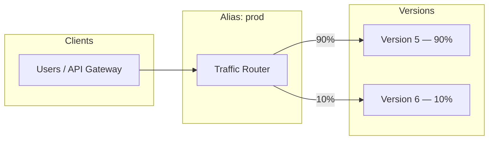
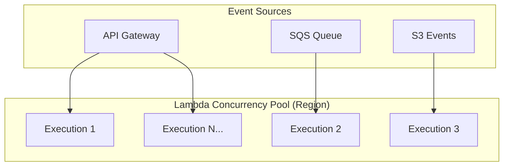
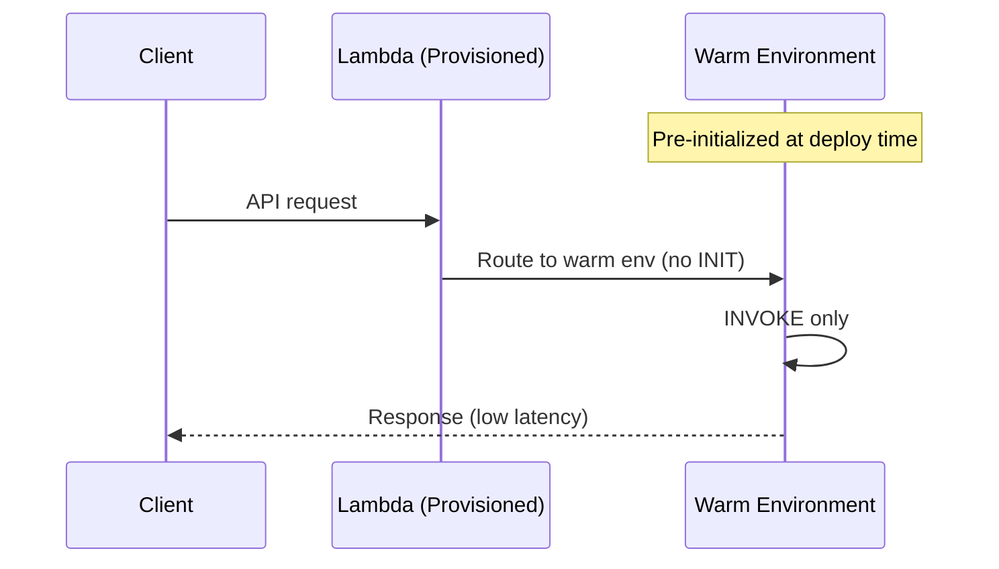
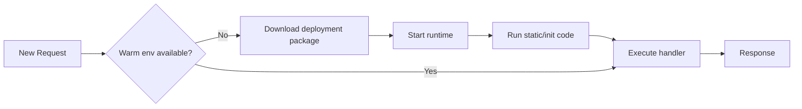
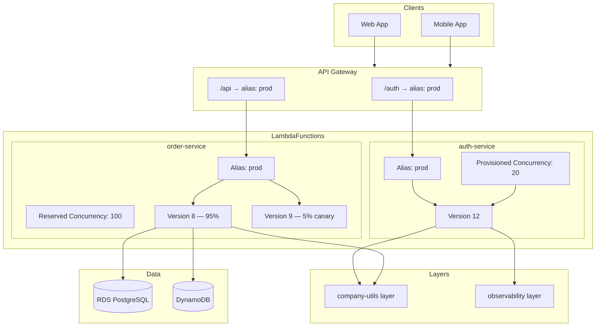

# AWS Lambda Advanced Concepts

> Production patterns for versions, concurrency, cold starts, and execution environments.

[← Back to Course Overview](../README.md) | [← Fundamentals](../Fundamentals/README.md) | [Integrations →](../Integrations/README.md) | [Security & Monitoring →](../Security-Monitoring/README.md)

---

## Table of Contents

1. [Overview](#overview)
2. [Versions](#versions)
3. [Aliases](#aliases)
4. [Layers](#layers)
5. [Concurrency](#concurrency)
6. [Reserved Concurrency](#reserved-concurrency)
7. [Provisioned Concurrency](#provisioned-concurrency)
8. [Cold Starts](#cold-starts)
9. [Execution Environment](#execution-environment)
10. [Putting It All Together](#putting-it-all-together)
11. [Interview Questions](#interview-questions)
12. [Quick Reference](#quick-reference)

---

## Overview

Fundamentals teach you *what* Lambda is. Advanced concepts teach you how to run Lambda **safely at scale in production** — rolling out code without downtime, sharing dependencies, controlling traffic, and managing latency.

```
Production Lambda concerns:
┌─────────────────────────────────────────────────────────────┐
│  Deploy safely     →  Versions + Aliases                    │
│  Share code        →  Layers                                │
│  Control scale     →  Concurrency / Reserved / Provisioned  │
│  Reduce latency    →  Cold start mitigation                 │
│  Understand runtime → Execution environment lifecycle       │
└─────────────────────────────────────────────────────────────┘
```

---

## Versions

Every time you **publish** new code or configuration to a Lambda function, AWS creates an immutable **version**.

### Key Rules

| Rule | Detail |
|------|--------|
| **Immutable** | Once published, a version cannot be changed |
| **Numbered** | `$LATEST`, `1`, `2`, `3`, … |
| **`$LATEST`** | Mutable working copy — not recommended for production traffic |
| **Published version** | Snapshot of code + config at publish time |

### Version Lifecycle

```
Developer edits function
        ↓
   $LATEST (mutable — dev/testing)
        ↓
   aws lambda publish-version
        ↓
   Version 3 (immutable — production candidate)
```

### Architecture: Versions in a Function

```
                    ┌─────────────────────────┐
                    │   Lambda Function       │
                    │   "order-processor"     │
                    └───────────┬─────────────┘
                                │
          ┌─────────────────────┼─────────────────────┐
          ▼                     ▼                     ▼
    ┌───────────┐        ┌───────────┐        ┌───────────┐
    │  $LATEST  │        │ Version 1 │        │ Version 2 │
    │ (mutable) │        │ (immutable)│       │ (immutable)│
    │ dev code  │        │ old prod  │        │ new prod  │
    └───────────┘        └───────────┘        └───────────┘
```

### Production Example: Publishing a New Release

**Scenario:** An e-commerce `order-processor` function handles payment validation. You fixed a bug and need to deploy without breaking live orders.

```bash
# 1. Update code on $LATEST
aws lambda update-function-code \
  --function-name order-processor \
  --zip-file fileb://order-processor-v2.zip

# 2. Wait until update completes
aws lambda wait function-updated --function-name order-processor

# 3. Publish immutable version
aws lambda publish-version \
  --function-name order-processor \
  --description "Fix duplicate charge bug"

# Output: "Version": "5"
```

```python
# boto3 equivalent
import boto3

client = boto3.client('lambda')

client.update_function_code(
    FunctionName='order-processor',
    ZipFile=open('order-processor-v2.zip', 'rb').read()
)

response = client.publish_version(
    FunctionName='order-processor',
    Description='Fix duplicate charge bug'
)
print(response['Version'])  # "5"
```

### Best Practices

- Never point production triggers directly at `$LATEST`
- Always **publish a version** before promoting to production
- Tag versions in CI/CD (`git commit`, build number) via `--description`
- Use **aliases** (next section) to route traffic to versions

---

## Aliases

An **alias** is a pointer to a specific Lambda version. It gives you a **stable name** (`prod`, `staging`) while the underlying version changes.

### Why Aliases Matter

```
Without alias:
  API Gateway → order-processor:5   (must update API on every deploy)

With alias:
  API Gateway → order-processor:prod  (alias points to version 5, then 6, etc.)
```

### Architecture: Alias Points to Version

```
  API Gateway / EventBridge / SNS
              │
              ▼
  ┌───────────────────────┐
  │  Alias: "prod"        │──────► Version 5 (100% traffic)
  └───────────────────────┘

  After canary deploy:
  ┌───────────────────────┐
  │  Alias: "prod"        │──────► Version 5 (90% traffic)
  │                       │──────► Version 6 (10% traffic)
  └───────────────────────┘
```

### Weighted Traffic (Canary / Blue-Green)

Aliases support **routing configuration** — split traffic between two versions:

```bash
# Route 90% to v5, 10% to v6 (canary)
aws lambda update-alias \
  --function-name order-processor \
  --name prod \
  --function-version 5 \
  --routing-config AdditionalVersionWeights={"6"=0.1}
```



### Production Example: Blue-Green Deployment

**Scenario:** Deploy `payment-api` with zero downtime and instant rollback.

```bash
# Step 1: Publish new version
NEW_VERSION=$(aws lambda publish-version \
  --function-name payment-api \
  --query 'Version' --output text)

# Step 2: Canary — 5% traffic to new version
aws lambda update-alias \
  --function-name payment-api \
  --name prod \
  --function-version $((NEW_VERSION - 1)) \
  --routing-config AdditionalVersionWeights={"$NEW_VERSION"=0.05}

# Step 3: Monitor CloudWatch errors for 30 minutes...

# Step 4: Shift 100% to new version
aws lambda update-alias \
  --function-name payment-api \
  --name prod \
  --function-version $NEW_VERSION

# Rollback (if needed) — point alias back to previous version
aws lambda update-alias \
  --function-name payment-api \
  --name prod \
  --function-version $((NEW_VERSION - 1))
```

### Common Alias Setup

| Alias | Points To | Used By |
|-------|-----------|---------|
| `dev` | `$LATEST` or Version N | Developers, internal tests |
| `staging` | Published version | QA, integration tests |
| `prod` | Published version | API Gateway, production triggers |

### CodeDeploy Integration

AWS CodeDeploy can automate alias-based deployments:

- **Canary** — shift traffic in steps (10% → 100%)
- **Linear** — equal increments over time
- **All-at-once** — instant cutover

CloudWatch alarms can **automatically roll back** if error rates spike during deployment.

---

## Layers

A **Lambda Layer** is a ZIP archive containing libraries, custom runtimes, or other dependencies. Layers let you **separate dependencies from function code** and **share them across functions**.

### Architecture: Function + Layers

```
┌─────────────────────────────────────────────┐
│              Lambda Function                │
│  ┌─────────────────────────────────────┐   │
│  │  Your handler code (small ZIP)       │   │
│  └─────────────────────────────────────┘   │
│  ┌──────────────┐ ┌──────────────┐         │
│  │  Layer 3     │ │  Layer 2     │  ...    │
│  │  pandas/numpy│ │  common-utils│         │
│  └──────────────┘ └──────────────┘         │
│  ┌──────────────┐                          │
│  │  Layer 1     │  AWS managed (e.g.      │
│  │  SDK/Pillow  │  Lambda Insights)        │
│  └──────────────┘                          │
└─────────────────────────────────────────────┘
         Mounted at /opt in execution environment
```

### Layer Limits

| Limit | Value |
|-------|-------|
| Layers per function | 5 |
| Unzipped layer size | 250 MB |
| Total unzipped (function + layers) | 250 MB (zip deploy) / 10 GB (container) |

### Layer Directory Structure (Python)

```
python/
└── lib/
    └── python3.12/
        └── site-packages/
            ├── pandas/
            ├── numpy/
            └── requests/
```

For Node.js: `nodejs/node_modules/`. For Java: `java/lib/`.

### Production Example: Shared Internal Library

**Scenario:** Five microservices share authentication, logging, and HTTP client utilities.

```
┌─────────────┐  ┌─────────────┐  ┌─────────────┐
│ user-api    │  │ order-api   │  │ payment-api │
└──────┬──────┘  └──────┬──────┘  └──────┬──────┘
       │                │                │
       └────────────────┼────────────────┘
                        ▼
              ┌───────────────────┐
              │ Layer: company-   │
              │ utils (v3)        │
              │ - auth helper     │
              │ - structured logs │
              │ - retry decorator │
              └───────────────────┘
```

**Build and publish a layer:**

```bash
# Build layer
mkdir -p layer/python/lib/python3.12/site-packages
pip install requests pydantic -t layer/python/lib/python3.12/site-packages/
cd layer && zip -r ../company-utils-layer.zip .

# Publish layer
aws lambda publish-layer-version \
  --layer-name company-utils \
  --zip-file fileb://company-utils-layer.zip \
  --compatible-runtimes python3.12 \
  --description "Shared auth, logging, HTTP utilities"

# Attach to function
aws lambda update-function-configuration \
  --function-name order-api \
  --layers arn:aws:lambda:us-east-1:123456789:layer:company-utils:3
```

**Use in function code:**

```python
# company_utils is available from the layer at /opt/python/lib/python3.12/site-packages
from company_utils.auth import validate_token
from company_utils.logging import get_logger

logger = get_logger(__name__)

def lambda_handler(event, context):
    user = validate_token(event['headers'].get('Authorization'))
    logger.info("Processing order", user_id=user['id'])
    # ...
```

### When to Use Layers

| Use Layer | Don't Use Layer |
|-----------|-----------------|
| Large dependencies (pandas, Pillow) | Tiny functions with no shared deps |
| Shared internal libraries | Single one-off function |
| Separate security patching of deps | When using container images anyway |

---

## Concurrency

**Concurrency** is the number of Lambda instances processing events **at the same time** in a region.

### How Lambda Scales

```
Each concurrent execution = 1 dedicated instance handling 1 request

  100 simultaneous API requests  →  up to 100 concurrent executions
  (each instance handles 1 request at a time)
```

### Architecture: Concurrency Model



### Account-Level Limit

| Setting | Default |
|---------|---------|
| Regional concurrent executions | **1,000** (soft limit, can be raised via AWS Support) |
| Burst concurrency | Up to 500–3,000 depending on region (initial burst) |

### Production Example: Flash Sale Traffic

**Scenario:** An online store expects 5,000 concurrent checkout requests during a flash sale.

```
Problem:
  Account limit = 1,000 concurrent
  5,000 requests arrive → 4,000 get throttled (429 errors)

Solution:
  1. Request limit increase from AWS Support (e.g., 10,000)
  2. Use reserved concurrency on critical functions
  3. Use SQS buffer for non-critical async work
```

```bash
# Check current account concurrency usage
aws cloudwatch get-metric-statistics \
  --namespace AWS/Lambda \
  --metric-name ConcurrentExecutions \
  --dimensions Name=FunctionName,Value=checkout-api \
  --start-time 2026-06-20T00:00:00Z \
  --end-time 2026-06-20T01:00:00Z \
  --period 60 \
  --statistics Maximum
```

### Throttling Behavior

When concurrency is exceeded:

| Invocation Type | Behavior |
|-----------------|----------|
| **Synchronous** (API Gateway) | Returns `429 TooManyRequestsException` |
| **Asynchronous** (S3, SNS) | Lambda retries with backoff (up to 6 hours) |
| **SQS trigger** | Messages stay in queue; Lambda polls when capacity frees |
| **Stream** (Kinesis, DynamoDB) | Iterator age increases; processing lag |

---

## Reserved Concurrency

**Reserved concurrency** sets a **maximum** number of concurrent executions for a specific function. It also **guarantees** that capacity is available for that function.

### Two Effects of Reserved Concurrency

```
1. CEILING  → Function cannot exceed N concurrent executions
2. FLOOR    → N executions are reserved (protected from other functions)
```

### Architecture: Reserved Concurrency in a Shared Account

```
Account limit: 1,000 concurrent executions (region)

┌─────────────────────────────────────────────────────────────┐
│                    1,000 Total Pool                         │
├──────────────────┬──────────────────┬───────────────────────┤
│ checkout-api     │ image-resizer    │ Unreserved pool       │
│ Reserved: 200    │ Reserved: 50     │ (750 available)       │
│ (guaranteed)     │ (guaranteed)     │ for all other funcs   │
└──────────────────┴──────────────────┴───────────────────────┘
```

### Production Example: Protect Critical Payment Function

**Scenario:** `payment-api` must never be starved by a runaway `report-generator` function.

```bash
# Guarantee 100 slots for payment-api, cap at 100
aws lambda put-function-concurrency \
  --function-name payment-api \
  --reserved-concurrent-executions 100

# Cap report-generator at 10 so it cannot consume entire account
aws lambda put-function-concurrency \
  --function-name report-generator \
  --reserved-concurrent-executions 10
```

```
Before:
  report-generator spikes → uses 900 concurrent → payment-api throttled ❌

After:
  payment-api always has 100 reserved slots ✅
  report-generator capped at 10 ✅
```

### Reserved Concurrency = 0

Setting reserved concurrency to **0** effectively **disables** the function — no invocations will run. Useful for maintenance or emergency kill switch.

```bash
aws lambda put-function-concurrency \
  --function-name legacy-import \
  --reserved-concurrent-executions 0
```

### Reserved vs Unreserved — Decision Guide

| Goal | Setting |
|------|---------|
| Protect critical function from starvation | Reserve concurrency on critical function |
| Prevent runaway function from consuming account | Reserve low cap on noisy function |
| Disable function temporarily | Set reserved concurrency to 0 |
| Maximum scale (no cap) | Do not set reserved concurrency (uses unreserved pool) |

---

## Provisioned Concurrency

**Provisioned concurrency** pre-initializes a specified number of execution environments so functions are **always warm** and ready — eliminating cold starts for that capacity.

### How It Differs from Reserved Concurrency

| Feature | Reserved Concurrency | Provisioned Concurrency |
|---------|---------------------|------------------------|
| **Purpose** | Limit / guarantee capacity | Eliminate cold starts |
| **Environments** | Created on demand | Pre-warmed before traffic |
| **Cost** | Pay per invocation + duration | Additional hourly charge per PC unit |
| **Use case** | Throttling, isolation | Latency-sensitive APIs |

### Architecture: Provisioned Concurrency

```
Without Provisioned Concurrency:
  Request → [Cold Start?] → Execute → Response
              (0–2000 ms delay)

With Provisioned Concurrency (N=10):
  ┌─────────────────────────────────────┐
  │  10 Pre-warmed Environments (ready) │◄── Always initialized
  └─────────────────────────────────────┘
  Request → Execute immediately → Response
              (~single-digit ms overhead)
```



### Production Example: Latency-Sensitive Authentication API

**Scenario:** A mobile app's login API must respond in under 200 ms. Cold starts on Java/Python add 1–3 seconds.

```bash
# Enable 20 provisioned concurrent executions on prod alias
aws lambda put-provisioned-concurrency-config \
  --function-name auth-api \
  --qualifier prod \
  --provisioned-concurrent-executions 20
```

```yaml
# SAM template excerpt
AuthApi:
  Type: AWS::Serverless::Function
  Properties:
    FunctionName: auth-api
    AutoPublishAlias: prod
    ProvisionedConcurrencyConfig:
      ProvisionedConcurrentExecutions: 20
```

**Cost consideration:**

```
Provisioned Concurrency billing:
  = (PC units) × (GB allocated) × (hours active) × (PC rate)

Example: 20 PC × 512 MB × 730 hrs/month ≈ significant fixed cost
→ Only use for latency-critical, steady-traffic functions
```

### When to Use Provisioned Concurrency

| Use | Skip |
|-----|------|
| User-facing APIs with strict SLA | Batch/background jobs |
| Steady, predictable traffic | Spiky, unpredictable traffic |
| After measuring cold start impact | Before optimizing code/package size |

### Application Auto Scaling for PC

Scale provisioned concurrency based on schedule or metrics:

```bash
# Scale PC from 10 (off-peak) to 50 (business hours)
aws application-autoscaling register-scalable-target \
  --service-namespace lambda \
  --resource-id function:auth-api:prod \
  --scalable-dimension lambda:function:ProvisionedConcurrency \
  --min-capacity 10 \
  --max-capacity 50
```

---

## Cold Starts

A **cold start** is the extra latency when Lambda must **create a new execution environment** before running your handler.

### Cold Start vs Warm Start

```
COLD START:
  Request → [INIT: load runtime + code + layers] → [INVOKE: handler] → Response
             └────────── 100 ms – 3+ seconds ──────┘

WARM START:
  Request → [INVOKE: handler only] → Response
             └── typically < 10 ms overhead ──┘
```

### What Happens During INIT (Cold Start)



| Phase | What Happens |
|-------|-------------|
| **Download** | Fetch function ZIP / layers from S3 |
| **Runtime init** | Start Python/Node/Java runtime |
| **Static init** | Run code outside handler (imports, global vars, `@app.on_event("startup")`) |
| **Handler invoke** | Your `lambda_handler` runs |

### Cold Start Duration by Runtime (Typical)

| Runtime | Typical Cold Start | Notes |
|---------|-------------------|-------|
| Python 3.12 | 100–400 ms | Good default choice |
| Node.js 20 | 100–300 ms | Fast, popular for APIs |
| Go | 50–200 ms | Compiled, very fast |
| .NET 8 | 200–500 ms | Improved with Native AOT |
| Java 17 | 1–3+ seconds | JVM startup; use SnapStart for Java |

### Production Example: Reducing Cold Starts

**Scenario:** A REST API built with Python + pandas sees P99 latency spikes of 2.5 seconds.

**Diagnosis:**

```python
# ❌ This runs on EVERY cold start (inside handler is OK, but imports are not)
import pandas as pd          # Heavy — adds 500ms+ to cold start
import numpy as np
from custom_ml_model import predict  # Loads model weights on import

def lambda_handler(event, context):
    ...
```

**Optimizations applied:**

```
1. Move heavy deps to a Layer (cached separately, smaller function ZIP)
2. Lazy-load ML model inside handler (not at module level)
3. Increase memory to 1024 MB (more CPU → faster init)
4. Enable Provisioned Concurrency = 5 on prod alias
5. Reduce package size (remove unused deps, use Lambda Powertools)
```

```python
# ✅ Lazy initialization — model loads once per environment, not per import chain
_model = None

def get_model():
    global _model
    if _model is None:
        from custom_ml_model import load_model
        _model = load_model()
    return _model

def lambda_handler(event, context):
    model = get_model()  # Fast on warm starts (already loaded)
    return model.predict(event['data'])
```

**Results:**

| Metric | Before | After |
|--------|--------|-------|
| P99 latency | 2,500 ms | 180 ms |
| Cold start rate | ~15% | ~0% (with PC) |
| Package size | 80 MB | 12 MB + layer |

### Cold Start Mitigation Checklist

- [ ] Keep deployment package small
- [ ] Use layers for heavy dependencies
- [ ] Avoid large imports at module level
- [ ] Choose faster runtimes (Python/Node/Go over Java for latency)
- [ ] Increase memory (faster CPU during init)
- [ ] Use Provisioned Concurrency for critical paths
- [ ] Use Java SnapStart for Java functions
- [ ] Avoid VPC unless necessary (VPC adds ENI setup time)

---

## Execution Environment

An **execution environment** is the isolated compute resource where your function code runs. Lambda reuses environments across invocations when possible.

### Environment Lifecycle

```
┌─────────────┐    ┌─────────────┐    ┌─────────────┐
│    INIT     │ →  │   INVOKE    │ →  │  SHUTDOWN   │
│  (once)     │    │  (repeat)   │    │  (idle/exp) │
└─────────────┘    └─────────────┘    └─────────────┘
 Cold start only    Warm invocations    Environment destroyed
```

### Architecture: Execution Environment Internals

```
┌──────────────────────────────────────────────────────────┐
│                  Execution Environment                   │
│  ┌────────────────────────────────────────────────────┐  │
│  │  /var/task/          Your function code            │  │
│  │  /opt/               Layers (read-only)              │  │
│  │  /tmp/               Ephemeral storage (512MB–10GB)│  │
│  └────────────────────────────────────────────────────┘  │
│  ┌────────────────────────────────────────────────────┐  │
│  │  Lambda Runtime (Python 3.12)                      │  │
│  │  - Manages handler invocation                      │  │
│  │  - Provides /opt, /tmp, env vars                     │  │
│  └────────────────────────────────────────────────────┘  │
│  ┌────────────────────────────────────────────────────┐  │
│  │  MicroVM Sandbox (Firecracker)                     │  │
│  │  - CPU, memory, network isolation                  │  │
│  └────────────────────────────────────────────────────┘  │
└──────────────────────────────────────────────────────────┘
```

### Environment Reuse (Warm Pool)

```
Invocation 1  →  Creates Environment A  →  INIT + INVOKE
Invocation 2  →  Reuses Environment A  →  INVOKE only (warm)
Invocation 3  →  Reuses Environment A  →  INVOKE only (warm)
   ... idle for ~10–15 minutes ...
Invocation 4  →  Environment A recycled →  New cold start
```

### What Persists Across Invocations

| Persists (same environment) | Does NOT Persist |
|----------------------------|------------------|
| Global variables | Environment after idle timeout |
| `/tmp` contents | `/tmp` after environment destroyed |
| Open DB connection pools | Connections after recycle (use carefully) |
| Cached SDK clients | Assumed durable storage |

### Production Example: Connection Pooling

**Scenario:** A Lambda function queries Amazon RDS PostgreSQL. Creating a new connection on every invoke adds 200 ms.

```python
import psycopg2
import os

# Module-level — reused across warm invocations in same environment
_connection = None

def get_connection():
    global _connection
    if _connection is None or _connection.closed:
        _connection = psycopg2.connect(
            host=os.environ['DB_HOST'],
            database=os.environ['DB_NAME'],
            user=os.environ['DB_USER'],
            password=os.environ['DB_SECRET']
        )
    return _connection

def lambda_handler(event, context):
    conn = get_connection()
    with conn.cursor() as cur:
        cur.execute("SELECT id, status FROM orders WHERE id = %s", (event['order_id'],))
        row = cur.fetchone()
    return {'statusCode': 200, 'body': {'id': row[0], 'status': row[1]}}
```

```
⚠️ Caveats:
  - Pool is per-environment, not global (100 concurrent = up to 100 connections)
  - Use RDS Proxy to manage connection pooling at scale
  - Stale connections: catch errors and reconnect
```

### VPC and Execution Environments

When a Lambda function is attached to a **VPC**, each new execution environment creates an **Elastic Network Interface (ENI)** — adding 1–10+ seconds to cold starts.

```
Non-VPC Lambda:     Cold start ~200 ms
VPC Lambda:         Cold start ~1–10 seconds (ENI creation)

Mitigation:
  - Use VPC only when accessing private resources (RDS in private subnet)
  - Use RDS Proxy, ElastiCache, or public endpoints where possible
  - Hyperplane ENIs (newer) reduce but don't eliminate VPC cold start penalty
```

### /tmp Ephemeral Storage

```python
def lambda_handler(event, context):
    # Process large file — use /tmp, not memory
    download_path = '/tmp/input.csv'
    output_path = '/tmp/output.parquet'

    download_from_s3(event['bucket'], event['key'], download_path)
    process_file(download_path, output_path)
    upload_to_s3(output_path, 'processed-bucket')

    return {'statusCode': 200}
```

Configure `/tmp` size (512 MB – 10,240 MB) in function configuration for large file processing.

---

## Putting It All Together

### Production Architecture: Full Stack Example

**Scenario:** A SaaS platform runs a multi-tenant API with safe deployments, shared libraries, and low-latency auth.



### Deployment Pipeline (CI/CD)

```
┌──────────┐   ┌──────────┐   ┌──────────────┐   ┌─────────────┐
│ Git Push │ → │ Build +  │ → │ Publish      │ → │ Update      │
│          │   │ Test     │   │ Version      │   │ Alias       │
└──────────┘   └──────────┘   └──────────────┘   └─────────────┘
                                    │                    │
                                    ▼                    ▼
                              Immutable snapshot    Canary 5% → 100%
                              (rollback ready)      CloudWatch alarm rollback
```

### Decision Matrix

| Requirement | Solution |
|-------------|----------|
| Safe production deploys | Versions + Aliases + Canary |
| Share code across 10 functions | Lambda Layers |
| Prevent one function from starving others | Reserved Concurrency |
| API must respond in < 200 ms | Provisioned Concurrency |
| Reduce cold start latency | Smaller package, layers, more memory, PC |
| Reuse DB connections | Module-level pool + RDS Proxy |
| Process large files | Increase `/tmp` storage |

---

## Interview Questions

### Versions & Aliases

**Q1: What is the difference between `$LATEST` and a published version?**
> `$LATEST` is mutable and changes every time you update code. Published versions are immutable snapshots. Production should use published versions via aliases, not `$LATEST`.

**Q2: How do you implement a canary deployment with Lambda?**
> Publish a new version, update the production alias with `AdditionalVersionWeights` to route a small percentage (e.g., 5%) to the new version while keeping the rest on the old version. Monitor CloudWatch metrics, then shift to 100% or roll back.

**Q3: Can you modify a published Lambda version?**
> No. Published versions are immutable. To deploy changes, update `$LATEST`, publish a new version, and update the alias.

### Layers

**Q4: What problem do Lambda Layers solve?**
> They separate dependencies from function code, reduce deployment package size, and allow sharing libraries across multiple functions. Layers are extracted to `/opt` at runtime.

**Q5: How many layers can you attach to a Lambda function?**
> Up to 5 layers per function.

### Concurrency

**Q6: What happens when Lambda reaches its concurrency limit?**
> Synchronous invocations return 429 (throttled). Asynchronous invocations are retried with backoff. SQS-triggered functions keep messages in the queue until capacity is available.

**Q7: What is the difference between reserved and provisioned concurrency?**
> Reserved concurrency sets a cap/floor on concurrent executions for capacity control. Provisioned concurrency pre-warms execution environments to eliminate cold starts. They solve different problems and can be used together.

**Q8: What happens if you set reserved concurrency to 0?**
> The function is throttled completely — no invocations will run. Useful as an emergency disable switch.

### Cold Starts & Execution Environment

**Q9: What causes a cold start in Lambda?**
> Lambda must create a new execution environment: download code/layers, start the runtime, run static initialization code, then invoke the handler. This happens when no warm environment is available.

**Q10: How do you reduce cold starts in production?**
> Keep packages small, use layers, lazy-load heavy imports, increase memory, choose faster runtimes, and use Provisioned Concurrency for latency-critical functions.

**Q11: What persists between Lambda invocations in the same execution environment?**
> Global/module-level variables, `/tmp` contents, and open connections (until the environment is recycled after idle timeout, typically 10–15 minutes).

**Q12: Why does VPC increase cold start time?**
> Lambda must create an Elastic Network Interface (ENI) to connect to VPC resources. ENI setup adds significant latency to the INIT phase.

---

## Quick Reference

### CLI Commands

```bash
# Versions
aws lambda publish-version --function-name my-fn --description "Release 2.1"

# Aliases
aws lambda create-alias --function-name my-fn --name prod --function-version 3
aws lambda update-alias --function-name my-fn --name prod \
  --function-version 3 --routing-config AdditionalVersionWeights={"4"=0.1}

# Layers
aws lambda publish-layer-version --layer-name my-layer \
  --zip-file fileb://layer.zip --compatible-runtimes python3.12

# Reserved concurrency
aws lambda put-function-concurrency --function-name my-fn \
  --reserved-concurrent-executions 100

# Provisioned concurrency
aws lambda put-provisioned-concurrency-config --function-name my-fn \
  --qualifier prod --provisioned-concurrent-executions 10

# Delete concurrency settings
aws lambda delete-function-concurrency --function-name my-fn
aws lambda delete-provisioned-concurrency-config --function-name my-fn --qualifier prod
```

### Concept Comparison Table

| Concept | Controls | Billing Impact | Primary Use |
|---------|----------|---------------|-------------|
| **Version** | Immutable code snapshot | None | Rollback, audit trail |
| **Alias** | Pointer to version(s) | None | Stable endpoint, canary |
| **Layer** | Shared dependencies | Layer storage minimal | DRY, smaller packages |
| **Concurrency** | Account-wide pool | Standard invoke pricing | Auto-scaling default |
| **Reserved Concurrency** | Per-function cap/floor | Standard invoke pricing | Isolation, protection |
| **Provisioned Concurrency** | Pre-warmed environments | Hourly PC charge + invokes | Eliminate cold starts |
| **Cold Start** | INIT phase latency | Indirect (longer duration) | Optimize package/runtime |
| **Execution Environment** | Isolated runtime sandbox | Standard invoke pricing | Reuse globals, /tmp |

---

## Further Reading

- [Lambda Versions](https://docs.aws.amazon.com/lambda/latest/dg/configuration-versions.html)
- [Lambda Aliases](https://docs.aws.amazon.com/lambda/latest/dg/configuration-aliases.html)
- [Lambda Layers](https://docs.aws.amazon.com/lambda/latest/dg/chapter-layers.html)
- [Lambda Concurrency](https://docs.aws.amazon.com/lambda/latest/dg/lambda-concurrency.html)
- [Provisioned Concurrency](https://docs.aws.amazon.com/lambda/latest/dg/provisioned-concurrency.html)
- [Understanding Lambda Cold Starts](https://docs.aws.amazon.com/lambda/latest/dg/lambda-runtime-environment.html)
- [Lambda Execution Environment](https://docs.aws.amazon.com/lambda/latest/dg/lambda-runtime-environment.html)

---

[← Back to Course Overview](../README.md) | [← Fundamentals](../Fundamentals/README.md) | [Integrations →](../Integrations/README.md) | [Security & Monitoring →](../Security-Monitoring/README.md)

*Part of the **AWS Lambda, Python (Boto3) & Serverless — Beginner to Advanced** course.*
