# AWS Lambda Integrations

> Connect Lambda to API Gateway, S3, SQS, SNS, EventBridge, DynamoDB Streams, Kinesis, and RDS.

[← Back to Course Overview](../README.md) | [← Fundamentals](../Fundamentals/README.md) | [← Advanced](../Advanced/README.md) | [Security & Monitoring →](../Security-Monitoring/README.md) | [Deployment →](../Deployment/README.md)

---

## Table of Contents

1. [Overview](#overview)
2. [API Gateway](#api-gateway)
3. [Amazon S3](#amazon-s3)
4. [Amazon SQS](#amazon-sqs)
5. [Amazon SNS](#amazon-sns)
6. [Amazon EventBridge](#amazon-eventbridge)
7. [DynamoDB Streams](#dynamodb-streams)
8. [Amazon Kinesis](#amazon-kinesis)
9. [Amazon RDS](#amazon-rds)
10. [Integration Comparison](#integration-comparison)
11. [Master Interview Questions](#master-interview-questions)

---

## Overview

Lambda does not run in isolation. It is triggered by **event sources** and often calls **downstream services**. Choosing the right integration determines latency, reliability, and cost.

```
                    ┌─────────────────────────────────────┐
                    │           AWS Lambda                │
                    │         (Your Handler)              │
                    └───────────┬────────────▲────────────┘
                                │            │
           Triggers (invoke)    │            │  Targets (called by Lambda)
                                ▼            │
    ┌──────────┬──────────┬──────────┬──────┴──────┬──────────┐
    │ API GW   │ S3       │ SQS      │ SNS         │ RDS      │
    │ EventBr  │ DDB Str  │ Kinesis  │ DynamoDB    │ S3       │
    └──────────┴──────────┴──────────┴─────────────┴──────────┘
```

| Integration | Invocation Type | Typical Pattern |
|-------------|----------------|-----------------|
| API Gateway | Synchronous | Request/response REST API |
| S3 | Asynchronous | Event-driven file processing |
| SQS | Poll-based | Decouple + buffer workloads |
| SNS | Asynchronous | Fan-out notifications |
| EventBridge | Asynchronous | Event routing & scheduling |
| DynamoDB Streams | Poll-based | React to DB changes |
| Kinesis | Poll-based | Real-time stream processing |
| RDS | Lambda calls RDS | Query relational data |

---

## API Gateway

**Amazon API Gateway** exposes your Lambda function as a **REST, HTTP, or WebSocket API**. Clients send HTTP requests; API Gateway invokes Lambda synchronously and returns the response.

### Architecture Diagram

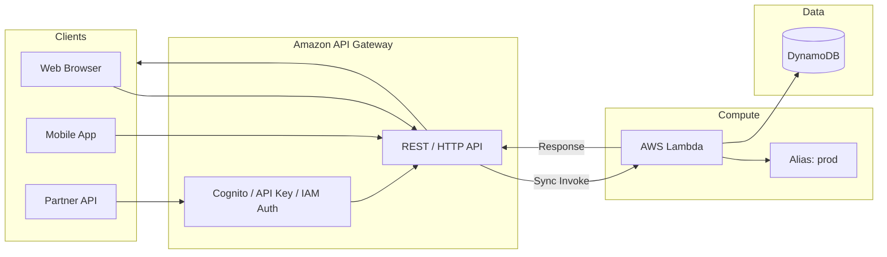

### Request Flow

```
1. Client sends HTTP request  →  GET /orders/123
2. API Gateway receives request, validates auth (optional)
3. API Gateway transforms request into Lambda event JSON
4. API Gateway synchronously invokes Lambda
5. Lambda executes handler, reads/writes DynamoDB
6. Lambda returns { statusCode, body, headers }
7. API Gateway maps response to HTTP format
8. Client receives HTTP 200 + JSON body
```

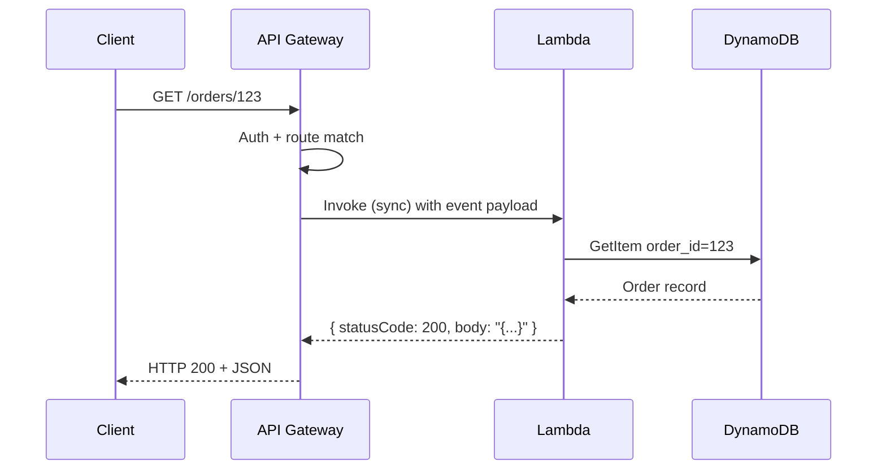

**Lambda event (API Gateway HTTP API):**

```python
event = {
    "requestContext": {"http": {"method": "GET", "path": "/orders/123"}},
    "pathParameters": {"id": "123"},
    "headers": {"authorization": "Bearer token..."},
    "body": None
}
```

**Lambda response:**

```python
return {
    "statusCode": 200,
    "headers": {"Content-Type": "application/json"},
    "body": json.dumps({"order_id": "123", "status": "shipped"})
}
```

### Real-World Use Case

**Scenario:** A food delivery startup exposes a mobile app API for browsing restaurants and placing orders.

```
Mobile App  →  API Gateway (HTTP API)  →  Lambda (order-service)  →  DynamoDB
                     │
                     └── Cognito JWT authorizer validates user token
```

- **Why API Gateway + Lambda:** Auto-scales with demand, pay per request, no EC2 to manage.
- **Production tips:** Use Lambda aliases (`prod`), enable throttling on API Gateway, return proper CORS headers, use Provisioned Concurrency for login/checkout endpoints.

### Interview Questions

**Q1: Is API Gateway → Lambda synchronous or asynchronous?**
> Synchronous. API Gateway waits for Lambda to return a response before replying to the client.

**Q2: What does Lambda need to return for API Gateway?**
> An object with `statusCode`, optional `headers`, and `body` (string). API Gateway maps this to the HTTP response.

**Q3: REST API vs HTTP API with Lambda — when to use which?**
> HTTP API is cheaper and faster for most REST use cases. REST API offers more features (request validation, WAF integration, API keys). Use REST API when you need those extras.

**Q4: How do you handle authentication with API Gateway and Lambda?**
> Use Cognito User Pools authorizer, Lambda authorizer (custom token validation), IAM auth, or API keys — configured on API Gateway before invocation reaches your function.

---

## Amazon S3

**Amazon S3** can trigger Lambda when objects are **created, deleted, or restored**. Lambda runs asynchronously to process uploaded files.

### Architecture Diagram

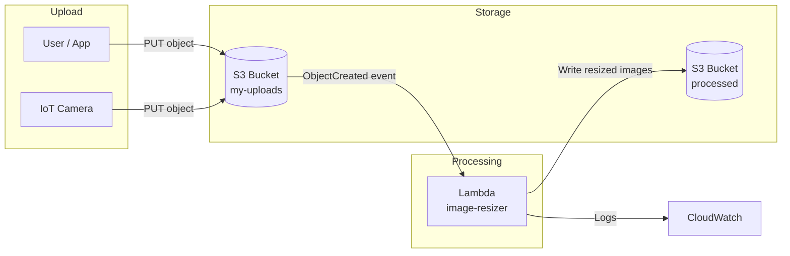

### Request Flow

```
1. User uploads photo.jpg to s3://my-uploads/photos/photo.jpg
2. S3 generates ObjectCreated:Put event
3. S3 asynchronously invokes Lambda with event payload
4. Lambda downloads object from S3
5. Lambda resizes image (web, mobile, thumbnail)
6. Lambda uploads results to s3://processed/
7. Lambda returns (S3 ignores return value)
8. On failure: Lambda retries twice, then optional DLQ
```

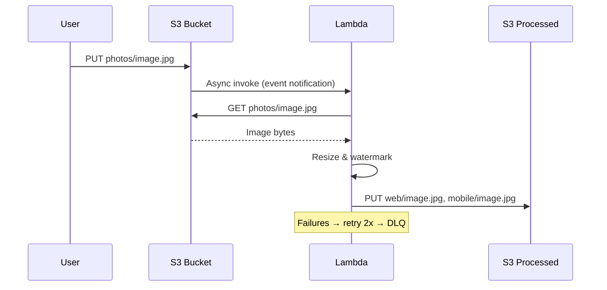

**Lambda event (S3 trigger):**

```python
event = {
    "Records": [{
        "eventName": "ObjectCreated:Put",
        "s3": {
            "bucket": {"name": "my-uploads"},
            "object": {"key": "photos/image.jpg", "size": 2048000}
        }
    }]
}
```

### Real-World Use Case

**Scenario:** A real estate platform lets agents upload property photos. Each upload must generate thumbnails and extract metadata automatically.

```
Agent uploads 10 MB photo  →  S3 (raw-photos/)
                                ↓ ObjectCreated
                           Lambda (photo-pipeline)
                                ↓
                    ┌───────────┴───────────┐
                    ▼                       ▼
            S3 (thumbnails/)         DynamoDB (metadata)
```

- **Why S3 + Lambda:** Upload and processing are decoupled. Lambda scales per file. No polling needed.
- **Production tips:** Enable S3 event notification with prefix/suffix filters (`photos/`, `.jpg`), use idempotent handlers (same file uploaded twice should not corrupt data), configure DLQ for failed processing.

### Interview Questions

**Q1: Is S3 → Lambda sync or async?**
> Asynchronous. S3 does not wait for Lambda to finish. Lambda retries twice on failure.

**Q2: Can one S3 bucket trigger multiple Lambda functions?**
> Yes. Configure multiple notification rules for different prefixes, suffixes, or event types.

**Q3: What S3 events can trigger Lambda?**
> `s3:ObjectCreated:*`, `s3:ObjectRemoved:*`, `s3:ObjectRestore:*`, and multipart upload events.

**Q4: How do you avoid infinite loops with S3 triggers?**
> Do not write output to the same bucket/prefix that triggers the function, or use separate buckets/prefixes with careful filter rules.

---

## Amazon SQS

**Amazon SQS** (Simple Queue Service) buffers messages between producers and Lambda. Lambda **polls** the queue and processes messages in batches.

### Architecture Diagram

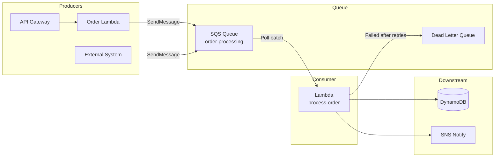

### Request Flow

```
1. Order Lambda receives checkout request via API Gateway
2. Order Lambda validates order, sends message to SQS queue
3. API Gateway returns 202 Accepted immediately (fast response)
4. Process-order Lambda polls SQS (event source mapping)
5. Lambda receives batch of up to 10 messages
6. Lambda processes each message (update inventory, charge payment)
7. Lambda deletes successfully processed messages from queue
8. Failed messages: retried until maxReceiveCount → DLQ
```

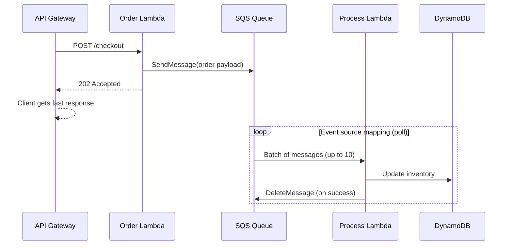

**Lambda event (SQS trigger):**

```python
event = {
    "Records": [{
        "messageId": "abc-123",
        "body": '{"order_id": "ORD-456", "items": [...]}',
        "attributes": {"ApproximateReceiveCount": "1"}
    }]
}
```

### Real-World Use Case

**Scenario:** An e-commerce site handles flash sales. Checkout must respond quickly, but inventory updates and email sending can happen in the background.

```
Checkout API  →  Lambda (accept order)  →  SQS  →  Lambda (fulfill order)
                                              ↓
                                    DynamoDB + SES + SNS
```

- **Why SQS + Lambda:** Decouples fast user response from slow backend work. SQS absorbs traffic spikes. Built-in retry and DLQ.
- **Production tips:** Set `reservedConcurrentExecutions` on consumer Lambda, configure `batchSize` and `maximumBatchingWindowInSeconds`, use partial batch failure reporting (`ReportBatchItemFailures`).

### Interview Questions

**Q1: How does Lambda receive messages from SQS?**
> Via an event source mapping. Lambda polls the queue automatically — you don't call SQS from a trigger config on the queue side.

**Q2: What happens if Lambda fails to process an SQS message?**
> The message becomes visible again after the visibility timeout. After `maxReceiveCount` failures, it moves to the Dead Letter Queue (DLQ).

**Q3: What is partial batch failure in SQS + Lambda?**
> If a batch of 10 messages fails partially, you can report which specific messages failed. Only those are retried; successful ones are deleted.

**Q4: SQS Standard vs FIFO with Lambda?**
> Standard: at-least-once delivery, best-effort ordering, higher throughput. FIFO: exactly-once processing, strict ordering, lower throughput. Use FIFO when order matters (e.g., account balance updates).

---

## Amazon SNS

**Amazon SNS** (Simple Notification Service) is a **pub/sub** messaging service. Lambda subscribes to SNS topics and is invoked when messages are published.

### Architecture Diagram

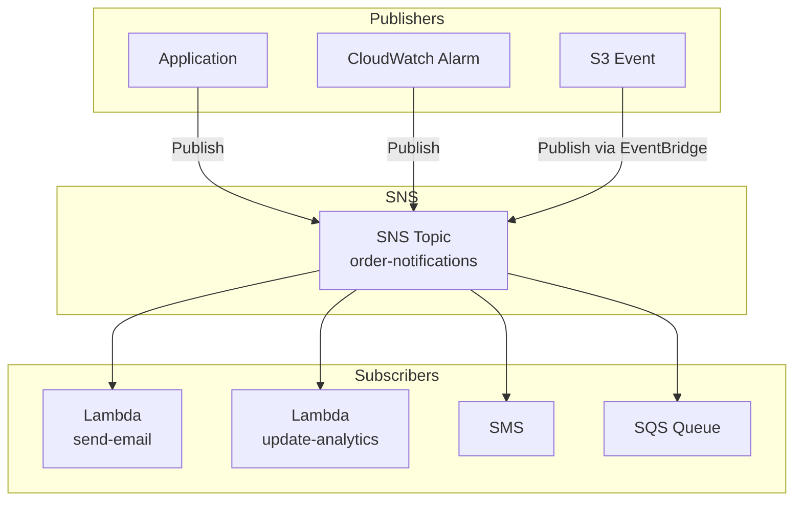

### Request Flow

```
1. Order service publishes message to SNS topic: "Order ORD-789 confirmed"
2. SNS fan-out: delivers copy to all subscribers in parallel
3. Lambda (send-email) invoked asynchronously with message
4. Lambda (update-analytics) invoked asynchronously with same message
5. SQS queue also receives a copy (for durable processing)
6. Each Lambda processes independently
7. On Lambda failure: SNS retries, then discards (configure DLQ on Lambda)
```

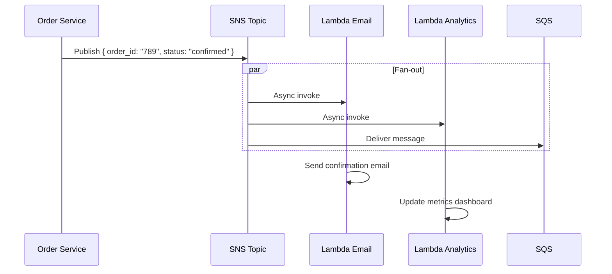

**Lambda event (SNS trigger):**

```python
event = {
    "Records": [{
        "Sns": {
            "Message": '{"order_id": "789", "status": "confirmed"}',
            "Subject": "Order Confirmed",
            "TopicArn": "arn:aws:sns:us-east-1:123456789:order-notifications"
        }
    }]
}
```

### Real-World Use Case

**Scenario:** A monitoring platform sends alerts when server CPU exceeds 80%. Multiple teams must be notified simultaneously.

```
CloudWatch Alarm  →  SNS Topic (critical-alerts)
                           ├── Lambda → PagerDuty integration
                           ├── Lambda → Slack webhook
                           ├── Email → on-call engineer
                           └── SQS → audit log processor
```

- **Why SNS + Lambda:** One event, many actions (fan-out). Add new subscribers without changing the publisher.
- **Production tips:** Use message attributes for filtering, configure Lambda DLQ for failed invocations, use SNS FIFO topics when ordering matters.

### Interview Questions

**Q1: SNS vs SQS — when to use which with Lambda?**
> SNS: fan-out (one message → many subscribers). SQS: buffer and decouple (one consumer processes messages sequentially/with controlled concurrency). Often used together: SNS → SQS → Lambda.

**Q2: Is SNS → Lambda sync or async?**
> Asynchronous. SNS does not wait for Lambda to complete.

**Q3: Can one SNS message trigger multiple Lambda functions?**
> Yes. Subscribe multiple Lambda functions (and other endpoints) to the same topic. SNS delivers to all subscribers.

**Q4: What is SNS message filtering?**
> Subscribers can define filter policies so they only receive messages matching certain attributes — reduces unnecessary Lambda invocations.

---

## Amazon EventBridge

**Amazon EventBridge** is a **serverless event bus** for routing events between AWS services, SaaS apps, and custom applications. Lambda is a common target.

### Architecture Diagram

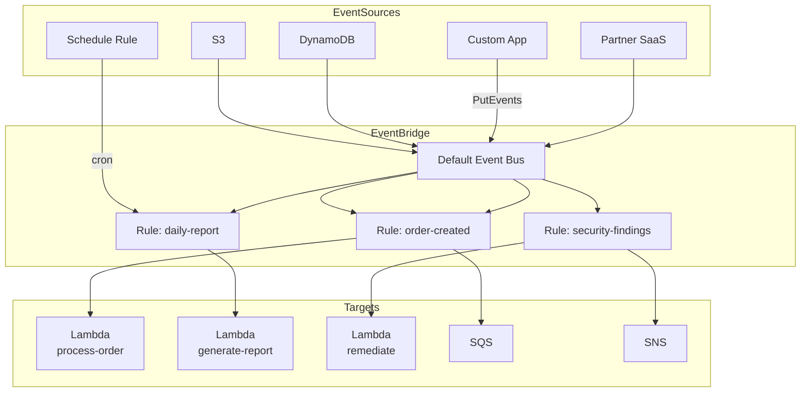

### Request Flow

```
1. Custom app calls events:PutEvents with order-created detail
2. EventBridge matches event against rule patterns
3. Rule "order-created" matches → routes to Lambda + SQS
4. Lambda invoked asynchronously with full event envelope
5. Lambda processes order side-effects (loyalty points, analytics)
6. Schedule rule fires at cron(0 8 * * ? *) → invokes report Lambda
7. Failed invocations: retry with exponential backoff, then DLQ
```

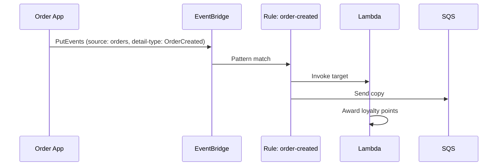

**Lambda event (EventBridge):**

```python
event = {
    "version": "0",
    "source": "com.myapp.orders",
    "detail-type": "OrderCreated",
    "detail": {
        "order_id": "ORD-100",
        "customer_id": "CUST-42",
        "total": 149.99
    }
}
```

**Schedule trigger (cron):**

```bash
aws events put-rule \
  --name daily-cleanup \
  --schedule-expression "cron(0 2 * * ? *)"

aws events put-targets \
  --rule daily-cleanup \
  --targets "Id"="1","Arn"="arn:aws:lambda:...:function:cleanup-fn"
```

### Real-World Use Case

**Scenario:** A multi-service platform uses EventBridge as the central nervous system. When a user signs up, multiple services react without direct coupling.

```
Auth Service  →  EventBridge (UserRegistered event)
                      ├── Lambda → Welcome email
                      ├── Lambda → Create CRM record
                      ├── SQS → Analytics pipeline
                      └── Step Functions → Onboarding workflow
```

- **Why EventBridge:** Decouples microservices. Content-based routing. Built-in scheduling. Archive and replay events.
- **Production tips:** Use event schemas, separate buses per domain (e.g., `orders-bus`), enable dead-letter queues on targets, use input transformers to reshape payloads.

### Interview Questions

**Q1: EventBridge vs SNS — what's the difference?**
> SNS is pub/sub with topic subscribers. EventBridge is an event bus with content-based routing rules, schema registry, scheduling, and cross-account event delivery. EventBridge is better for event-driven architectures with many sources and filters.

**Q2: How do you schedule a Lambda function with EventBridge?**
> Create a rule with a `schedule-expression` (cron or rate), and add the Lambda function as a target. EventBridge invokes it on the schedule.

**Q3: Can EventBridge invoke Lambda asynchronously?**
> Yes. EventBridge always invokes Lambda asynchronously with retry and DLQ support.

**Q4: What is an EventBridge event pattern?**
> A JSON filter that matches events by source, detail-type, or detail fields. Only matching events are routed to the rule's targets.

---

## DynamoDB Streams

**DynamoDB Streams** captures item-level changes (insert, update, delete) in a DynamoDB table. Lambda polls the stream and processes change records.

### Architecture Diagram

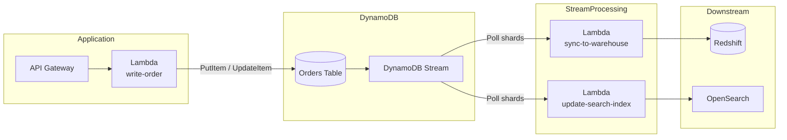

### Request Flow

```
1. Client creates order via API → Lambda writes to DynamoDB
2. DynamoDB saves item and writes change record to stream
3. Lambda event source mapping polls stream shards
4. Lambda receives batch of stream records (up to 10,000 per shard)
5. Lambda processes each record (NEW_AND_OLD_IMAGES available)
6. Lambda updates Redshift / OpenSearch / sends notification
7. Lambda checkpoints iterator position (at-least-once delivery)
8. On failure: retry until data expires (24h default) or bisect batch
```

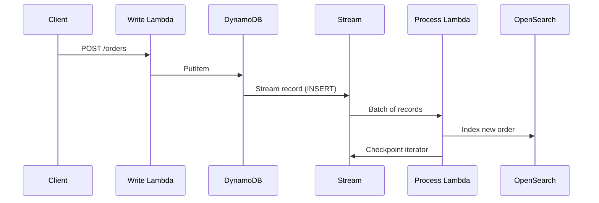

**Lambda event (DynamoDB Stream):**

```python
event = {
    "Records": [{
        "eventName": "INSERT",
        "dynamodb": {
            "Keys": {"order_id": {"S": "ORD-100"}},
            "NewImage": {
                "order_id": {"S": "ORD-100"},
                "status": {"S": "pending"},
                "total": {"N": "149.99"}
            }
        }
    }]
}
```

### Real-World Use Case

**Scenario:** A serverless todo app stores tasks in DynamoDB. When a task is completed, the search index and audit log must update automatically.

```
Mobile App  →  API GW  →  Lambda  →  DynamoDB (tasks table)
                                           ↓ Stream
                                    Lambda (stream-processor)
                                           ↓
                              ┌────────────┴────────────┐
                              ▼                         ▼
                        OpenSearch                  S3 Audit Log
```

- **Why DynamoDB Streams + Lambda:** React to data changes without polling. Keeps read models (search, analytics) in sync with the source of truth.
- **Production tips:** Choose stream view type (`NEW_AND_OLD_IMAGES` for updates), handle duplicate records (at-least-once), monitor `IteratorAge` metric, use `TRIM_HORIZON` or `LATEST` starting position carefully.

### Interview Questions

**Q1: What DynamoDB stream view types are available?**
> `KEYS_ONLY`, `NEW_IMAGE`, `OLD_IMAGE`, `NEW_AND_OLD_IMAGES`. Choose based on what data your Lambda needs.

**Q2: Is DynamoDB Streams delivery exactly-once?**
> No. Delivery is **at-least-once**. Your handler must be idempotent.

**Q3: What is IteratorAge in DynamoDB Streams + Lambda?**
> A CloudWatch metric showing how far behind Lambda is in processing the stream. High IteratorAge indicates lag or processing bottlenecks.

**Q4: Can one DynamoDB stream trigger multiple Lambda functions?**
> Yes. Create separate event source mappings for each Lambda function on the same stream.

---

## Amazon Kinesis

**Amazon Kinesis Data Streams** ingests real-time data streams (clickstreams, logs, IoT telemetry). Lambda polls shards and processes records in batches.

### Architecture Diagram

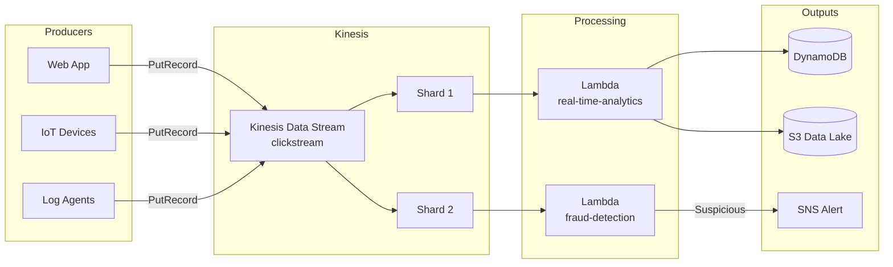

### Request Flow

```
1. Web app sends click event to Kinesis (page view, product click)
2. Kinesis assigns record to a shard based on partition key
3. Lambda event source mapping polls shard for records
4. Lambda receives batch (up to 10,000 records or 6 MB)
5. Lambda aggregates clicks, updates real-time dashboard in DynamoDB
6. Lambda checkpoints sequence number per shard
7. Parallel processing: one Lambda instance per shard (by default)
8. On failure: retry batch, bisect on error, or skip to DLQ
```

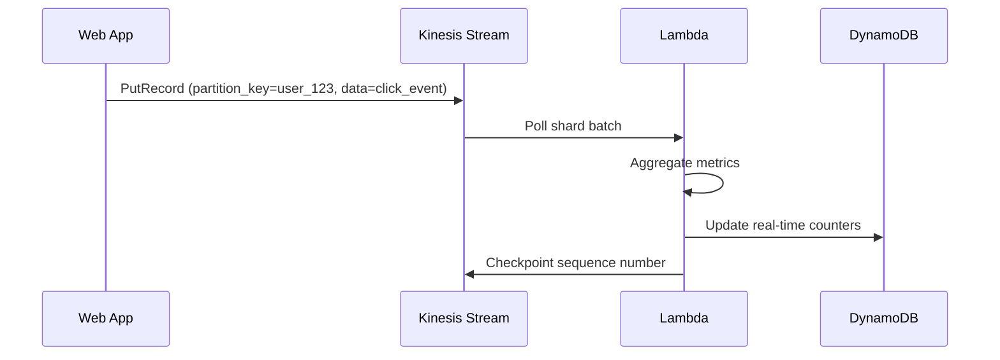

**Lambda event (Kinesis):**

```python
import base64, json

event = {
    "Records": [{
        "kinesis": {
            "partitionKey": "user_123",
            "sequenceNumber": "49590338271490256608559692538361571095921575989136588898",
            "data": base64.b64encode(json.dumps({
                "page": "/products/shoes",
                "action": "click"
            }).encode()).decode()
        }
    }]
}
```

### Real-World Use Case

**Scenario:** A fintech app streams transaction events for real-time fraud detection. Suspicious patterns trigger instant account holds.

```
Payment Gateway  →  Kinesis (transactions stream)
                           ↓
                    Lambda (fraud-detector)
                           ↓
              ┌────────────┴────────────┐
              ▼                         ▼
        Normal → DynamoDB          Fraud → SNS → Lambda (freeze account)
```

- **Why Kinesis + Lambda:** Handles high-throughput real-time data. Ordered processing per partition key. Multiple consumers can read the same stream.
- **Production tips:** Right-size shard count, monitor `IteratorAge`, use enhanced fan-out for low-latency consumers, set appropriate batch size and parallelization factor.

### Interview Questions

**Q1: Kinesis vs SQS for Lambda — when to use which?**
> Kinesis: high-volume real-time streaming, ordering within a partition key, multiple consumers, replay capability. SQS: simple queue, decoupling, per-message processing, DLQ — better for task queues.

**Q2: How many Lambda instances process a Kinesis stream?**
> By default, one concurrent Lambda invocation per shard. Use `ParallelizationFactor` to run multiple invocations per shard (up to 10).

**Q3: What happens if Lambda fails processing a Kinesis batch?**
> The entire batch is retried. Enable bisect on error to split failing batches. After retries expire, records may be sent to DLQ or skipped depending on config.

**Q4: What is Kinesis IteratorAge?**
> Time between record arrival in Kinesis and Lambda processing. High IteratorAge means your consumer is falling behind.

---

## Amazon RDS

Lambda integrates with **Amazon RDS** (and Aurora) when your function needs to **query relational data**. Lambda runs in a **VPC** and connects through **RDS Proxy** for production workloads.

### Architecture Diagram

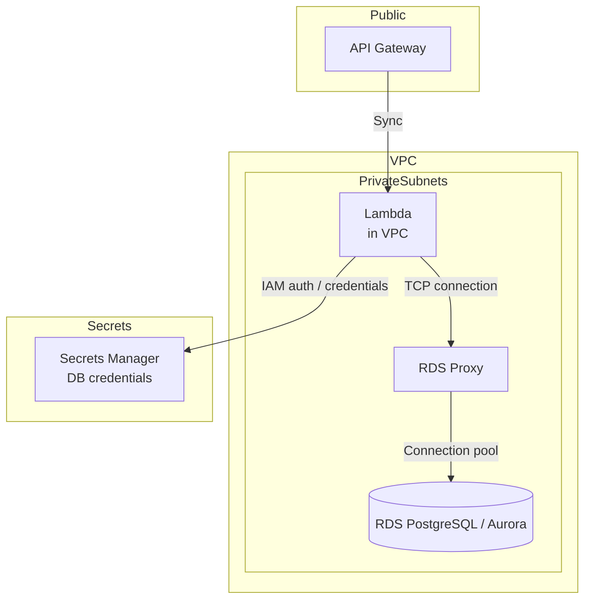

### Request Flow

```
1. Client calls GET /reports/sales via API Gateway
2. API Gateway synchronously invokes Lambda (in VPC)
3. Lambda retrieves DB credentials from Secrets Manager
4. Lambda opens connection to RDS Proxy (not directly to RDS)
5. RDS Proxy routes query to available RDS instance in pool
6. Lambda executes SQL, fetches results
7. Lambda returns JSON response to API Gateway
8. Connection returned to proxy pool (not closed per request)
9. Lambda ENI remains in VPC for warm invocations
```

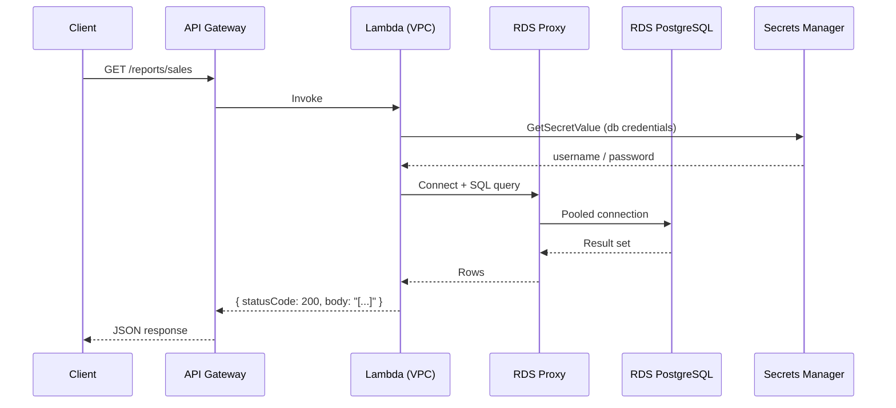

**Lambda code (Python + RDS Proxy):**

```python
import os
import json
import psycopg2
import boto3

SECRET_ARN = os.environ['DB_SECRET_ARN']
PROXY_ENDPOINT = os.environ['RDS_PROXY_ENDPOINT']

_connection = None

def get_connection():
    global _connection
    if _connection is None or _connection.closed:
        secret = boto3.client('secretsmanager').get_secret_value(SecretId=SECRET_ARN)
        creds = json.loads(secret['SecretString'])
        _connection = psycopg2.connect(
            host=PROXY_ENDPOINT,
            dbname=creds['dbname'],
            user=creds['username'],
            password=creds['password']
        )
    return _connection

def lambda_handler(event, context):
    conn = get_connection()
    with conn.cursor() as cur:
        cur.execute("SELECT product, SUM(amount) FROM sales GROUP BY product")
        rows = cur.fetchall()
    return {
        'statusCode': 200,
        'body': json.dumps([{'product': r[0], 'total': float(r[1])} for r in rows])
    }
```

### Real-World Use Case

**Scenario:** A healthcare admin portal exposes patient appointment reports stored in Aurora PostgreSQL. Data is sensitive and lives in a private subnet.

```
Admin Portal  →  API Gateway  →  Lambda (VPC)
                                      ↓
                               RDS Proxy (connection pooling)
                                      ↓
                               Aurora PostgreSQL (private subnet)
                                      ↑
                               Secrets Manager (rotated credentials)
```

- **Why Lambda + RDS Proxy:** Lambda scales to many concurrent executions — without a proxy, each instance could open its own DB connection and exhaust RDS limits. RDS Proxy pools connections and supports IAM auth.
- **Production tips:** Always use RDS Proxy, store credentials in Secrets Manager, place Lambda in private subnets with NAT for outbound internet, set appropriate Lambda timeout (DB queries can be slow), consider Aurora Serverless for variable workloads.

### Aurora Native Lambda Integration

Aurora can also **invoke Lambda directly** from the database (reverse direction):

```sql
-- Aurora MySQL: invoke Lambda from a stored procedure / trigger
SELECT lambda_async(
  'arn:aws:lambda:us-east-1:123456789:function:notify-patient',
  JSON_OBJECT('appointment_id', NEW.id, 'status', NEW.status)
);
```

Use this when database events (insert/update) should trigger Lambda without DynamoDB Streams.

### Interview Questions

**Q1: Why does Lambda need VPC configuration to access RDS?**
> RDS instances in private subnets are not publicly accessible. Lambda must run inside the same VPC (with appropriate security groups) to reach the database over the private network.

**Q2: Why use RDS Proxy with Lambda instead of connecting directly?**
> Lambda scales rapidly — hundreds of concurrent invocations could open hundreds of DB connections and hit RDS limits. RDS Proxy maintains a connection pool and multiplexes Lambda connections.

**Q3: Does VPC Lambda have cold start implications?**
> Yes. VPC Lambda must attach an Elastic Network Interface (ENI), adding 1–10+ seconds to cold starts. Use RDS Proxy, minimize VPC use to only functions that need it, and consider Provisioned Concurrency.

**Q4: How do you manage RDS credentials in Lambda?**
> Store credentials in AWS Secrets Manager or Parameter Store (SecureString). Retrieve at runtime with boto3. Enable automatic rotation. Prefer IAM database authentication via RDS Proxy where supported.

---

## Integration Comparison

### Trigger vs Target

| Service | Lambda Role | Invocation | Batch Support |
|---------|--------------|------------|---------------|
| API Gateway | Trigger | Sync | No |
| S3 | Trigger | Async | No (one event per object) |
| SQS | Trigger | Poll (sync per batch) | Yes (up to 10) |
| SNS | Trigger | Async | No |
| EventBridge | Trigger | Async | No |
| DynamoDB Streams | Trigger | Poll (sync per batch) | Yes |
| Kinesis | Trigger | Poll (sync per batch) | Yes |
| RDS | Target (Lambda calls RDS) | N/A | N/A |

### Choosing the Right Integration

```
Need HTTP API?                    →  API Gateway + Lambda
File uploaded?                    →  S3 + Lambda
Decouple + buffer work?           →  SQS + Lambda
Notify many subscribers?          →  SNS + Lambda
Central event routing?            →  EventBridge + Lambda
React to DB changes?              →  DynamoDB Streams + Lambda
Real-time high-volume stream?     →  Kinesis + Lambda
Query relational data?            →  Lambda + RDS Proxy + RDS
```

### Error Handling Summary

| Integration | Retry Behavior | DLQ Support |
|-------------|---------------|-------------|
| API Gateway | Client sees error immediately | Configure on Lambda |
| S3 | 2 retries, then discard | Lambda DLQ |
| SQS | Visibility timeout + redrive | SQS DLQ |
| SNS | 3 retries, then discard | Lambda DLQ |
| EventBridge | 24h retry with backoff | Target DLQ |
| DynamoDB Streams | Retry until data expires | Lambda DLQ / bisect batch |
| Kinesis | Retry batch, bisect on error | Lambda DLQ |
| RDS | Application-level error handling | Return 500 to client |

---

## Master Interview Questions

### Cross-Integration

**Q1: What is the difference between synchronous and asynchronous Lambda invocation?**
> Sync: caller waits for response (API Gateway). Async: caller fires and forgets; Lambda retries on failure (S3, SNS, EventBridge).

**Q2: What is an event source mapping?**
> A Lambda resource that polls an AWS service (SQS, Kinesis, DynamoDB Streams) and invokes your function with batches of records. Lambda manages polling — you don't invoke directly.

**Q3: How do you prevent Lambda from being overwhelmed by too many events?**
> Use SQS as a buffer, set reserved concurrency limits, use EventBridge input transformation, or throttle at API Gateway.

**Q4: Design a serverless order processing system using multiple integrations.**
> API Gateway → Lambda (validate) → DynamoDB (store order) → DynamoDB Stream → Lambda (sync analytics) + EventBridge (OrderCreated) → SNS (notify customer) + SQS (fulfillment queue) → Lambda (ship order).

**Q5: Which integrations support batch processing?**
> SQS, Kinesis, and DynamoDB Streams support batch processing via event source mappings. S3, SNS, and EventBridge invoke with single events (S3 can have multiple records in one event for batch uploads).

---

## Quick Reference — Enable Triggers

```bash
# API Gateway → Lambda (via AWS Console or SAM/TF)
# S3 → Lambda
aws s3api put-bucket-notification-configuration \
  --bucket my-uploads \
  --notification-configuration '{
    "LambdaFunctionConfigurations": [{
      "LambdaFunctionArn": "arn:aws:lambda:...:function:image-resizer",
      "Events": ["s3:ObjectCreated:*"],
      "Filter": {"Key": {"FilterRules": [{"Name": "prefix", "Value": "photos/"}]}}
    }]
  }'

# SQS → Lambda (event source mapping)
aws lambda create-event-source-mapping \
  --function-name process-order \
  --event-source-arn arn:aws:sqs:us-east-1:123456789:order-queue \
  --batch-size 10

# SNS → Lambda (subscribe)
aws sns subscribe \
  --topic-arn arn:aws:sns:us-east-1:123456789:order-notifications \
  --protocol lambda \
  --notification-endpoint arn:aws:lambda:...:function:send-email

# EventBridge → Lambda
aws events put-rule --name order-created \
  --event-pattern '{"source":["com.myapp.orders"],"detail-type":["OrderCreated"]}'
aws events put-targets --rule order-created \
  --targets "Id"="1","Arn"="arn:aws:lambda:...:function:process-order"

# DynamoDB Streams → Lambda
aws lambda create-event-source-mapping \
  --function-name sync-search \
  --event-source-arn arn:aws:dynamodb:...:table/Orders/stream/2026-01-01 \
  --starting-position LATEST

# Kinesis → Lambda
aws lambda create-event-source-mapping \
  --function-name clickstream-processor \
  --event-source-arn arn:aws:kinesis:...:stream/clickstream \
  --batch-size 100 \
  --starting-position TRIM_HORIZON
```

---

## Further Reading

- [Lambda Event Source Mapping](https://docs.aws.amazon.com/lambda/latest/dg/invocation-eventsourcemapping.html)
- [API Gateway Lambda Integration](https://docs.aws.amazon.com/apigateway/latest/developerguide/http-api-develop-integrations-lambda.html)
- [S3 Event Notifications](https://docs.aws.amazon.com/AmazonS3/latest/userguide/NotificationHowTo.html)
- [SQS with Lambda](https://docs.aws.amazon.com/lambda/latest/dg/with-sqs.html)
- [SNS with Lambda](https://docs.aws.amazon.com/lambda/latest/dg/with-sns.html)
- [EventBridge with Lambda](https://docs.aws.amazon.com/lambda/latest/dg/services-eventbridge.html)
- [DynamoDB Streams with Lambda](https://docs.aws.amazon.com/lambda/latest/dg/with-ddb.html)
- [Kinesis with Lambda](https://docs.aws.amazon.com/lambda/latest/dg/with-kinesis.html)
- [RDS Proxy with Lambda](https://docs.aws.amazon.com/lambda/latest/dg/services-rds.html)

---

[← Back to Course Overview](../README.md) | [← Fundamentals](../Fundamentals/README.md) | [← Advanced](../Advanced/README.md) | [Security & Monitoring →](../Security-Monitoring/README.md) | [Deployment →](../Deployment/README.md)

*Part of the **AWS Lambda, Python (Boto3) & Serverless — Beginner to Advanced** course.*
