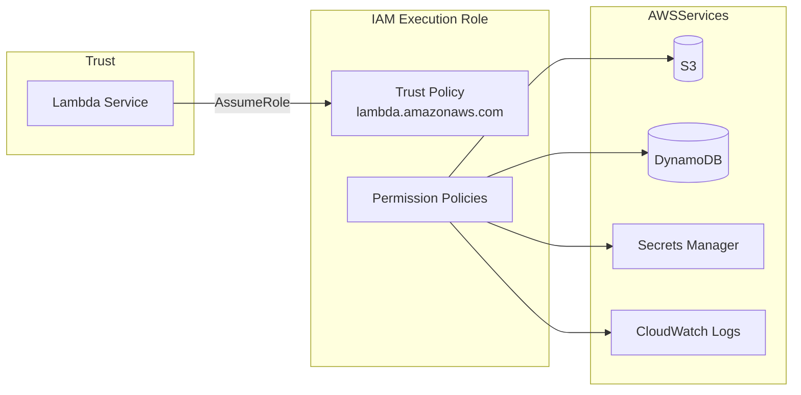
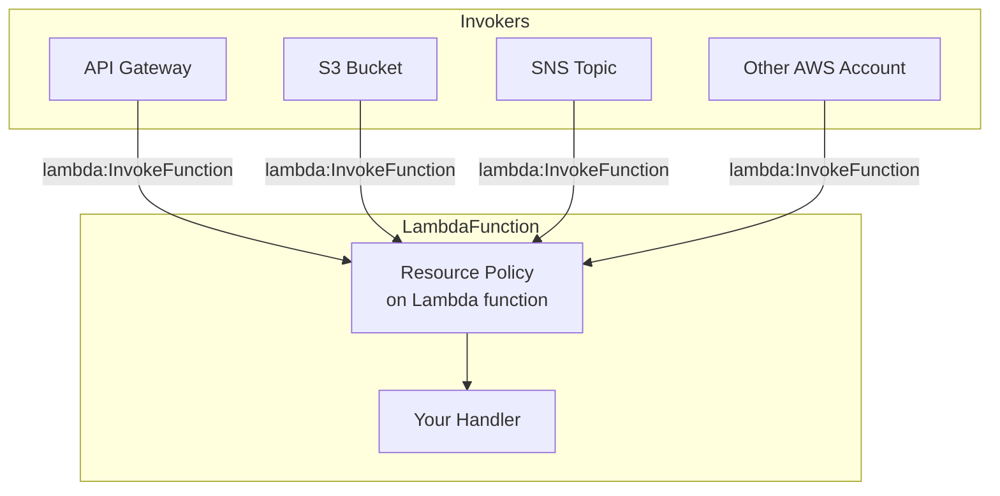
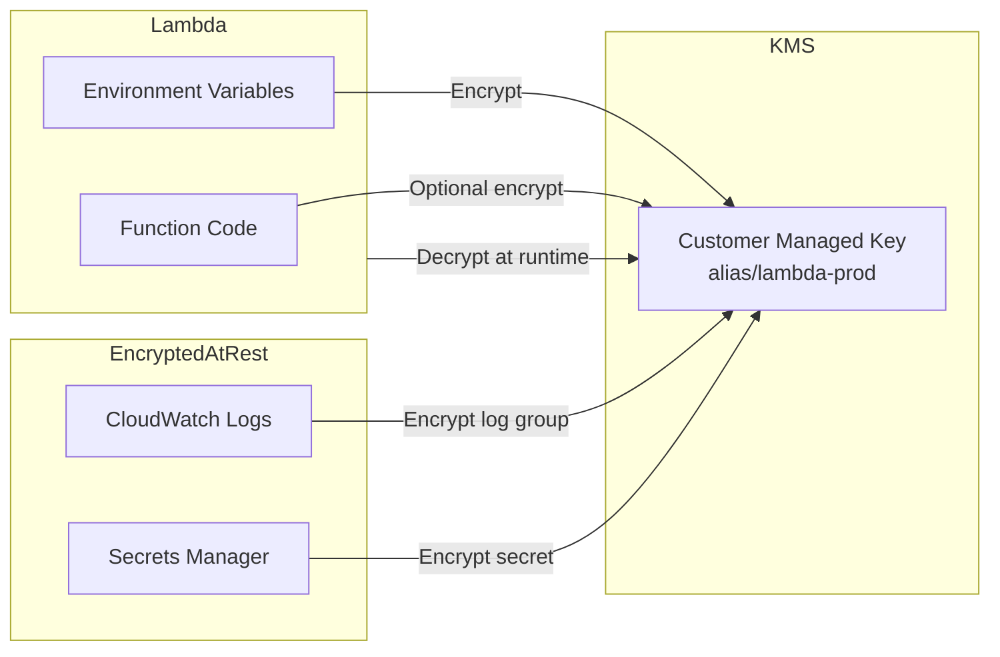
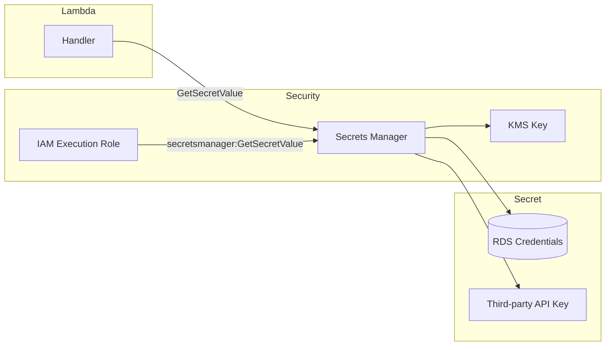
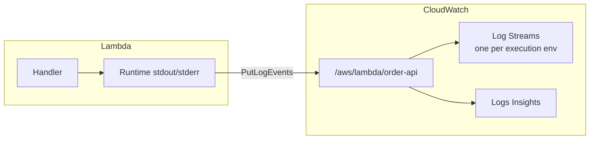
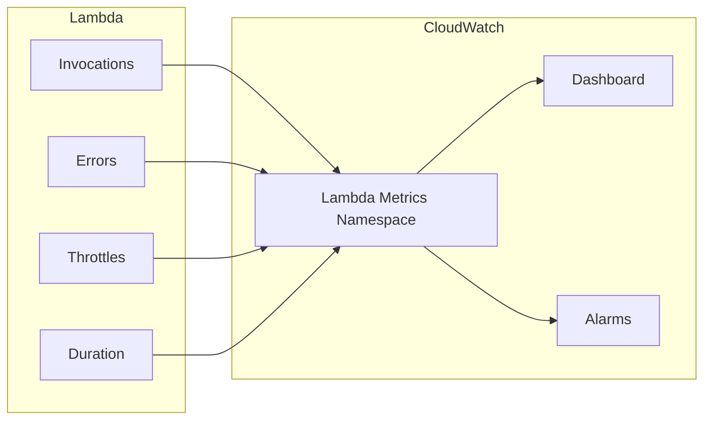
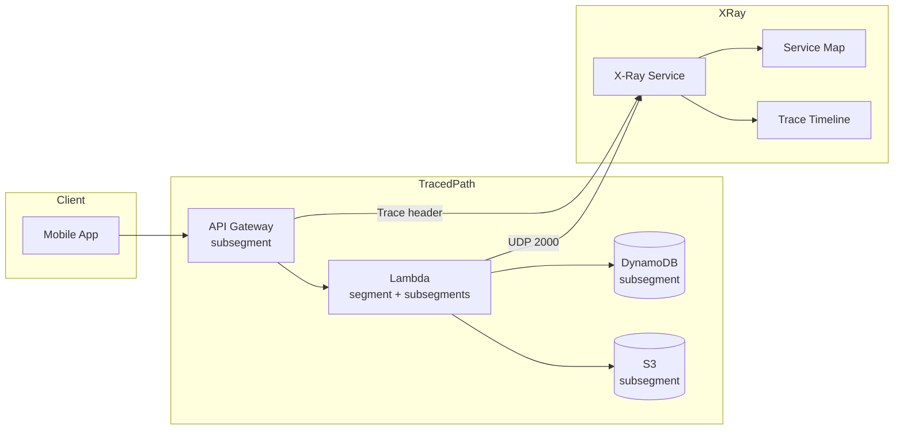
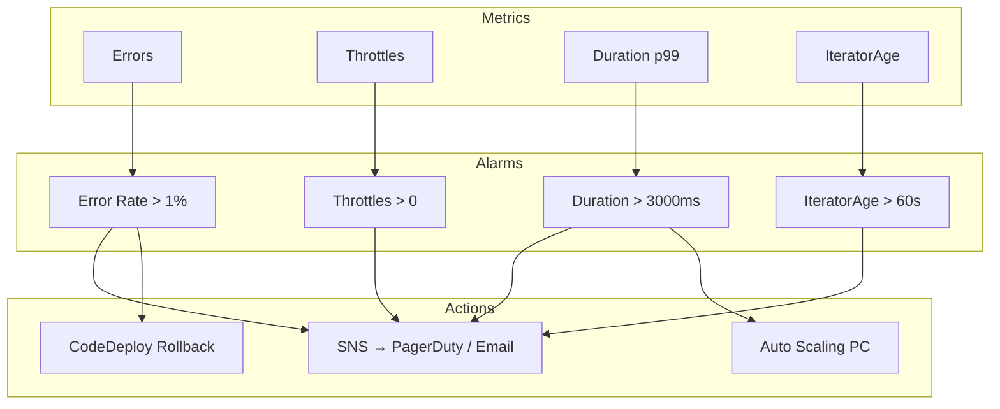
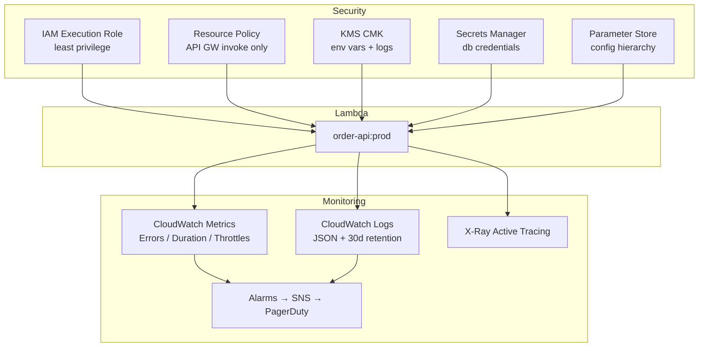

# AWS Lambda Security and Monitoring

> Secure Lambda functions in production and observe them with CloudWatch and X-Ray.

[← Back to Course Overview](../README.md) | [← Fundamentals](../Fundamentals/README.md) | [← Advanced](../Advanced/README.md) | [← Integrations](../Integrations/README.md) | [Deployment →](../Deployment/README.md)

---

## Table of Contents

### Security
1. [Overview](#overview)
2. [IAM Roles](#iam-roles)
3. [Resource Policies](#resource-policies)
4. [KMS](#kms)
5. [Secrets Manager](#secrets-manager)
6. [Parameter Store](#parameter-store)

### Monitoring
7. [CloudWatch Logs](#cloudwatch-logs)
8. [CloudWatch Metrics](#cloudwatch-metrics)
9. [X-Ray](#x-ray)
10. [Alarms](#alarms)

### Reference
11. [Production Stack Example](#production-stack-example)
12. [Security & Monitoring Checklist](#security--monitoring-checklist)
13. [Interview Questions](#interview-questions)
14. [Quick Reference](#quick-reference)

---

## Overview

Lambda security and monitoring work together. **Security** controls *who can invoke your function* and *what your function can access*. **Monitoring** tells you *what happened* when things go wrong.

```
┌─────────────────────────────────────────────────────────────────────┐
│                    Lambda Security & Monitoring                     │
├──────────────────────────────┬──────────────────────────────────────┤
│         SECURITY             │           MONITORING                 │
│  Who invokes Lambda?         │  What did Lambda log?                │
│  What can Lambda access?     │  How many errors / throttles?        │
│  How are secrets stored?     │  How long did each call take?        │
│  Is data encrypted?          │  When to page on-call?               │
├──────────────────────────────┴──────────────────────────────────────┤
│  IAM Roles │ Resource Policies │ KMS │ Secrets Manager │ Param Store│
│  CloudWatch Logs │ Metrics │ X-Ray │ Alarms                             │
└─────────────────────────────────────────────────────────────────────┘
```

| Concern | Tool | Question It Answers |
|---------|------|---------------------|
| Outbound permissions | IAM execution role | Can Lambda read from S3? Write to DynamoDB? |
| Inbound permissions | Resource policy | Can API Gateway / S3 invoke this function? |
| Encryption at rest | KMS | Are env vars and logs encrypted? |
| Secret storage | Secrets Manager / Parameter Store | Where do DB passwords and API keys live? |
| Debugging | CloudWatch Logs | What did my function print or error on? |
| Performance | CloudWatch Metrics + X-Ray | Latency, errors, cold starts, bottlenecks |
| Alerting | CloudWatch Alarms | When should we wake someone up? |

---

## IAM Roles

Every Lambda function has an **execution role** — an IAM role that Lambda assumes when running your code. This role defines **outbound permissions** (what AWS services your function can call).

### Architecture



### Trust Policy vs Permission Policy

```
Trust Policy     →  WHO can assume this role?     →  lambda.amazonaws.com
Permission Policy →  WHAT can the role do?        →  s3:GetObject, dynamodb:PutItem
```

**Trust policy (required):**

```json
{
  "Version": "2012-10-17",
  "Statement": [{
    "Effect": "Allow",
    "Principal": { "Service": "lambda.amazonaws.com" },
    "Action": "sts:AssumeRole"
  }]
}
```

**Permission policy (least privilege example):**

```json
{
  "Version": "2012-10-17",
  "Statement": [
    {
      "Effect": "Allow",
      "Action": ["dynamodb:GetItem", "dynamodb:PutItem", "dynamodb:Query"],
      "Resource": "arn:aws:dynamodb:us-east-1:123456789:table/Orders"
    },
    {
      "Effect": "Allow",
      "Action": ["secretsmanager:GetSecretValue"],
      "Resource": "arn:aws:secretsmanager:us-east-1:123456789:secret:prod/db-*"
    },
    {
      "Effect": "Allow",
      "Action": ["logs:CreateLogGroup", "logs:CreateLogStream", "logs:PutLogEvents"],
      "Resource": "arn:aws:logs:us-east-1:123456789:log-group:/aws/lambda/order-api:*"
    }
  ]
}
```

### Production Example: Order API Role

**Scenario:** `order-api` Lambda reads/writes DynamoDB, fetches DB credentials from Secrets Manager, and writes logs.

```bash
# Create role with trust policy
aws iam create-role \
  --role-name order-api-lambda-role \
  --assume-role-policy-document file://trust-policy.json

# Attach custom least-privilege policy (NOT AdministratorAccess)
aws iam put-role-policy \
  --role-name order-api-lambda-role \
  --policy-name order-api-permissions \
  --policy-document file://permissions.json

# Assign to Lambda
aws lambda update-function-configuration \
  --function-name order-api \
  --role arn:aws:iam::123456789:role/order-api-lambda-role
```

**SAM template:**

```yaml
OrderApiFunction:
  Type: AWS::Serverless::Function
  Properties:
    FunctionName: order-api
    Handler: app.handler
    Runtime: python3.12
    Policies:
      - DynamoDBCrudPolicy:
          TableName: Orders
      - Statement:
          - Effect: Allow
            Action: secretsmanager:GetSecretValue
            Resource: !Sub arn:aws:secretsmanager:${AWS::Region}:${AWS::AccountId}:secret:prod/db-*
      - AWSLambdaBasicExecutionRole   # CloudWatch Logs
```

### Best Practices

| Do | Don't |
|----|-------|
| One role per function (or per domain) | Share one `AdministratorAccess` role across all Lambdas |
| Grant least privilege per resource ARN | Use `"Resource": "*"` unless required |
| Use managed policies for common patterns (`AWSLambdaBasicExecutionRole`) | Embed long-lived access keys in environment variables |
| Add VPC access policy only when Lambda is in VPC | Attach `AmazonS3FullAccess` when you only need one bucket |
| Audit roles with IAM Access Analyzer | Reuse EC2 instance roles for Lambda |

### Common Managed Policies

| Policy | Purpose |
|--------|---------|
| `AWSLambdaBasicExecutionRole` | Write to CloudWatch Logs |
| `AWSLambdaVPCAccessExecutionRole` | Create ENI for VPC Lambda |
| `AWSXRayDaemonWriteAccess` | Send traces to X-Ray |

---

## Resource Policies

A **resource-based policy** is attached **to the Lambda function itself**. It controls **inbound access** — which AWS services or accounts can **invoke** your function.

### Architecture



### IAM Role vs Resource Policy

| | IAM Execution Role | Resource Policy |
|--|-------------------|-----------------|
| **Direction** | Outbound (Lambda → AWS) | Inbound (AWS → Lambda) |
| **Attached to** | IAM role | Lambda function |
| **Answers** | "What can Lambda call?" | "Who can invoke Lambda?" |
| **Example** | Lambda reads S3 bucket | S3 triggers Lambda on upload |

### Production Example: S3 Trigger Permission

When S3 invokes Lambda, AWS adds a resource policy automatically. You can also set it explicitly:

```bash
aws lambda add-permission \
  --function-name image-resizer \
  --statement-id s3-trigger-permission \
  --action lambda:InvokeFunction \
  --principal s3.amazonaws.com \
  --source-arn arn:aws:s3:::my-uploads \
  --source-account 123456789
```

**Resulting resource policy on the function:**

```json
{
  "Version": "2012-10-17",
  "Statement": [{
    "Sid": "s3-trigger-permission",
    "Effect": "Allow",
    "Principal": { "Service": "s3.amazonaws.com" },
    "Action": "lambda:InvokeFunction",
    "Resource": "arn:aws:lambda:us-east-1:123456789:function:image-resizer",
    "Condition": {
      "StringEquals": { "AWS:SourceAccount": "123456789" },
      "ArnLike": { "AWS:SourceArn": "arn:aws:s3:::my-uploads" }
    }
  }]
}
```

### Cross-Account Invocation

**Scenario:** Account A (shared services) hosts the Lambda. Account B (workload) invokes it.

```bash
# Account A — allow Account B to invoke
aws lambda add-permission \
  --function-name shared-auth-validator \
  --statement-id allow-account-b \
  --action lambda:InvokeFunction \
  --principal 987654321 \
  --function-url-auth-type NONE
```

### Best Practices

- Use **condition keys** (`AWS:SourceArn`, `AWS:SourceAccount`) to prevent confused deputy attacks
- Review resource policies with `aws lambda get-policy --function-name my-fn`
- Remove stale permissions when decommissioning triggers
- For public HTTP access, prefer **API Gateway** with auth over Lambda Function URLs without auth
- Limit cross-account invoke to specific function aliases/versions when possible

---

## KMS

**AWS KMS** (Key Management Service) encrypts Lambda **environment variables**, **deployment packages** (optional), and **CloudWatch Logs** at rest.

### Architecture



### What KMS Encrypts in Lambda

| Resource | Default Encryption | Custom KMS Key |
|----------|-------------------|----------------|
| Environment variables | AWS managed key | Customer managed CMK |
| CloudWatch Logs | AWS managed key | CMK on log group |
| Secrets Manager secrets | AWS managed key | CMK on secret |
| SQS DLQ / SNS (related) | Service default | CMK optional |

### Production Example: Encrypt Environment Variables

**Scenario:** A payment Lambda stores API endpoint URLs and feature flags in environment variables. Compliance requires customer-managed encryption.

```bash
# Create KMS key
aws kms create-key --description "Lambda prod encryption"
aws kms create-alias --alias-name alias/lambda-prod --target-key-id <key-id>

# Key policy must allow Lambda role to decrypt
# Attach to Lambda
aws lambda update-function-configuration \
  --function-name payment-api \
  --kms-key-arn arn:aws:kms:us-east-1:123456789:key/abc-123 \
  --environment "Variables={GATEWAY_URL=https://pay.example.com,ENV=prod}"
```

**KMS key policy snippet (allow Lambda role):**

```json
{
  "Sid": "AllowLambdaDecrypt",
  "Effect": "Allow",
  "Principal": {
    "AWS": "arn:aws:iam::123456789:role/payment-api-lambda-role"
  },
  "Action": ["kms:Decrypt", "kms:DescribeKey"],
  "Resource": "*"
}
```

**Encrypt CloudWatch Log Group:**

```bash
aws logs create-log-group --log-group-name /aws/lambda/payment-api
aws logs associate-kms-key \
  --log-group-name /aws/lambda/payment-api \
  --kms-key-id alias/lambda-prod
```

### Best Practices

- Use **customer managed CMKs** for production and compliance (PCI, HIPAA)
- Grant Lambda execution role only `kms:Decrypt` and `kms:DescribeKey` — not `kms:*`
- Enable **automatic key rotation** on CMKs
- Use separate CMKs per environment (dev/staging/prod)
- Do not store secrets in env vars even with KMS — use Secrets Manager (KMS-backed)
- Monitor KMS API calls via CloudTrail for audit

---

## Secrets Manager

**AWS Secrets Manager** stores sensitive values (passwords, API keys, tokens) with **automatic rotation**, **encryption**, and **fine-grained IAM access**.

### Architecture



### Production Example: RDS Credentials

**Scenario:** `report-api` Lambda queries Aurora PostgreSQL. Credentials rotate every 30 days.

**Store secret:**

```bash
aws secretsmanager create-secret \
  --name prod/report-api/db \
  --description "Aurora credentials for report-api" \
  --secret-string '{"username":"report_user","password":"...","host":"proxy.example.rds.amazonaws.com","dbname":"reports"}' \
  --kms-key-id alias/lambda-prod
```

**Lambda code:**

```python
import json
import boto3
import os

_secret_cache = None

def get_db_credentials():
    global _secret_cache
    if _secret_cache is None:
        client = boto3.client('secretsmanager')
        response = client.get_secret_value(SecretId=os.environ['DB_SECRET_ARN'])
        _secret_cache = json.loads(response['SecretString'])
    return _secret_cache

def lambda_handler(event, context):
    creds = get_db_credentials()
    # Connect via RDS Proxy using creds['username'], creds['password']
    ...
```

**IAM permission:**

```json
{
  "Effect": "Allow",
  "Action": "secretsmanager:GetSecretValue",
  "Resource": "arn:aws:secretsmanager:us-east-1:123456789:secret:prod/report-api/db-*"
}
```

**Automatic rotation (RDS):**

```bash
aws secretsmanager rotate-secret \
  --secret-id prod/report-api/db \
  --rotation-lambda-arn arn:aws:lambda:...:function:SecretsManagerRDSRotation \
  --rotation-rules AutomaticallyAfterDays=30
```

### Secrets Manager vs Environment Variables

| | Environment Variables | Secrets Manager |
|--|----------------------|-----------------|
| **Best for** | Non-sensitive config (table names, URLs) | Passwords, API keys, tokens |
| **Rotation** | Manual redeploy | Automatic |
| **Encryption** | Optional KMS | Always KMS-encrypted |
| **Audit** | Limited | CloudTrail `GetSecretValue` logs |
| **Cost** | Free | Per secret per month + API calls |

### Best Practices

- Cache secrets in a **module-level variable** (reuse across warm invocations)
- Handle rotation: catch auth errors and refresh cache
- One secret per service/environment (`prod/order-api/db`, not one mega-secret)
- Never log secret values — redact in structured logs
- Use **resource-based policies** on secrets for cross-account access when needed
- Prefer **RDS Proxy + IAM auth** over static passwords where possible

---

## Parameter Store

**AWS Systems Manager Parameter Store** stores configuration and secrets as **hierarchical parameters**. Use **Standard** for config and **Advanced (SecureString)** for sensitive values.

### Architecture

```mermaid
flowchart TB
    subgraph Hierarchy
        ROOT[/myapp/]
        PROD[/myapp/prod/]
        DEV[/myapp/dev/]
        P1[/myapp/prod/db/host]
        P2[/myapp/prod/db/name]
        P3[/myapp/prod/api/key\nSecureString]
    end

    subgraph Lambda
        L[Handler]
    end

    ROOT --> PROD
    ROOT --> DEV
    PROD --> P1
    PROD --> P2
    PROD --> P3
    L -->|GetParameter / GetParametersByPath| PROD
```

### Parameter Types

| Type | Use Case | Encryption | Cost |
|------|----------|------------|------|
| **String** | Feature flags, URLs, table names | No | Free (Standard) |
| **StringList** | Comma-separated values | No | Free |
| **SecureString** | API keys, tokens | KMS | Free (Standard) / paid (Advanced) |

### Production Example: Hierarchical Config

**Scenario:** Multi-tenant SaaS app with shared Lambda code across tenants — config driven by Parameter Store.

```bash
# Store parameters
aws ssm put-parameter \
  --name /order-api/prod/dynamodb/table \
  --value Orders \
  --type String

aws ssm put-parameter \
  --name /order-api/prod/stripe/api-key \
  --value sk_live_... \
  --type SecureString \
  --key-id alias/lambda-prod
```

**Lambda code — load config by path:**

```python
import boto3
import os

ssm = boto3.client('ssm')

def load_config(prefix='/order-api/prod/'):
    params = {}
    paginator = ssm.get_paginator('get_parameters_by_path')
    for page in paginator.paginate(Path=prefix, WithDecryption=True, Recursive=True):
        for p in page['Parameters']:
            key = p['Name'].replace(prefix, '')
            params[key] = p['Value']
    return params

_config = None

def lambda_handler(event, context):
    global _config
    if _config is None:
        _config = load_config(os.environ.get('CONFIG_PREFIX', '/order-api/prod/'))
    table = _config['dynamodb/table']
    ...
```

**IAM permission:**

```json
{
  "Effect": "Allow",
  "Action": ["ssm:GetParameter", "ssm:GetParameters", "ssm:GetParametersByPath"],
  "Resource": "arn:aws:ssm:us-east-1:123456789:parameter/order-api/prod/*"
},
{
  "Effect": "Allow",
  "Action": ["kms:Decrypt"],
  "Resource": "arn:aws:kms:us-east-1:123456789:key/abc-123"
}
```

### Parameter Store vs Secrets Manager

| Choose Parameter Store | Choose Secrets Manager |
|------------------------|------------------------|
| Non-rotating config | Automatic credential rotation |
| Hierarchical naming (`/app/prod/...`) | Native RDS rotation Lambdas |
| Cost-sensitive (many params) | Audit-heavy secret lifecycle |
| SecureString for simple secrets | Cross-account secret replication |

### Best Practices

- Use a **consistent hierarchy**: `/{service}/{env}/{key}`
- Load parameters at cold start and cache — avoid SSM call on every invocation
- Use `WithDecryption=True` for SecureString parameters
- Restrict IAM to path prefixes, not `parameter/*`
- Use **Parameter Store labels** for versioning config snapshots

---

## CloudWatch Logs

Lambda **automatically** sends logs to **Amazon CloudWatch Logs** when the execution role has logging permissions. Every `print()`, `logging`, and uncaught exception appears in a log group.

### Architecture



### Log Group Structure

```
/aws/lambda/order-api          ← Log group (one per function)
  ├── 2026/06/20/[$LATEST]abc123   ← Log stream (per execution environment)
  ├── 2026/06/20/[$LATEST]def456
  └── 2026/06/20/[prod]ghi789     ← Stream for alias/version
```

### Production Example: Structured JSON Logging

**Scenario:** Production team needs searchable logs with request ID, latency, and error tracking.

```python
import json
import logging
import os
import time

logger = logging.getLogger()
logger.setLevel(os.environ.get('LOG_LEVEL', 'INFO'))

def lambda_handler(event, context):
    start = time.time()
    request_id = context.aws_request_id

    logger.info(json.dumps({
        'level': 'INFO',
        'request_id': request_id,
        'function': context.function_name,
        'event': 'request_received',
        'path': event.get('rawPath', 'N/A')
    }))

    try:
        result = process_order(event)
        logger.info(json.dumps({
            'level': 'INFO',
            'request_id': request_id,
            'event': 'request_completed',
            'duration_ms': round((time.time() - start) * 1000, 2),
            'status': 'success'
        }))
        return result
    except Exception as e:
        logger.error(json.dumps({
            'level': 'ERROR',
            'request_id': request_id,
            'event': 'request_failed',
            'error': str(e),
            'duration_ms': round((time.time() - start) * 1000, 2)
        }))
        raise
```

**CloudWatch Logs Insights query:**

```sql
fields @timestamp, request_id, event, duration_ms, error
| filter function like /order-api/
| filter level = "ERROR"
| sort @timestamp desc
| limit 50
```

**Set log retention (avoid unbounded cost):**

```bash
aws logs put-retention-policy \
  --log-group-name /aws/lambda/order-api \
  --retention-in-days 30
```

### Best Practices

| Do | Don't |
|----|-------|
| Use JSON structured logging | Log passwords, tokens, or PII |
| Include `request_id` in every log line | Use plain `print()` in production without structure |
| Set log retention (14–90 days) | Leave retention as "Never expire" |
| Use log levels (`INFO`, `ERROR`, `DEBUG`) | Log entire event payloads in prod (may contain sensitive data) |
| Encrypt log groups with KMS for compliance | Log at `DEBUG` in production by default |
| Use **AWS Lambda Powertools** for Python | Build custom logging frameworks from scratch |

---

## CloudWatch Metrics

Lambda publishes **automatic metrics** to CloudWatch — no code required. Use them for dashboards, alarms, and capacity planning.

### Architecture



### Built-in Lambda Metrics

| Metric | Description | Alarm On? |
|--------|-------------|-----------|
| **Invocations** | Total invocation count | Unusual spikes |
| **Errors** | Failed invocations (uncaught exceptions) | Yes — critical |
| **Duration** | Execution time (ms) | P99 latency SLA |
| **Throttles** | Invocations throttled (concurrency limit) | Yes — capacity |
| **ConcurrentExecutions** | Active instances | Approaching account limit |
| **DeadLetterErrors** | Failed async delivery to DLQ | Yes |
| **IteratorAge** | Stream lag (Kinesis/DynamoDB) | Yes — processing lag |
| **ProvisionedConcurrencyUtilization** | PC usage vs configured | Right-sizing PC |

### Production Example: Operations Dashboard

**Scenario:** SRE team monitors `payment-api` across prod and staging.

```bash
# Get error rate last hour
aws cloudwatch get-metric-statistics \
  --namespace AWS/Lambda \
  --metric-name Errors \
  --dimensions Name=FunctionName,Value=payment-api Name=Resource,Value=payment-api:prod \
  --start-time 2026-06-20T10:00:00Z \
  --end-time 2026-06-20T11:00:00Z \
  --period 300 \
  --statistics Sum

# Get P99 duration
aws cloudwatch get-metric-statistics \
  --namespace AWS/Lambda \
  --metric-name Duration \
  --dimensions Name=FunctionName,Value=payment-api \
  --extended-statistics p99 \
  --start-time 2026-06-20T10:00:00Z \
  --end-time 2026-06-20T11:00:00Z \
  --period 300
```

**Custom metrics (business KPIs):**

```python
import boto3

cloudwatch = boto3.client('cloudwatch')

def lambda_handler(event, context):
    order_total = process_payment(event)

    cloudwatch.put_metric_data(
        Namespace='OrderApi/Business',
        MetricData=[{
            'MetricName': 'OrderValue',
            'Value': order_total,
            'Unit': 'None',
            'Dimensions': [
                {'Name': 'Environment', 'Value': 'prod'},
                {'Name': 'FunctionName', 'Value': context.function_name}
            ]
        }]
    )
    return {'statusCode': 200}
```

### Metric Dimensions

Filter metrics by:
- `FunctionName` — required for most queries
- `Resource` — includes alias/version (`payment-api:prod`)

### Best Practices

- Monitor **Errors**, **Throttles**, and **Duration (p99)** on every production function
- Use **metric filters** on logs to create metrics from log patterns (e.g., count `"level":"ERROR"`)
- Emit **custom business metrics** sparingly (cost: PutMetricData API charges)
- Build one dashboard per service with invocations, errors, duration, and concurrency
- Compare `$LATEST` vs `prod` alias metrics separately during deployments

---

## X-Ray

**AWS X-Ray** traces requests end-to-end across Lambda, API Gateway, DynamoDB, SQS, and other services. It shows **where time is spent** and **what failed**.

### Architecture



### Enable X-Ray on Lambda

```bash
# Active tracing — Lambda creates segments automatically
aws lambda update-function-configuration \
  --function-name order-api \
  --tracing-config Mode=Active
```

**SAM:**

```yaml
OrderApiFunction:
  Type: AWS::Serverless::Function
  Properties:
    Tracing: Active
    Policies:
      - AWSXRayDaemonWriteAccess
```

### Production Example: Custom Subsegments

**Scenario:** `order-api` is slow. You need to know if latency is from DynamoDB, external payment API, or cold start.

```python
from aws_xray_sdk.core import xray_recorder
from aws_xray_sdk.core import patch_all

patch_all()  # Auto-trace boto3 calls

def lambda_handler(event, context):
    with xray_recorder.in_subsegment('validate_input'):
        order = validate(event)

    with xray_recorder.in_subsegment('fetch_customer'):
        customer = get_customer(order['customer_id'])

    with xray_recorder.in_subsegment('charge_payment'):
        charge_result = call_payment_gateway(order)

    with xray_recorder.in_subsegment('save_order'):
        save_to_dynamodb(order)

    return {'statusCode': 200, 'body': order}
```

**Trace timeline (conceptual):**

```
order-api (total: 850ms)
├── validate_input          12ms
├── fetch_customer          45ms
│   └── DynamoDB GetItem    40ms
├── charge_payment         720ms  ← bottleneck
│   └── HTTPS external     715ms
└── save_order              73ms
    └── DynamoDB PutItem    68ms
```

### X-Ray Annotations and Metadata

```python
xray_recorder.put_annotation('customer_id', order['customer_id'])  # Indexable — filter traces
xray_recorder.put_metadata('order_payload', order, 'order')          # Detail — not indexed
```

### Best Practices

- Enable **Active tracing** on all user-facing production Lambdas
- Use **AWS X-Ray SDK** with `patch_all()` for automatic boto3 subsegments
- Add custom subsegments around business logic and external HTTP calls
- Use **annotations** for fields you search by (user ID, order ID, tenant)
- Sample rate: default is 1 req/sec + 5% — adjust with sampling rules for high traffic
- Combine X-Ray with CloudWatch Logs using the same `request_id`

---

## Alarms

**CloudWatch Alarms** watch metrics and trigger actions when thresholds are breached — SNS notifications, Auto Scaling, or Lambda rollback via CodeDeploy.

### Architecture



### Production Example: Multi-Alarm Strategy

**Scenario:** `payment-api:prod` requires paging on errors and auto-rollback during deployment.

**1. Error rate alarm:**

```bash
aws cloudwatch put-metric-alarm \
  --alarm-name payment-api-prod-errors \
  --alarm-description "Payment API error rate exceeded 1%" \
  --namespace AWS/Lambda \
  --metric-name Errors \
  --dimensions Name=FunctionName,Value=payment-api Name=Resource,Value=payment-api:prod \
  --statistic Sum \
  --period 60 \
  --evaluation-periods 3 \
  --threshold 5 \
  --comparison-operator GreaterThanThreshold \
  --treat-missing-data notBreaching \
  --alarm-actions arn:aws:sns:us-east-1:123456789:critical-alerts
```

**2. Throttle alarm:**

```bash
aws cloudwatch put-metric-alarm \
  --alarm-name payment-api-prod-throttles \
  --metric-name Throttles \
  --namespace AWS/Lambda \
  --dimensions Name=FunctionName,Value=payment-api \
  --statistic Sum \
  --period 60 \
  --evaluation-periods 1 \
  --threshold 0 \
  --comparison-operator GreaterThanThreshold \
  --alarm-actions arn:aws:sns:us-east-1:123456789:critical-alerts
```

**3. Duration P99 SLA alarm:**

```bash
aws cloudwatch put-metric-alarm \
  --alarm-name payment-api-prod-latency-p99 \
  --metric-name Duration \
  --namespace AWS/Lambda \
  --dimensions Name=FunctionName,Value=payment-api \
  --extended-statistic p99 \
  --period 300 \
  --evaluation-periods 2 \
  --threshold 3000 \
  --comparison-operator GreaterThanThreshold \
  --alarm-actions arn:aws:sns:us-east-1:123456789:warning-alerts
```

**4. Log-based metric filter + alarm (ERROR count):**

```bash
# Create metric filter
aws logs put-metric-filter \
  --log-group-name /aws/lambda/payment-api \
  --filter-name ErrorCount \
  --filter-pattern '{ $.level = "ERROR" }' \
  --metric-transformations \
    metricName=StructuredErrors,metricNamespace=OrderApi/Logs,metricValue=1

# Alarm on structured errors
aws cloudwatch put-metric-alarm \
  --alarm-name payment-api-structured-errors \
  --metric-name StructuredErrors \
  --namespace OrderApi/Logs \
  --statistic Sum \
  --period 300 \
  --evaluation-periods 1 \
  --threshold 10 \
  --comparison-operator GreaterThanThreshold \
  --alarm-actions arn:aws:sns:us-east-1:123456789:critical-alerts
```

### Recommended Alarms per Production Function

| Alarm | Metric | Threshold (starting point) | Severity |
|-------|--------|---------------------------|----------|
| Error count | `Errors` | > 0 for 3 consecutive minutes | Critical |
| Throttles | `Throttles` | > 0 | Critical |
| High latency | `Duration` p99 | > SLA (e.g., 3000 ms) | Warning |
| Concurrent executions | `ConcurrentExecutions` | > 80% of account limit | Warning |
| DLQ failures | `DeadLetterErrors` | > 0 | Critical |
| Stream lag | `IteratorAge` | > 60,000 ms | Warning |
| PC utilization | `ProvisionedConcurrencyUtilization` | > 80% sustained | Info |

### Best Practices

- Route **critical** alarms to PagerDuty/Opsgenie; **warnings** to Slack/email
- Use `TreatMissingData: notBreaching` for error alarms (no traffic ≠ error)
- Tie alarms to **Lambda aliases** (`payment-api:prod`) not `$LATEST`
- Connect error alarms to **CodeDeploy auto-rollback** during canary deployments
- Avoid alarm fatigue: tune thresholds with baseline metrics first
- Document runbooks linked from SNS messages (which alarm → what to check)

---

## Production Stack Example

Full security and monitoring setup for a production `order-api` Lambda:



```
Deploy checklist for order-api:prod
──────────────────────────────────
Security
  ✓ Execution role: DynamoDB + Secrets Manager + SSM + Logs only
  ✓ Resource policy: API Gateway source ARN condition
  ✓ KMS CMK on env vars and log group
  ✓ DB creds in Secrets Manager (30-day rotation)
  ✓ Config in /order-api/prod/* Parameter Store

Monitoring
  ✓ Structured JSON logging with request_id
  ✓ Log retention: 30 days
  ✓ X-Ray Active tracing + custom subsegments
  ✓ Dashboard: invocations, errors, p99 duration, concurrency
  ✓ Alarms: errors, throttles, p99 latency → SNS → PagerDuty
  ✓ CodeDeploy canary with alarm-based rollback
```

---

## Security & Monitoring Checklist

### Security

- [ ] Execution role follows least privilege (no `*`, no admin policies)
- [ ] Resource policies use `SourceArn` and `SourceAccount` conditions
- [ ] Secrets in Secrets Manager or SecureString — not plain env vars
- [ ] KMS CMK for env vars, logs, and secrets in regulated environments
- [ ] VPC + security groups only when accessing private resources
- [ ] No hardcoded credentials in code or Git
- [ ] CloudTrail enabled for API audit trail
- [ ] Dependency scanning (Dependabot, Snyk) on Lambda layers/packages

### Monitoring

- [ ] CloudWatch Logs with structured JSON format
- [ ] Log retention policy set (not infinite)
- [ ] X-Ray enabled on user-facing functions
- [ ] Dashboard per service (errors, duration, throttles, concurrency)
- [ ] Alarms on Errors, Throttles, and latency SLA
- [ ] DLQ configured for async invocations with DLQ alarm
- [ ] Runbooks linked from alarm notifications
- [ ] Logs Insights saved queries for common debugging scenarios

---

## Interview Questions

**Q1: What is a Lambda execution role?**
> An IAM role Lambda assumes when running your code. Its permission policies define which AWS services the function can access (outbound). The trust policy allows `lambda.amazonaws.com` to assume the role.

**Q2: What is the difference between an IAM role and a resource policy on Lambda?**
> The execution role controls what Lambda can call (outbound). The resource policy controls who can invoke Lambda (inbound), such as S3, SNS, or another account.

**Q3: Should you store database passwords in Lambda environment variables?**
> No. Use Secrets Manager (with rotation) or Parameter Store SecureString. Environment variables are visible in the console and CloudFormation; even with KMS encryption, Secrets Manager provides better lifecycle management.

**Q4: Parameter Store vs Secrets Manager — when to use which?**
> Parameter Store for hierarchical config and simple SecureString secrets at lower cost. Secrets Manager for credentials requiring automatic rotation, cross-account replication, and strict audit requirements.

**Q5: How does Lambda logging work?**
> Lambda automatically sends stdout/stderr to CloudWatch Logs if the execution role has `logs:CreateLogGroup`, `logs:CreateLogStream`, and `logs:PutLogEvents`. Log group name is `/aws/lambda/<function-name>`.

**Q6: What Lambda metrics would you alarm on in production?**
> Errors (critical), Throttles (critical), Duration p99 (SLA breach), DeadLetterErrors, IteratorAge for streams, and optionally ConcurrentExecutions approaching limits.

**Q7: What is AWS X-Ray and how do you enable it on Lambda?**
> X-Ray traces requests across services showing latency breakdown. Enable with `TracingConfig Mode=Active` on the function and attach `AWSXRayDaemonWriteAccess` to the execution role.

**Q8: What is a cold start and can X-Ray help detect it?**
> Cold start is latency from creating a new execution environment (INIT phase). X-Ray shows an initialization segment on the trace; Duration metrics may spike without code changes.

**Q9: How do you encrypt Lambda environment variables?**
> Set `KMSKeyArn` on the function configuration. Lambda encrypts env vars at rest with that CMK and decrypts at runtime. The execution role needs `kms:Decrypt` on the key.

**Q10: Design monitoring for a payment Lambda during canary deployment.**
> Monitor Errors and Duration on the `prod` alias, attach CloudWatch alarms to CodeDeploy for auto-rollback, enable X-Ray to compare traces between versions, use structured logs with version in every line, and page on-call via SNS if error rate exceeds threshold during canary.

---

## Quick Reference

### CLI Commands

```bash
# IAM — update execution role
aws lambda update-function-configuration \
  --function-name my-fn --role arn:aws:iam::123456789:role/my-lambda-role

# Resource policy — allow S3 invoke
aws lambda add-permission --function-name my-fn \
  --action lambda:InvokeFunction --principal s3.amazonaws.com \
  --source-arn arn:aws:s3:::my-bucket --statement-id s3invoke

# KMS — encrypt env vars
aws lambda update-function-configuration \
  --function-name my-fn --kms-key-arn arn:aws:kms:us-east-1:123456789:key/abc

# Secrets Manager — retrieve in code via boto3 get_secret_value

# Parameter Store
aws ssm get-parameter --name /myapp/prod/api/url --with-decryption

# Logs — tail live
aws logs tail /aws/lambda/my-fn --follow --format short

# X-Ray — enable tracing
aws lambda update-function-configuration \
  --function-name my-fn --tracing-config Mode=Active

# Alarm — errors
aws cloudwatch put-metric-alarm --alarm-name my-fn-errors \
  --namespace AWS/Lambda --metric-name Errors \
  --dimensions Name=FunctionName,Value=my-fn \
  --statistic Sum --period 60 --evaluation-periods 2 \
  --threshold 1 --comparison-operator GreaterThanOrEqualToThreshold \
  --alarm-actions arn:aws:sns:us-east-1:123456789:alerts
```

### Service Comparison

| Service | Primary Purpose |
|---------|----------------|
| IAM Role | Outbound permissions for Lambda |
| Resource Policy | Inbound invoke permissions |
| KMS | Encrypt env vars, logs, secrets |
| Secrets Manager | Rotating credentials |
| Parameter Store | Hierarchical config + SecureString |
| CloudWatch Logs | Function output and errors |
| CloudWatch Metrics | Performance and health KPIs |
| X-Ray | Distributed request tracing |
| Alarms | Automated alert actions |

---

## Further Reading

- [Lambda Execution Role](https://docs.aws.amazon.com/lambda/latest/dg/lambda-intro-execution-role.html)
- [Lambda Resource-based Policies](https://docs.aws.amazon.com/lambda/latest/dg/access-control-resource-based.html)
- [Lambda Environment Variables Encryption](https://docs.aws.amazon.com/lambda/latest/dg/configuration-envvars.html)
- [CloudWatch Logs for Lambda](https://docs.aws.amazon.com/lambda/latest/dg/monitoring-cloudwatchlogs.html)
- [CloudWatch Metrics for Lambda](https://docs.aws.amazon.com/lambda/latest/dg/monitoring-metrics.html)
- [Lambda X-Ray](https://docs.aws.amazon.com/lambda/latest/dg/services-xray.html)
- [Secrets Manager with Lambda](https://docs.aws.amazon.com/secretsmanager/latest/userguide/retrieving-secrets_lambda.html)
- [Parameter Store](https://docs.aws.amazon.com/systems-manager/latest/userguide/systems-manager-parameter-store.html)

---

[← Back to Course Overview](../README.md) | [← Fundamentals](../Fundamentals/README.md) | [← Advanced](../Advanced/README.md) | [← Integrations](../Integrations/README.md) | [Deployment →](../Deployment/README.md)

*Part of the **AWS Lambda, Python (Boto3) & Serverless — Beginner to Advanced** course.*
