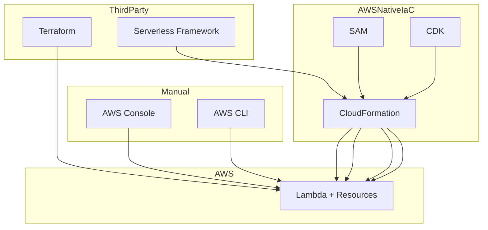
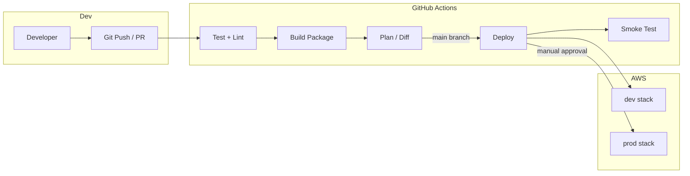

# AWS Lambda Deployment Methods

> Deploy Lambda functions using the Console, CLI, SAM, CDK, Terraform, CloudFormation, and Serverless Framework — with CI/CD workflows.

[← Back to Course Overview](../README.md) | [← Fundamentals](../Fundamentals/README.md) | [← Advanced](../Advanced/README.md) | [← Integrations](../Integrations/README.md) | [← Security & Monitoring](../Security-Monitoring/README.md)

---

## Table of Contents

1. [Overview](#overview)
2. [Deployment Methods Comparison](#deployment-methods-comparison)
3. [AWS Console](#aws-console)
4. [AWS CLI](#aws-cli)
5. [AWS SAM](#aws-sam)
6. [AWS CDK](#aws-cdk)
7. [Terraform](#terraform)
8. [CloudFormation](#cloudformation)
9. [Serverless Framework](#serverless-framework)
10. [CI/CD Workflows](#cicd-workflows)
11. [Choosing the Right Method](#choosing-the-right-method)
12. [Interview Questions](#interview-questions)
13. [Quick Reference](#quick-reference)

---

## Overview

Deploying Lambda is more than uploading a ZIP file. You must package code, configure runtime/handler/memory/timeout, attach IAM roles, wire triggers, and promote safely across environments.

```
Deployment lifecycle:
┌──────────┐   ┌──────────┐   ┌──────────┐   ┌──────────┐   ┌──────────┐
│  Write   │ → │  Package │ → │  Deploy  │ → │  Test    │ → │ Promote  │
│  Code    │   │  + deps  │   │  to AWS  │   │  invoke  │   │ to prod  │
└──────────┘   └──────────┘   └──────────┘   └──────────┘   └──────────┘
                                    ↑
              Console / CLI / SAM / CDK / Terraform / CFN / Serverless
```

### What Gets Deployed

| Component | Description |
|-----------|-------------|
| **Function code** | Python handler + dependencies (ZIP or container) |
| **Configuration** | Runtime, handler, memory, timeout, env vars |
| **IAM role** | Execution role with least-privilege policies |
| **Triggers** | API Gateway, S3, SQS, EventBridge, etc. |
| **Supporting resources** | DynamoDB tables, SQS queues, log groups, alarms |

---

## Deployment Methods Comparison

| Method | Type | Best For | IaC | Learning Curve |
|--------|------|----------|-----|----------------|
| **AWS Console** | Manual UI | Learning, quick tests | No | Low |
| **AWS CLI** | Command line | Scripts, CI first steps | No | Low |
| **SAM** | AWS-native IaC | Serverless-first Python/Node apps | Yes (YAML) | Medium |
| **CDK** | Code-based IaC | Teams using Python/TypeScript | Yes (code → CFN) | Medium–High |
| **Terraform** | Multi-cloud IaC | Multi-cloud, existing TF shops | Yes (HCL) | Medium |
| **CloudFormation** | AWS-native IaC | Full AWS control, no abstractions | Yes (YAML/JSON) | Medium–High |
| **Serverless Framework** | Third-party framework | Fast serverless prototyping | Yes (YAML) | Medium |



---

## AWS Console

The **AWS Lambda Console** is the web UI for creating, updating, and testing functions. Best for learning and one-off changes — not recommended for production deployments.

### Architecture

```
Developer Browser
       ↓
AWS Lambda Console
       ↓
┌──────────────────────────────────┐
│  Create / Update Function        │
│  - Upload ZIP or edit inline     │
│  - Set runtime, handler, memory   │
│  - Configure triggers, env vars  │
└──────────────────────────────────┘
       ↓
   Lambda Function (live in account)
```

### Deployment Steps

```
1. Open AWS Console → Lambda → Create function
2. Choose "Author from scratch"
3. Set function name, Python 3.12 runtime
4. Create or select execution role
5. Upload ZIP or paste inline code
6. Configure handler: lambda_function.lambda_handler
7. Set memory (512 MB) and timeout (30 sec)
8. Add environment variables
9. Create test event → Test
10. Add trigger (API Gateway, S3, etc.)
```

### Console Deployment Example

**Scenario:** Deploy a hello-world function for a workshop demo.

```
Console path:
  Lambda → Functions → Create function
    Name:           hello-workshop
    Runtime:        Python 3.12
    Architecture:   arm64 (Graviton — lower cost)
    Execution role: Create role with basic Lambda permissions

  Code tab → Upload from → .zip file → function.zip
  Runtime settings → Handler: lambda_function.lambda_handler
  Configuration → Environment variables → KEY=VALUE
  Test tab → Create event → Invoke
```

### When to Use Console

| Use Console | Avoid Console |
|-------------|---------------|
| First-time learning | Production deployments |
| Quick debugging / test | Teams needing reproducibility |
| Viewing logs and metrics | Managing 10+ functions |
| Manual invoke testing | Compliance / audit requirements |

### Best Practices

- Use Console for **exploration only** — not as your deployment pipeline
- Never edit production functions directly without a rollback plan
- Export working config to IaC (SAM/CDK) once validated
- Enable **Code signing** and **tags** even for dev functions

---

## AWS CLI

The **AWS CLI** deploys Lambda from your terminal or shell scripts. It is the foundation most CI/CD pipelines use under the hood.

### Architecture

```
Local Machine / CI Runner
  ├── lambda_function.py
  ├── requirements.txt  (installed to package/)
  └── function.zip
         ↓
    aws lambda create-function / update-function-code
         ↓
    AWS Lambda API → Function deployed
```

### Deployment Example: Create and Update

**Project structure:**

```
hello-api/
├── lambda_function.py
├── requirements.txt
└── deploy.sh
```

**`lambda_function.py`:**

```python
import json

def lambda_handler(event, context):
    return {
        'statusCode': 200,
        'body': json.dumps({'message': 'Hello from CLI deploy!'})
    }
```

**`deploy.sh`:**

```bash
#!/bin/bash
set -euo pipefail

FUNCTION_NAME="hello-api"
ROLE_ARN="arn:aws:iam::123456789:role/lambda-basic-execution"
RUNTIME="python3.12"
HANDLER="lambda_function.lambda_handler"
REGION="us-east-1"

# Package dependencies
rm -rf package function.zip
pip install -r requirements.txt -t package/ --quiet
cp lambda_function.py package/
cd package && zip -r ../function.zip . && cd ..

# Create or update
if aws lambda get-function --function-name "$FUNCTION_NAME" --region "$REGION" 2>/dev/null; then
  echo "Updating existing function..."
  aws lambda update-function-code \
    --function-name "$FUNCTION_NAME" \
    --zip-file fileb://function.zip \
    --region "$REGION"

  aws lambda wait function-updated --function-name "$FUNCTION_NAME" --region "$REGION"

  aws lambda update-function-configuration \
    --function-name "$FUNCTION_NAME" \
    --runtime "$RUNTIME" \
    --handler "$HANDLER" \
    --memory-size 256 \
    --timeout 30 \
    --region "$REGION"
else
  echo "Creating new function..."
  aws lambda create-function \
    --function-name "$FUNCTION_NAME" \
    --runtime "$RUNTIME" \
    --role "$ROLE_ARN" \
    --handler "$HANDLER" \
    --zip-file fileb://function.zip \
    --memory-size 256 \
    --timeout 30 \
    --region "$REGION"
fi

# Publish version and update alias
VERSION=$(aws lambda publish-version \
  --function-name "$FUNCTION_NAME" \
  --region "$REGION" \
  --query 'Version' --output text)

aws lambda update-alias \
  --function-name "$FUNCTION_NAME" \
  --name prod \
  --function-version "$VERSION" \
  --region "$REGION" 2>/dev/null || \
aws lambda create-alias \
  --function-name "$FUNCTION_NAME" \
  --name prod \
  --function-version "$VERSION" \
  --region "$REGION"

echo "Deployed $FUNCTION_NAME version $VERSION"
```

**Deploy large packages via S3 (> 50 MB direct upload limit):**

```bash
aws s3 cp function.zip s3://my-deploy-artifacts/lambda/hello-api.zip
aws lambda update-function-code \
  --function-name hello-api \
  --s3-bucket my-deploy-artifacts \
  --s3-key lambda/hello-api.zip
```

### Best Practices

- Always `aws lambda wait function-updated` before config changes
- Use **S3** for packages over 50 MB
- Script create vs update logic (idempotent deploys)
- Publish **versions** and update **aliases** — never point prod at `$LATEST`
- Store `ROLE_ARN`, `REGION`, and function name in environment variables or SSM

---

## AWS SAM

**AWS SAM** (Serverless Application Model) is an open-source framework for building serverless apps. SAM templates extend CloudFormation with simplified syntax for Lambda, API Gateway, and DynamoDB.

### Architecture

```
template.yaml (SAM)
       ↓
  sam build          →  Build artifacts (.aws-sam/)
       ↓
  sam deploy         →  CloudFormation stack
       ↓
  Lambda + API Gateway + DynamoDB + IAM (all managed)
```

### Project Structure

```
order-api/
├── template.yaml
├── samconfig.toml
└── src/
    ├── app.py
    └── requirements.txt
```

### SAM Template Example

**`template.yaml`:**

```yaml
AWSTemplateFormatVersion: '2010-09-09'
Transform: AWS::Serverless-2016-10-31
Description: Order API - SAM deployment

Globals:
  Function:
    Runtime: python3.12
    Timeout: 30
    MemorySize: 512
    Architectures: [arm64]
    Tracing: Active
    Environment:
      Variables:
        TABLE_NAME: !Ref OrdersTable
        LOG_LEVEL: INFO

Resources:
  OrderApiFunction:
    Type: AWS::Serverless::Function
    Properties:
      FunctionName: order-api
      Handler: app.lambda_handler
      CodeUri: src/
      AutoPublishAlias: prod
      Policies:
        - DynamoDBCrudPolicy:
            TableName: !Ref OrdersTable
        - AWSLambdaBasicExecutionRole
      Events:
        GetOrder:
          Type: HttpApi
          Properties:
            ApiId: !Ref OrderHttpApi
            Path: /orders/{id}
            Method: GET
        CreateOrder:
          Type: HttpApi
          Properties:
            ApiId: !Ref OrderHttpApi
            Path: /orders
            Method: POST

  OrderHttpApi:
    Type: AWS::Serverless::HttpApi
    Properties:
      StageName: prod

  OrdersTable:
    Type: AWS::DynamoDB::Table
    Properties:
      TableName: Orders
      BillingMode: PAY_PER_REQUEST
      AttributeDefinitions:
        - AttributeName: order_id
          AttributeType: S
      KeySchema:
        - AttributeName: order_id
          KeyType: HASH

Outputs:
  ApiUrl:
    Description: API Gateway endpoint
    Value: !Sub https://${OrderHttpApi}.execute-api.${AWS::Region}.amazonaws.com/prod
```

**`samconfig.toml`:**

```toml
version = 0.1

[default.deploy.parameters]
stack_name = "order-api-stack"
resolve_s3 = true
s3_prefix = "order-api"
region = "us-east-1"
confirm_changeset = false
capabilities = "CAPABILITY_IAM"
parameter_overrides = "Environment=dev"
```

### Deploy Commands

```bash
# Build (install deps, prepare artifacts)
sam build

# First deploy (guided — creates samconfig.toml)
sam deploy --guided

# Subsequent deploys
sam deploy

# Local testing
sam local invoke OrderApiFunction --event events/get-order.json
sam local start-api
```

### Production Example: Canary Deployment with SAM

```yaml
OrderApiFunction:
  Type: AWS::Serverless::Function
  Properties:
    AutoPublishAlias: prod
    DeploymentPreference:
      Type: Canary10Percent5Minutes
      Alarms:
        - !Ref AliasErrorAlarm
      Hooks:
        PreTraffic: !Ref PreTrafficHookFunction
```

```bash
sam deploy --config-env production
# CloudFormation + CodeDeploy shifts 10% traffic, monitors alarms, rolls back on error
```

### Best Practices

- Use `Globals` to DRY shared function settings
- Prefer **HTTP API** over REST API for cost and simplicity (unless you need WAF/validation)
- Use `sam build --use-container` when building on Mac/Windows for Linux-compatible binaries
- Store secrets in **SSM/Secrets Manager** — reference via `{{resolve:...}}` in template
- Separate stacks per environment: `order-api-dev`, `order-api-prod`

---

## AWS CDK

**AWS CDK** (Cloud Development Kit) defines infrastructure in **Python, TypeScript, Java, or C#**. CDK synthesizes to CloudFormation and deploys the stack.

### Architecture

```
app.py (CDK code)
       ↓
  cdk synth          →  CloudFormation template
       ↓
  cdk deploy         →  CloudFormation stack → Lambda + resources
```

### Project Structure

```
order-api-cdk/
├── app.py
├── cdk.json
├── requirements.txt
└── order_api/
    ├── __init__.py
    └── order_api_stack.py
```

### CDK Example (Python)

**`app.py`:**

```python
#!/usr/bin/env python3
import aws_cdk as cdk
from order_api.order_api_stack import OrderApiStack

app = cdk.App()
OrderApiStack(app, "OrderApiStack",
    env=cdk.Environment(account="123456789", region="us-east-1"))
app.synth()
```

**`order_api/order_api_stack.py`:**

```python
from aws_cdk import (
    Stack, Duration, RemovalPolicy,
    aws_lambda as lambda_,
    aws_apigatewayv2 as apigwv2,
    aws_apigatewayv2_integrations as integrations,
    aws_dynamodb as dynamodb,
    aws_logs as logs,
)
from constructs import Construct

class OrderApiStack(Stack):
    def __init__(self, scope: Construct, construct_id: str, **kwargs):
        super().__init__(scope, construct_id, **kwargs)

        table = dynamodb.Table(
            self, "OrdersTable",
            table_name="Orders",
            partition_key=dynamodb.Attribute(name="order_id", type=dynamodb.AttributeType.STRING),
            billing_mode=dynamodb.BillingMode.PAY_PER_REQUEST,
            removal_policy=RemovalPolicy.RETAIN,
        )

        fn = lambda_.Function(
            self, "OrderApiFunction",
            function_name="order-api",
            runtime=lambda_.Runtime.PYTHON_3_12,
            handler="app.lambda_handler",
            code=lambda_.Code.from_asset("src"),
            timeout=Duration.seconds(30),
            memory_size=512,
            architecture=lambda_.Architecture.ARM_64,
            tracing=lambda_.Tracing.ACTIVE,
            environment={"TABLE_NAME": table.table_name},
            log_retention=logs.RetentionDays.ONE_MONTH,
        )
        table.grant_read_write_data(fn)

        api = apigwv2.HttpApi(self, "OrderHttpApi", api_name="order-api")

        integration = integrations.HttpLambdaIntegration(
            "OrderIntegration", fn)

        apigwv2.HttpRoute(
            self, "GetOrderRoute",
            http_api=api,
            route_key=apigwv2.HttpRouteKey.with_("/orders/{id}", apigwv2.HttpMethod.GET),
            integration=integration,
        )
        apigwv2.HttpRoute(
            self, "CreateOrderRoute",
            http_api=api,
            route_key=apigwv2.HttpRouteKey.with_("/orders", apigwv2.HttpMethod.POST),
            integration=integration,
        )
```

### Deploy Commands

```bash
# Setup
python -m venv .venv && source .venv/bin/activate  # Linux/Mac
pip install aws-cdk-lib constructs
npm install -g aws-cdk   # CDK CLI

cdk bootstrap            # One-time per account/region
cdk synth                # Preview CloudFormation
cdk diff                 # Show changes before deploy
cdk deploy OrderApiStack
cdk destroy OrderApiStack
```

### Best Practices

- Use **constructs** and **stacks** to organize code (one stack per service or environment)
- Run `cdk diff` in CI before `cdk deploy` to catch unintended changes
- Use **context** and **environment variables** for account/region separation
- Leverage `grant_*` methods for IAM instead of raw policy JSON
- Pin CDK library versions in `requirements.txt`

---

## Terraform

**Terraform** by HashiCorp manages AWS (and other cloud) resources using **HCL** configuration. Popular in multi-cloud and platform teams.

### Architecture

```
*.tf files (HCL)
       ↓
  terraform plan     →  Preview changes
       ↓
  terraform apply    →  AWS API → Lambda + resources
       ↓
  terraform.tfstate  →  State file (tracks resources)
```

### Project Structure

```
order-api-tf/
├── main.tf
├── variables.tf
├── outputs.tf
├── versions.tf
└── src/
    └── lambda_function.py
```

### Terraform Example

**`versions.tf`:**

```hcl
terraform {
  required_version = ">= 1.5"
  required_providers {
    aws = {
      source  = "hashicorp/aws"
      version = "~> 5.0"
    }
    archive = {
      source  = "hashicorp/archive"
      version = "~> 2.4"
    }
  }

  backend "s3" {
    bucket         = "my-terraform-state"
    key            = "lambda/order-api/terraform.tfstate"
    region         = "us-east-1"
    dynamodb_table = "terraform-locks"
    encrypt        = true
  }
}

provider "aws" {
  region = var.aws_region
}
```

**`main.tf`:**

```hcl
data "archive_file" "lambda_zip" {
  type        = "zip"
  source_dir  = "${path.module}/src"
  output_path = "${path.module}/build/function.zip"
}

resource "aws_iam_role" "lambda_role" {
  name = "order-api-lambda-role"
  assume_role_policy = jsonencode({
    Version = "2012-10-17"
    Statement = [{
      Action    = "sts:AssumeRole"
      Effect    = "Allow"
      Principal = { Service = "lambda.amazonaws.com" }
    }]
  })
}

resource "aws_iam_role_policy_attachment" "lambda_basic" {
  role       = aws_iam_role.lambda_role.name
  policy_arn = "arn:aws:iam::aws:policy/service-role/AWSLambdaBasicExecutionRole"
}

resource "aws_dynamodb_table" "orders" {
  name         = "Orders"
  billing_mode = "PAY_PER_REQUEST"
  hash_key     = "order_id"

  attribute {
    name = "order_id"
    type = "S"
  }
}

resource "aws_iam_role_policy" "dynamodb_access" {
  name = "dynamodb-access"
  role = aws_iam_role.lambda_role.id
  policy = jsonencode({
    Version = "2012-10-17"
    Statement = [{
      Effect = "Allow"
      Action = ["dynamodb:GetItem", "dynamodb:PutItem", "dynamodb:Query"]
      Resource = aws_dynamodb_table.orders.arn
    }]
  })
}

resource "aws_lambda_function" "order_api" {
  function_name    = "order-api"
  role             = aws_iam_role.lambda_role.arn
  handler          = "lambda_function.lambda_handler"
  runtime          = "python3.12"
  architectures    = ["arm64"]
  filename         = data.archive_file.lambda_zip.output_path
  source_code_hash = data.archive_file.lambda_zip.output_base64sha256
  timeout          = 30
  memory_size      = 512

  environment {
    variables = {
      TABLE_NAME = aws_dynamodb_table.orders.name
    }
  }

  tracing_config {
    mode = "Active"
  }
}

resource "aws_lambda_alias" "prod" {
  name             = "prod"
  function_name    = aws_lambda_function.order_api.function_name
  function_version = aws_lambda_function.order_api.version
}

resource "aws_apigatewayv2_api" "order_api" {
  name          = "order-api"
  protocol_type = "HTTP"
}

resource "aws_apigatewayv2_integration" "lambda" {
  api_id                 = aws_apigatewayv2_api.order_api.id
  integration_type       = "AWS_PROXY"
  integration_uri        = aws_lambda_alias.prod.arn
  payload_format_version = "2.0"
}

resource "aws_apigatewayv2_route" "get_order" {
  api_id    = aws_apigatewayv2_api.order_api.id
  route_key = "GET /orders/{id}"
  target    = "integrations/${aws_apigatewayv2_integration.lambda.id}"
}

resource "aws_lambda_permission" "apigw" {
  statement_id  = "AllowAPIGatewayInvoke"
  action        = "lambda:InvokeFunction"
  function_name = aws_lambda_function.order_api.function_name
  qualifier     = aws_lambda_alias.prod.name
  principal     = "apigateway.amazonaws.com"
  source_arn    = "${aws_apigatewayv2_api.order_api.execution_arn}/*/*"
}
```

### Deploy Commands

```bash
terraform init
terraform plan -var="aws_region=us-east-1"
terraform apply -auto-approve
terraform output
```

### Best Practices

- Store state remotely in **S3 + DynamoDB locking** — never commit `terraform.tfstate`
- Use `source_code_hash` so Terraform detects code changes
- Split environments with **workspaces** or separate state files (`dev/`, `prod/`)
- Use **modules** for reusable Lambda patterns
- Run `terraform plan` in CI and require approval before `apply`

---

## CloudFormation

**AWS CloudFormation** is the native IaC service. SAM and CDK both compile down to CloudFormation. Use raw CFN when you need full control without abstractions.

### Architecture

```
template.yaml (CloudFormation)
       ↓
  aws cloudformation deploy
       ↓
  CloudFormation Stack
       ↓
  Lambda + IAM + API Gateway + DynamoDB
```

### CloudFormation Example

**`template.yaml`:**

```yaml
AWSTemplateFormatVersion: '2010-09-09'
Description: Order API - CloudFormation deployment

Parameters:
  Environment:
    Type: String
    Default: dev
    AllowedValues: [dev, staging, prod]

Resources:
  LambdaExecutionRole:
    Type: AWS::IAM::Role
    Properties:
      RoleName: !Sub order-api-role-${Environment}
      AssumeRolePolicyDocument:
        Version: '2012-10-17'
        Statement:
          - Effect: Allow
            Principal:
              Service: lambda.amazonaws.com
            Action: sts:AssumeRole
      ManagedPolicyArns:
        - arn:aws:iam::aws:policy/service-role/AWSLambdaBasicExecutionRole
      Policies:
        - PolicyName: DynamoDBAccess
          PolicyDocument:
            Version: '2012-10-17'
            Statement:
              - Effect: Allow
                Action:
                  - dynamodb:GetItem
                  - dynamodb:PutItem
                Resource: !GetAtt OrdersTable.Arn

  OrderApiFunction:
    Type: AWS::Lambda::Function
    Properties:
      FunctionName: !Sub order-api-${Environment}
      Runtime: python3.12
      Handler: lambda_function.lambda_handler
      Role: !GetAtt LambdaExecutionRole.Arn
      Timeout: 30
      MemorySize: 512
      Architectures: [arm64]
      Environment:
        Variables:
          TABLE_NAME: !Ref OrdersTable
          ENVIRONMENT: !Ref Environment
      Code:
        ZipFile: |
          import json
          def lambda_handler(event, context):
              return {'statusCode': 200, 'body': json.dumps('placeholder')}

  OrdersTable:
    Type: AWS::DynamoDB::Table
    Properties:
      TableName: !Sub Orders-${Environment}
      BillingMode: PAY_PER_REQUEST
      AttributeDefinitions:
        - AttributeName: order_id
          AttributeType: S
      KeySchema:
        - AttributeName: order_id
          KeyType: HASH

  OrderApiAlias:
    Type: AWS::Lambda::Alias
    Properties:
      FunctionName: !Ref OrderApiFunction
      FunctionVersion: !GetAtt OrderApiFunction.Version
      Name: !Ref Environment

Outputs:
  FunctionArn:
    Value: !GetAtt OrderApiFunction.Arn
  TableName:
    Value: !Ref OrdersTable
```

### Deploy Commands

```bash
# Package template (uploads Lambda code to S3)
aws cloudformation package \
  --template-file template.yaml \
  --s3-bucket my-cfn-artifacts \
  --output-template-file packaged.yaml

# Deploy stack
aws cloudformation deploy \
  --template-file packaged.yaml \
  --stack-name order-api-dev \
  --parameter-overrides Environment=dev \
  --capabilities CAPABILITY_NAMED_IAM

# Update code only (after packaging new ZIP)
aws cloudformation deploy \
  --template-file packaged.yaml \
  --stack-name order-api-dev \
  --capabilities CAPABILITY_NAMED_IAM
```

### Best Practices

- Use **nested stacks** for large applications
- Enable **StackSets** for multi-account deployment
- Use **Change Sets** to preview changes before applying
- Prefer SAM/CDK over raw CFN for Lambda-heavy apps (less boilerplate)
- Tag all resources with `Environment`, `Service`, and `Owner`

---

## Serverless Framework

The **Serverless Framework** is a third-party, open-source tool for building serverless apps. It uses `serverless.yml` and deploys via CloudFormation under the hood.

### Architecture

```
serverless.yml
       ↓
  serverless deploy
       ↓
  CloudFormation stack (generated)
       ↓
  Lambda + API Gateway + resources
```

### Project Structure

```
order-api/
├── serverless.yml
├── package.json          # Serverless CLI plugins
└── handler.py
```

### Serverless Framework Example

**`serverless.yml`:**

```yaml
service: order-api
frameworkVersion: '3'

provider:
  name: aws
  runtime: python3.12
  architecture: arm64
  region: us-east-1
  stage: ${opt:stage, 'dev'}
  memorySize: 512
  timeout: 30
  tracing:
    lambda: true
  environment:
    TABLE_NAME: ${self:service}-orders-${self:provider.stage}
  iam:
    role:
      statements:
        - Effect: Allow
          Action:
            - dynamodb:GetItem
            - dynamodb:PutItem
            - dynamodb:Query
          Resource: !GetAtt OrdersTable.Arn

functions:
  orderApi:
    handler: handler.lambda_handler
    events:
      - httpApi:
          path: /orders
          method: post
      - httpApi:
          path: /orders/{id}
          method: get

resources:
  Resources:
    OrdersTable:
      Type: AWS::DynamoDB::Table
      Properties:
        TableName: ${self:provider.environment.TABLE_NAME}
        BillingMode: PAY_PER_REQUEST
        AttributeDefinitions:
          - AttributeName: order_id
            AttributeType: S
        KeySchema:
          - AttributeName: order_id
            KeyType: HASH

plugins:
  - serverless-python-requirements

custom:
  pythonRequirements:
    dockerizePip: true
    slim: true
```

**`handler.py`:**

```python
import json
import os
import boto3

dynamodb = boto3.resource('dynamodb')
table = dynamodb.Table(os.environ['TABLE_NAME'])

def lambda_handler(event, context):
    method = event['requestContext']['http']['method']

    if method == 'POST':
        body = json.loads(event.get('body', '{}'))
        table.put_item(Item={'order_id': body['order_id'], 'status': 'pending'})
        return {'statusCode': 201, 'body': json.dumps({'created': True})}

    order_id = event['pathParameters']['id']
    resp = table.get_item(Key={'order_id': order_id})
    return {'statusCode': 200, 'body': json.dumps(resp.get('Item', {}))}
```

### Deploy Commands

```bash
npm install -g serverless
npm install --save-dev serverless-python-requirements

serverless deploy                    # deploy to dev
serverless deploy --stage prod       # deploy to production
serverless invoke -f orderApi --data '{"body":"{}"}'
serverless logs -f orderApi --tail
serverless remove --stage dev        # tear down stack
```

### Best Practices

- Use **stages** (`dev`, `staging`, `prod`) for environment separation
- Use `serverless-python-requirements` with `dockerizePip: true` for native deps
- Pin `frameworkVersion` to avoid breaking changes
- Consider **Serverless Compose** for multi-service apps
- For new AWS-only projects, evaluate **SAM** as a first-class alternative

---

## CI/CD Workflows

Production Lambda deployments should be **automated, repeatable, and safe**. Below are GitHub Actions workflows for common methods.

### CI/CD Architecture



### Workflow 1: AWS CLI + GitHub Actions

**`.github/workflows/deploy-cli.yml`:**

```yaml
name: Deploy Lambda (CLI)

on:
  push:
    branches: [main]
    paths: ['hello-api/**']

permissions:
  id-token: write
  contents: read

jobs:
  deploy:
    runs-on: ubuntu-latest
    defaults:
      run:
        working-directory: hello-api

    steps:
      - uses: actions/checkout@v4

      - name: Configure AWS credentials
        uses: aws-actions/configure-aws-credentials@v4
        with:
          role-to-assume: arn:aws:iam::123456789:role/github-actions-lambda
          aws-region: us-east-1

      - name: Setup Python
        uses: actions/setup-python@v5
        with:
          python-version: '3.12'

      - name: Package Lambda
        run: |
          pip install -r requirements.txt -t package/
          cp lambda_function.py package/
          cd package && zip -r ../function.zip .

      - name: Deploy
        run: chmod +x deploy.sh && ./deploy.sh

      - name: Smoke test
        run: |
          aws lambda invoke \
            --function-name hello-api:prod \
            --payload '{"name":"CI"}' \
            response.json
          cat response.json | grep -q "Hello"
```

### Workflow 2: SAM + GitHub Actions

**`.github/workflows/deploy-sam.yml`:**

```yaml
name: Deploy Lambda (SAM)

on:
  push:
    branches: [main]
  pull_request:
    branches: [main]

permissions:
  id-token: write
  contents: read

jobs:
  test-and-deploy:
    runs-on: ubuntu-latest
    steps:
      - uses: actions/checkout@v4

      - uses: aws-actions/setup-sam@v2
      - uses: aws-actions/configure-aws-credentials@v4
        with:
          role-to-assume: arn:aws:iam::123456789:role/github-actions-sam
          aws-region: us-east-1

      - name: SAM Build
        run: sam build --use-container

      - name: SAM Validate
        run: sam validate

      - name: Deploy to dev (PR)
        if: github.event_name == 'pull_request'
        run: sam deploy --config-env dev --no-confirm-changeset --no-fail-on-empty-changeset

      - name: Deploy to prod (main)
        if: github.ref == 'refs/heads/main'
        run: sam deploy --config-env prod --no-confirm-changeset --no-fail-on-empty-changeset

      - name: Invoke smoke test
        if: github.ref == 'refs/heads/main'
        run: |
          API_URL=$(aws cloudformation describe-stacks \
            --stack-name order-api-stack \
            --query "Stacks[0].Outputs[?OutputKey=='ApiUrl'].OutputValue" \
            --output text)
          curl -sf "$API_URL/orders" -X POST \
            -H "Content-Type: application/json" \
            -d '{"order_id":"ci-test-001"}'
```

### Workflow 3: CDK + GitHub Actions

**`.github/workflows/deploy-cdk.yml`:**

```yaml
name: Deploy Lambda (CDK)

on:
  push:
    branches: [main]

permissions:
  id-token: write
  contents: read

jobs:
  deploy:
    runs-on: ubuntu-latest
    steps:
      - uses: actions/checkout@v4

      - uses: actions/setup-python@v5
        with:
          python-version: '3.12'

      - name: Install dependencies
        run: |
          pip install -r requirements.txt
          npm install -g aws-cdk

      - uses: aws-actions/configure-aws-credentials@v4
        with:
          role-to-assume: arn:aws:iam::123456789:role/github-actions-cdk
          aws-region: us-east-1

      - name: CDK Diff
        run: cdk diff OrderApiStack

      - name: CDK Deploy
        run: cdk deploy OrderApiStack --require-approval never
```

### Workflow 4: Terraform + GitHub Actions

**`.github/workflows/deploy-terraform.yml`:**

```yaml
name: Deploy Lambda (Terraform)

on:
  push:
    branches: [main]
  pull_request:
    branches: [main]

permissions:
  id-token: write
  contents: read
  pull-requests: write

jobs:
  terraform:
    runs-on: ubuntu-latest
    defaults:
      run:
        working-directory: order-api-tf

    steps:
      - uses: actions/checkout@v4

      - uses: hashicorp/setup-terraform@v3

      - uses: aws-actions/configure-aws-credentials@v4
        with:
          role-to-assume: arn:aws:iam::123456789:role/github-actions-terraform
          aws-region: us-east-1

      - name: Terraform Init
        run: terraform init

      - name: Terraform Plan
        run: terraform plan -no-color -out=tfplan
        continue-on-error: false

      - name: Terraform Apply (main only)
        if: github.ref == 'refs/heads/main'
        run: terraform apply -auto-approve tfplan
```

### Workflow 5: Serverless Framework + GitHub Actions

**`.github/workflows/deploy-serverless.yml`:**

```yaml
name: Deploy Lambda (Serverless)

on:
  push:
    branches: [main]

jobs:
  deploy:
    runs-on: ubuntu-latest
    steps:
      - uses: actions/checkout@v4

      - uses: actions/setup-node@v4
        with:
          node-version: '20'

      - uses: actions/setup-python@v5
        with:
          python-version: '3.12'

      - uses: aws-actions/configure-aws-credentials@v4
        with:
          role-to-assume: arn:aws:iam::123456789:role/github-actions-serverless
          aws-region: us-east-1

      - name: Install Serverless
        run: npm install -g serverless serverless-python-requirements

      - name: Deploy
        run: serverless deploy --stage prod --verbose
```

### CI/CD Best Practices

| Practice | Why |
|----------|-----|
| **OIDC / IAM roles** for CI | No long-lived AWS access keys in GitHub secrets |
| **Separate environments** (dev/staging/prod) | Prevent accidental prod changes |
| **Manual approval for prod** | GitHub Environments with required reviewers |
| **Run tests before deploy** | Catch errors before they reach AWS |
| **Smoke test after deploy** | Verify function actually works post-deploy |
| **Deploy to alias, not `$LATEST`** | Safe rollback via alias version pointer |
| **Use canary deployments** | SAM/CDK/CodeDeploy shift traffic gradually |
| **Store artifacts in S3** | Reproducible deployments, audit trail |

### Production Pipeline (Multi-Stage)

```
PR opened
  → lint + unit tests
  → sam build / terraform plan / cdk diff
  → deploy to dev
  → integration tests

Merge to main
  → deploy to staging
  → automated smoke tests
  → manual approval gate
  → deploy to prod (canary 10% → 100%)
  → CloudWatch alarm check
  → auto-rollback on error
```

---

## Choosing the Right Method

```
Start here:
  Learning?           → AWS Console
  Quick script?       → AWS CLI
  AWS serverless app? → SAM
  Python/TS infra code? → CDK
  Multi-cloud / TF shop? → Terraform
  Full CFN control?   → CloudFormation
  Fast prototype?     → Serverless Framework
```

| Team Context | Recommended |
|--------------|-------------|
| Solo developer, AWS-only | SAM or Serverless Framework |
| Enterprise AWS, Python devs | CDK or SAM |
| Platform team, multi-cloud | Terraform |
| Existing CloudFormation shop | SAM (extends CFN) or raw CFN |
| Workshop / interview prep | Console + CLI first, then SAM |

---

## Interview Questions

**Q1: What are the main ways to deploy a Lambda function?**
> AWS Console (manual), AWS CLI (scripted), and IaC tools: SAM, CDK, CloudFormation, Terraform, and Serverless Framework. Production should use IaC + CI/CD, not Console.

**Q2: What is AWS SAM and how does it relate to CloudFormation?**
> SAM is an extension of CloudFormation with simplified syntax for serverless resources. `sam deploy` creates/updates a CloudFormation stack. SAM macros transform `AWS::Serverless::*` resources into standard CloudFormation.

**Q3: CDK vs CloudFormation — what's the difference?**
> CloudFormation uses YAML/JSON templates. CDK lets you define infrastructure in programming languages (Python, TypeScript), then synthesizes to CloudFormation. CDK adds abstractions, loops, and type checking.

**Q4: Why use Terraform instead of SAM for Lambda?**
> Terraform is cloud-agnostic and fits teams already using HCL for AWS + other providers. SAM is AWS-native and simpler for pure serverless apps. Choose based on team skills and multi-cloud needs.

**Q5: How do you deploy Lambda in CI/CD without storing AWS access keys?**
> Use GitHub Actions OIDC to assume an IAM role (`role-to-assume`) with short-lived credentials. No static keys in secrets.

**Q6: What is `sam build` and why is it needed?**
> `sam build` installs dependencies, compiles code, and prepares artifacts in `.aws-sam/build/`. Required before `sam deploy` so the packaged ZIP includes all dependencies.

**Q7: How do you handle Lambda deployments across dev, staging, and prod?**
> Separate stacks/stages (`sam deploy --config-env prod`), separate AWS accounts (best), or parameter overrides. Always deploy to aliases/versions — never mutate prod via `$LATEST`.

**Q8: What is a canary deployment for Lambda?**
> Traffic is gradually shifted to a new version (e.g., 10% → 100%) using Lambda aliases + CodeDeploy. CloudWatch alarms trigger automatic rollback if errors spike.

---

## Quick Reference

### Deploy Command Cheat Sheet

```bash
# Console:  Lambda → Create function (UI)

# CLI
zip function.zip lambda_function.py
aws lambda update-function-code --function-name my-fn --zip-file fileb://function.zip

# SAM
sam build && sam deploy --guided

# CDK
cdk deploy MyStack

# Terraform
terraform init && terraform apply

# CloudFormation
aws cloudformation deploy --template-file packaged.yaml --stack-name my-stack --capabilities CAPABILITY_IAM

# Serverless
serverless deploy --stage prod
```

### Method → Underlying Engine

| Tool | Deploy Engine |
|------|---------------|
| Console | Direct API |
| CLI | Direct API |
| SAM | CloudFormation |
| CDK | CloudFormation |
| CloudFormation | CloudFormation |
| Terraform | Terraform + AWS API |
| Serverless Framework | CloudFormation |

---

## Further Reading

- [AWS Lambda Deployment Packages](https://docs.aws.amazon.com/lambda/latest/dg/gettingstarted-package.html)
- [AWS SAM Developer Guide](https://docs.aws.amazon.com/serverless-application-model/latest/developerguide/what-is-sam.html)
- [AWS CDK Developer Guide](https://docs.aws.amazon.com/cdk/v2/guide/home.html)
- [Terraform AWS Lambda](https://registry.terraform.io/providers/hashicorp/aws/latest/docs/resources/lambda_function)
- [CloudFormation Lambda](https://docs.aws.amazon.com/AWSCloudFormation/latest/UserGuide/aws-resource-lambda-function.html)
- [Serverless Framework Docs](https://www.serverless.com/framework/docs)
- [GitHub Actions OIDC with AWS](https://docs.github.com/en/actions/security-for-github-actions/security-hardening-your-deployments/configuring-openid-connect-in-amazon-web-services)

---

[← Back to Course Overview](../README.md) | [← Fundamentals](../Fundamentals/README.md) | [← Advanced](../Advanced/README.md) | [← Integrations](../Integrations/README.md) | [← Security & Monitoring](../Security-Monitoring/README.md)

*Part of the **AWS Lambda, Python (Boto3) & Serverless — Beginner to Advanced** course.*
