# AWS Lambda, Python (Boto3) & Serverless — Beginner to Advanced

> A structured learning path from Lambda basics to production-grade serverless patterns.

---

## 📖 [Master Lambda Guide](./MASTER_LAMBDA_GUIDE.md)

**Start here for exams and interviews.** One consolidated guide covering all modules, certification mapping, 40+ interview Q&As, and a **one-page cheat sheet**.

Suitable for: **AWS Developer Associate · Solutions Architect Associate · DevOps Engineer · Backend Engineer interviews**

**→ [Open MASTER_LAMBDA_GUIDE.md](./MASTER_LAMBDA_GUIDE.md)**

---

## Overview

**AWS Lambda** is AWS's serverless compute service. You upload code, connect it to event sources (API Gateway, S3, DynamoDB, and more), and AWS runs it on demand — no servers to provision, patch, or scale.

This course covers everything you need to go from your first `lambda_handler` to deploying resilient, cost-aware functions in production using **Python** and **Boto3**.

### What You Will Learn

| Level | Topics |
|-------|--------|
| **Fundamentals** | What Lambda is, serverless model, benefits, limits, use cases, runtime, handler, memory, timeout, environment variables |
| **Advanced** | Versions, aliases, layers, concurrency controls, cold starts, execution environments |
| **Integrations** | API Gateway, S3, SQS, SNS, EventBridge, DynamoDB Streams, Kinesis, RDS |
| **Security & Monitoring** | IAM roles, resource policies, KMS, secrets, CloudWatch, X-Ray, alarms |
| **Deployment** | Console, CLI, SAM, CDK, Terraform, CloudFormation, Serverless Framework, CI/CD |

### Who This Is For

- Developers new to AWS Lambda and serverless
- DevOps engineers moving workloads from EC2 to Lambda
- Interview preparation (fundamentals + advanced Q&A included in each guide)

---

## Course Modules

### [📘 AWS Lambda Fundamentals](./1.Fundamentals/README.md)

Start here if you are new to Lambda.

- What is AWS Lambda and serverless computing
- Benefits, limitations, and real-world use cases
- Architecture, runtime, handler, memory, timeout
- Environment variables
- 18 interview questions with answers
- Diagrams and Python examples

**→ [Read Fundamentals Guide](./1.Fundamentals/README.md)**

---

### [📗 AWS Lambda Advanced Concepts](./2.Advanced/README.md)

Continue here once you understand the basics and need production patterns.

- Versions and aliases (safe deployments, traffic shifting)
- Lambda Layers (shared dependencies)
- Concurrency, reserved concurrency, provisioned concurrency
- Cold starts and execution environments
- Architecture diagrams and production scenarios

**→ [Read Advanced Guide](./2.Advanced/README.md)**

---

### [📙 AWS Lambda Integrations](./3.Integrations/README.md)

Learn how Lambda connects to other AWS services in production.

- API Gateway, S3, SQS, SNS, EventBridge
- DynamoDB Streams, Kinesis, RDS
- Architecture diagram + request flow for each integration
- Real-world use cases and interview questions

**→ [Read Integrations Guide](./3.Integrations/README.md)**

---

### [📕 AWS Lambda Security and Monitoring](./4.Security-Monitoring/README.md)

Secure and observe Lambda functions in production.

- IAM roles, resource policies, KMS encryption
- Secrets Manager and Parameter Store
- CloudWatch Logs, metrics, and alarms
- AWS X-Ray distributed tracing
- Best practices, checklists, and production examples

**→ [Read Security & Monitoring Guide](./4.Security-Monitoring/README.md)**

---

### [📒 AWS Lambda Deployment Methods](./5.Deployment/README.md)

Deploy Lambda functions the right way for every environment.

- AWS Console and CLI (manual and scripted)
- SAM, CDK, Terraform, CloudFormation, Serverless Framework
- Full deployment examples for an order-api project
- GitHub Actions CI/CD workflows for each method

**→ [Read Deployment Guide](./5.Deployment/README.md)**

---

## Repository Structure

```
AWS Lambda, Python(Boto3) & Serverless- Beginner to Advanced/
├── README.md                      ← Course overview
├── MASTER_LAMBDA_GUIDE.md         ← All-in-one guide + cheat sheet
├── 1.Fundamentals/README.md
├── 2.Advanced/README.md
├── 3.Integrations/README.md
├── 4.Security-Monitoring/README.md
├── 5.Deployment/README.md
└── docs/aws/lambda/README.md    ← Consolidated Lambda guide
```

---

## Quick Start — Your First Lambda (Python)

```python
import json

def lambda_handler(event, context):
    name = event.get('name', 'World')
    return {
        'statusCode': 200,
        'body': json.dumps(f'Hello, {name}!')
    }
```

```bash
# Package and deploy
zip function.zip lambda_function.py

aws lambda create-function \
  --function-name hello-lambda \
  --runtime python3.12 \
  --handler lambda_function.lambda_handler \
  --role arn:aws:iam::ACCOUNT_ID:role/lambda-execution-role \
  --zip-file fileb://function.zip

# Test
aws lambda invoke \
  --function-name hello-lambda \
  --payload '{"name": "Prasad"}' \
  response.json
```

For full explanations of handler, runtime, memory, and timeout, see the [Fundamentals guide](./1.Fundamentals/README.md) or the [Master Lambda Guide](./MASTER_LAMBDA_GUIDE.md).

---

## Learning Path

```mermaid
flowchart LR
    A[Start Here] --> B[Fundamentals]
    B --> C[Advanced Concepts]
    C --> D[Integrations]
    D --> F[Security & Monitoring]
    F --> G[Deployment Methods]
    G --> E[Production Ready]

    click B "./1.Fundamentals/README.md" "Fundamentals"
    click C "./2.Advanced/README.md" "Advanced"
    click D "./3.Integrations/README.md" "Integrations"
    click F "./4.Security-Monitoring/README.md" "Security & Monitoring"
    click G "./5.Deployment/README.md" "Deployment"
```



```
Step 0  →  Read Master Lambda Guide (overview + cheat sheet)
Step 1  →  Read Fundamentals (what, why, how)
Step 2  →  Read Advanced (versions, concurrency, cold starts)
Step 3  →  Read Integrations (API Gateway, S3, SQS, streams, RDS)
Step 4  →  Read Security & Monitoring (IAM, secrets, CloudWatch, X-Ray)
Step 5  →  Read Deployment Methods (SAM, CDK, Terraform, CI/CD)
Step 6  →  Build and deploy a project (API + DynamoDB + GitHub Actions)
Step 7  →  Add canary deployments, alarms, and cost optimization
```

---

## Reference Materials

Diagrams are **inline Mermaid** in each module README (no external image files required). Start with:

- [Fundamentals — diagrams for Lambda basics, architecture, and use cases](./1.Fundamentals/README.md)
- [Consolidated Lambda guide](../docs/aws/lambda/README.md)

---

## External Resources

- [AWS Lambda Developer Guide](https://docs.aws.amazon.com/lambda/latest/dg/welcome.html)
- [AWS Lambda Pricing](https://aws.amazon.com/lambda/pricing/)
- [Lambda Runtimes](https://docs.aws.amazon.com/lambda/latest/dg/lambda-runtimes.html)
- [Lambda Quotas](https://docs.aws.amazon.com/lambda/latest/dg/gettingstarted-limits.html)
- [Boto3 Documentation](https://boto3.amazonaws.com/v1/documentation/api/latest/index.html)

---

*AWS Lambda, Python (Boto3) & Serverless — Beginner to Advanced*
