# AWS Lambda — Complete Guide

> **Beginner to Advanced** · Simple English · Practical examples · Exam & interview ready

A comprehensive reference for **AWS Developer Associate (DVA-C02)**, **Solutions Architect Associate (SAA-C03)**, **DevOps Engineers**, and **Backend Developers**.

**Related course modules in this repo:** [AWS Lambda, Python (Boto3) & Serverless — Beginner to Advanced](../../AWS%20Lambda,%20Python(Boto3)%20%26%20Serverless-%20Beginner%20to%20Advanced/README.md)

---

## Table of Contents

1. [What Is AWS Lambda?](#what-is-aws-lambda)
2. [Serverless Computing](#serverless-computing)
3. [Lambda Architecture](#lambda-architecture)
4. [Runtime](#runtime)
5. [Handler](#handler)
6. [Memory](#memory)
7. [Timeout](#timeout)
8. [Environment Variables](#environment-variables)
9. [IAM Roles](#iam-roles)
10. [Versions](#versions)
11. [Aliases](#aliases)
12. [Layers](#layers)
13. [Triggers](#triggers)
14. [Destinations](#destinations)
15. [Concurrency](#concurrency)
16. [Monitoring](#monitoring)
17. [Logging](#logging)
18. [Security](#security)
19. [Networking](#networking)
20. [Deployment Methods](#deployment-methods)
21. [Best Practices](#best-practices)
22. [Common Mistakes](#common-mistakes)
23. [Real-World Use Cases](#real-world-use-cases)
24. [Interview Questions](#interview-questions)
25. [Quick Revision Cheat Sheet](#quick-revision-cheat-sheet)

---

## What Is AWS Lambda?

**AWS Lambda** is a **serverless, event-driven compute service**. You upload code; AWS runs it when an event triggers it. You do not provision, patch, or scale servers.

> Lambda is a compute service that lets you run code without provisioning or managing servers. AWS handles server maintenance, capacity provisioning, automatic scaling, and logging. You pay only for compute time consumed.

### Key Characteristics

| Feature | Detail |
|---------|--------|
| Compute model | Event-driven functions (FaaS) |
| Scaling | Automatic — scales to zero when idle |
| Billing | Per request + duration (GB-seconds) |
| Availability | Multi-AZ by default |
| Languages | Python, Node.js, Java, Go, .NET, Ruby, and more |
| Free tier | 1M requests + 400K GB-seconds/month (always free) |

### Simple Analogy

Think of Lambda like a **vending machine**:

- You do not own or maintain the machine (no servers).
- You stock it with your product (your code).
- It runs only when someone presses a button (an event trigger).
- You pay only when someone buys something (pay per execution).

### When to Use Lambda vs Other Compute

| Scenario | Use Lambda | Better Alternative |
|----------|-----------|-------------------|
| Event-driven, variable traffic | ✅ | — |
| Short tasks (< 15 min) | ✅ | — |
| REST API with unpredictable load | ✅ | — |
| Full OS control | ❌ | EC2, ECS |
| Workloads > 15 minutes | ❌ | EC2, Step Functions |
| Steady 24/7 high traffic | ❌ | EC2 Reserved Instances |
| GPU workloads | ❌ | EC2 with GPU |
| Large monolith (> 250 MB zip) | ❌ | Container image (10 GB) or ECS |

---

## Serverless Computing

**Serverless** does **not** mean there are no servers. It means **you do not manage them** — AWS does.

### Evolution of Compute Models

```
Physical Server  →  EC2  →  Containers  →  Lambda (Serverless)
     ↓                 ↓          ↓                  ↓
You buy hardware   Rent VMs   Manage images      Write code only
Pay 24/7           Pay/hour   Pay for pods       Pay per millisecond
Fixed capacity     Elastic    Elastic            Auto-scales to zero
```

### IaaS vs PaaS vs SaaS vs FaaS

| Model | You Manage | AWS Manages | Example |
|-------|-----------|-------------|---------|
| **IaaS** | OS, Runtime, App | Hardware, Network | EC2 |
| **PaaS** | App, Data | OS, Runtime, Infra | Elastic Beanstalk |
| **SaaS** | Data & Access | Everything else | Gmail, Salesforce |
| **FaaS (Lambda)** | **Function code only** | Runtime, OS, scaling, HA | **AWS Lambda** |

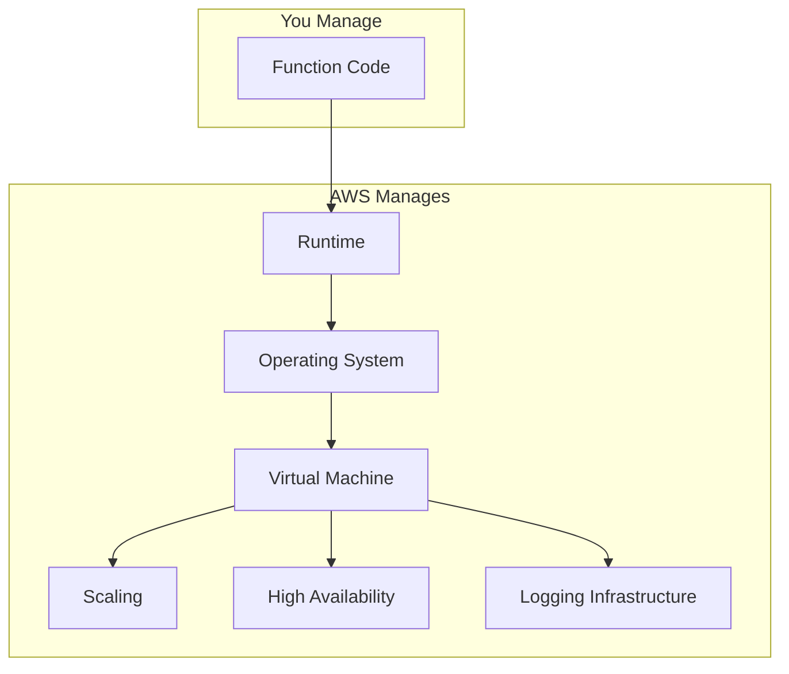

### Benefits of Serverless

1. **No server management** — no SSH, patching, or capacity planning
2. **Automatic scaling** — 1 request or 10,000 requests handled automatically
3. **Pay per use** — no cost when idle
4. **High availability** — multi-AZ by default
5. **Fast deployment** — minutes, not days
6. **200+ AWS integrations** — native event sources and targets

---

## Lambda Architecture

### High-Level Architecture

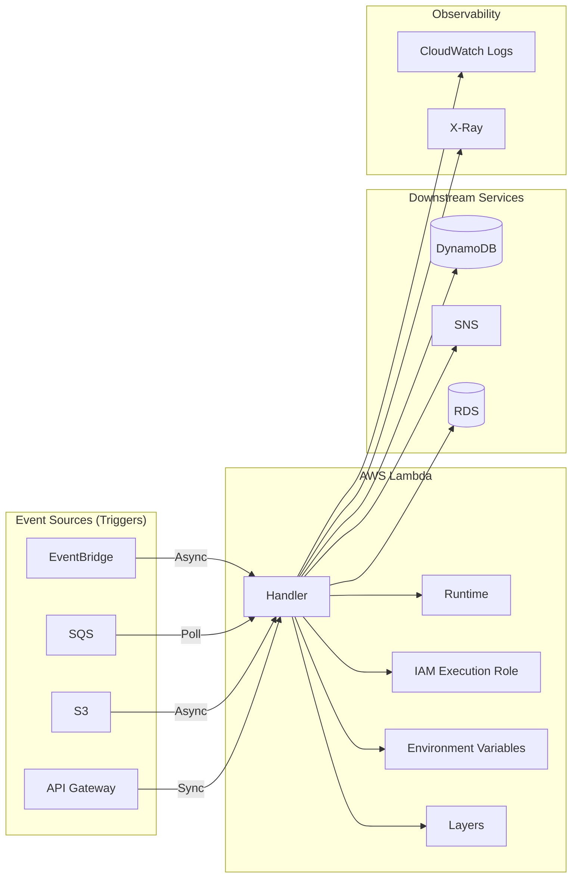

### Internal Architecture (Execution Stack)

```
┌─────────────────────────────────────────┐
│           Your Code (Handler)           │  ← You write this
├─────────────────────────────────────────┤
│         Lambda Runtime (e.g. Python)    │  ← AWS provides
├─────────────────────────────────────────┤
│              Sandbox (Isolation)        │  ← AWS manages
├─────────────────────────────────────────┤
│     MicroVM (Firecracker) │  Host OS    │  ← AWS manages
├─────────────────────────────────────────┤
│                  Hardware               │  ← AWS manages
└─────────────────────────────────────────┘
```

Each function runs in its own **isolated sandbox**. One AWS account can run thousands of functions; AWS shares hardware efficiently across customers.

### Key Components

| Component | Role |
|-----------|------|
| **Event source** | Triggers Lambda (S3, API GW, SQS, etc.) |
| **Handler** | Entry point function AWS invokes |
| **Runtime** | Language environment (Python 3.12, Node.js 20, etc.) |
| **Execution role** | IAM role — outbound permissions to AWS services |
| **Environment variables** | Non-sensitive configuration (4 KB max) |
| **Layers** | Shared libraries mounted at `/opt` |
| **CloudWatch Logs** | Automatic logging of stdout/stderr |

### Execution Lifecycle

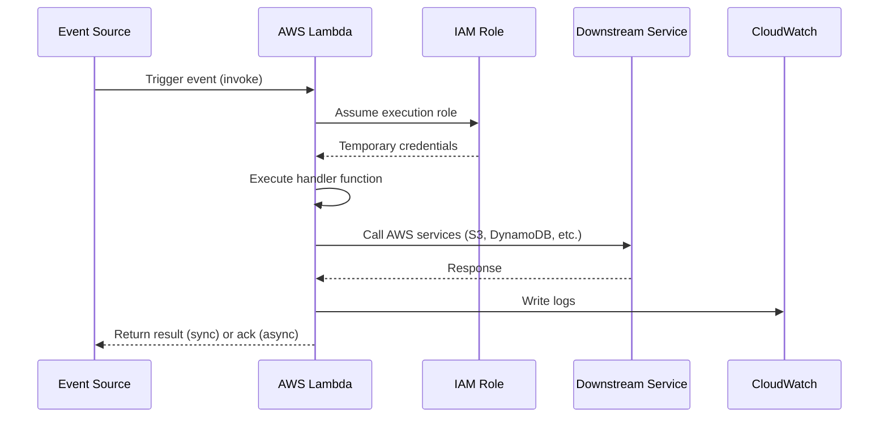

### Runtime Phases

```
INIT (cold start)  →  INVOKE (handler runs)  →  SHUTDOWN (after idle ~10–15 min)
```

| Phase | What Happens |
|-------|-------------|
| **INIT** | Create environment, download code/layers, start runtime |
| **INVOKE** | Run your handler with the event payload |
| **SHUTDOWN** | Environment recycled after idle timeout |

### Service Limits (Must Know)

| Limit | Value |
|-------|-------|
| Max timeout | **900 sec (15 min)** |
| Memory | **128 MB – 10,240 MB** |
| Env variables total | **4 KB** |
| Deployment package (zip) | 50 MB zipped / 250 MB unzipped |
| Container image | Up to **10 GB** |
| Layers per function | **5** |
| Concurrent executions (default) | **1,000/region** (soft limit) |
| `/tmp` storage | 512 MB – 10,240 MB |

---

## Runtime

The **runtime** is the language environment that runs your function code. AWS provides and manages it — you choose which one to use at deploy time.

### Supported Runtimes (Popular)

| Runtime | Identifier | Notes |
|---------|-----------|-------|
| Python 3.12 | `python3.12` | Recommended for new Python projects |
| Python 3.11 | `python3.11` | Active |
| Node.js 20.x | `nodejs20.x` | Fast cold starts, popular for APIs |
| Node.js 18.x | `nodejs18.x` | Active |
| Java 21 | `java21` | Use SnapStart to reduce cold starts |
| Java 17 | `java17` | Active |
| Go | `provided.al2023` | Compiled, very fast cold starts |
| .NET 8 | `dotnet8` | Active |
| Ruby 3.3 | `ruby3.3` | Active |

> Check the [AWS Lambda runtimes documentation](https://docs.aws.amazon.com/lambda/latest/dg/lambda-runtimes.html) for the latest supported versions and deprecation dates.

### What the Runtime Provides

- Language interpreter or runtime engine
- Standard library
- AWS SDK (boto3 for Python is included)
- Runtime interface for handler invocation
- Lifecycle management (init, invoke, shutdown)

### Architecture Options

| Architecture | Identifier | Benefit |
|-------------|-----------|---------|
| x86_64 | `x86_64` | Default, broad compatibility |
| arm64 (Graviton2) | `arm64` | ~20% lower cost, good performance |

```bash
# Create function with arm64 (Graviton)
aws lambda create-function \
  --function-name my-function \
  --runtime python3.12 \
  --architectures arm64 \
  --handler lambda_function.lambda_handler \
  --role arn:aws:iam::123456789012:role/lambda-execution-role \
  --zip-file fileb://function.zip
```

### Custom Runtimes

- **Container images** — package up to 10 GB (any runtime, any dependencies)
- **Custom runtime** — use the [Lambda Runtime API](https://docs.aws.amazon.com/lambda/latest/dg/runtimes-custom.html) to bring your own language runtime

---

## Handler

The **handler** is the entry point AWS calls when your function is invoked.

### Handler Format

```
<file_name>.<function_name>
```

**Example:** File `lambda_function.py` with function `lambda_handler`:

```
Handler: lambda_function.lambda_handler
```

### Python Handler Example

```python
import json

def lambda_handler(event, context):
    """
    event   → Input data from the trigger (dict)
    context → Runtime metadata (request ID, memory, remaining time)
    """
    name = event.get('name', 'World')

    return {
        'statusCode': 200,
        'body': json.dumps(f'Hello, {name}!')
    }
```

### Understanding `event` and `context`

**`event`** — Input payload. Structure depends on the trigger:

```python
# API Gateway trigger
event = {
    "httpMethod": "GET",
    "path": "/users",
    "queryStringParameters": {"id": "123"},
    "body": None
}

# S3 trigger
event = {
    "Records": [{
        "s3": {
            "bucket": {"name": "my-bucket"},
            "object": {"key": "photos/image.jpg"}
        }
    }]
}
```

**`context`** — Runtime metadata:

```python
def lambda_handler(event, context):
    print(f"Request ID: {context.aws_request_id}")
    print(f"Function name: {context.function_name}")
    print(f"Memory limit: {context.memory_limit_in_mb} MB")
    print(f"Time remaining: {context.get_remaining_time_in_millis()} ms")
    return {"statusCode": 200}
```

### Return Value by Trigger Type

| Trigger | Return Format |
|---------|--------------|
| API Gateway | `{"statusCode": 200, "body": "...", "headers": {...}}` |
| S3 / Async | Return value ignored — write output to S3, SNS, etc. |
| Synchronous invoke | Any JSON-serializable object |

---

## Memory

Memory controls **RAM allocation** and **proportionally affects CPU power**.

### Configuration

| Setting | Value |
|---------|-------|
| Minimum | 128 MB |
| Maximum | 10,240 MB (10 GB) |
| Increment | 1 MB |

### Memory vs CPU Relationship

```
128 MB    →  Minimal CPU
512 MB    →  Moderate CPU
1,024 MB  →  ~1 full vCPU equivalent
1,769 MB  →  1 full vCPU (official threshold)
3,008 MB  →  ~2 vCPUs
10,240 MB →  Maximum CPU
```

> More memory = more CPU = potentially faster execution. Sometimes **more memory is cheaper** because the function finishes faster.

### Right-Sizing Memory

| Memory | Duration | Cost per 1M invocations (example) |
|--------|----------|----------------------------------|
| 128 MB | 200 ms | $0.33 |
| 512 MB | 80 ms | $0.27 ← Better! |
| 1024 MB | 50 ms | $0.42 |

**Process:** Start at 128 MB → load test at 256, 512, 1024 MB → pick the sweet spot where duration × cost is lowest.

### Ephemeral Storage (`/tmp`)

| Setting | Value |
|---------|-------|
| Default | 512 MB |
| Maximum | 10,240 MB |
| Persistence | Same warm environment only — cleared on recycle |

```bash
aws lambda update-function-configuration \
  --function-name my-function \
  --memory-size 1024 \
  --ephemeral-storage Size=2048
```

```python
def lambda_handler(event, context):
    with open('/tmp/output.csv', 'w') as f:
        f.write('processed data')
    return {"statusCode": 200}
```

---

## Timeout

The **timeout** is the maximum time your function can run before AWS forcibly stops it.

### Configuration

| Setting | Value |
|---------|-------|
| Default | 3 seconds |
| Minimum | 1 second |
| Maximum | **900 seconds (15 minutes)** |

### Why Timeout Matters

```
Without proper timeout:
  Bug causes infinite loop → Lambda runs 15 min → You pay for 15 min × memory

With proper timeout:
  Bug causes infinite loop → Lambda stops at 30 sec → You pay for 30 sec
```

### Graceful Exit Pattern

```python
def lambda_handler(event, context):
    remaining = context.get_remaining_time_in_millis()

    if remaining < 5000:  # Less than 5 seconds left
        save_checkpoint(event)
        return {"statusCode": 202, "body": "Processing continues..."}

    result = process_data(event)
    return {"statusCode": 200, "body": result}
```

```bash
aws lambda update-function-configuration \
  --function-name my-function \
  --timeout 30
```

### Timeout Decision Guide

| Workload | Memory | Timeout |
|----------|--------|---------|
| Simple API call | 256–512 MB | 10–30 sec |
| Image processing | 1024–3008 MB | 60–300 sec |
| ETL job | 3008+ MB | up to 900 sec |
| Long workflows (> 15 min) | — | Use **Step Functions** |

---

## Environment Variables

**Environment variables** are key-value pairs attached to your function for configuration without code changes.

### Limits and Rules

| Rule | Value |
|------|-------|
| Max total size | 4 KB (all variables combined) |
| Key pattern | `[a-zA-Z]([a-zA-Z0-9_])+` |
| Reserved keys | `AWS_*`, `LAMBDA_*`, `_HANDLER` (set by Lambda) |
| Encryption | Optional — encrypt with AWS KMS |

### AWS CLI

```bash
aws lambda update-function-configuration \
  --function-name my-function \
  --environment "Variables={DB_TABLE=Users,ENV=production,LOG_LEVEL=INFO}"
```

### Python Usage

```python
import os
import boto3

def lambda_handler(event, context):
    table_name = os.environ['DB_TABLE']
    env = os.environ.get('ENV', 'development')

    dynamodb = boto3.resource('dynamodb')
    table = dynamodb.Table(table_name)
    # ...
```

### Environment Variables vs Secrets

| | Environment Variables | Secrets Manager / Parameter Store |
|--|----------------------|----------------------------------|
| **Best for** | Non-sensitive config | Passwords, API keys, tokens |
| **Rotation** | Manual | Automatic (Secrets Manager) |
| **Cost** | Free | Secrets Manager has a fee |
| **Size limit** | 4 KB total | Much larger |

```python
# ❌ Bad — secret in env var or code
API_KEY = "sk-abc123secret"

# ✅ Good — sensitive values from Secrets Manager
import boto3
client = boto3.client('secretsmanager')
secret = client.get_secret_value(SecretId='prod/api-key')
api_key = secret['SecretString']
```

### Dev vs Prod Pattern

Use separate functions, aliases, or AWS accounts per environment — not the same env vars on one function.

---

## IAM Roles

Every Lambda function needs an **execution role** — an IAM role Lambda assumes at runtime for **outbound permissions**.

### Security Model Overview

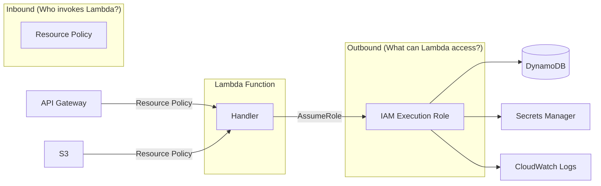

### Trust Policy vs Permission Policy

| Policy Type | Question | Example |
|-------------|----------|---------|
| **Trust policy** | Who can assume this role? | `lambda.amazonaws.com` |
| **Permission policy** | What can the role do? | `dynamodb:PutItem`, `s3:GetObject` |

**Trust policy (required):**

```json
{
  "Version": "2012-10-17",
  "Statement": [{
    "Effect": "Allow",
    "Principal": { "Service": "lambda.amazonaws.com" },
    "Action": "sts:AssumeRole"
  }]
}
```

**Least-privilege permission policy:**

```json
{
  "Version": "2012-10-17",
  "Statement": [
    {
      "Effect": "Allow",
      "Action": ["dynamodb:GetItem", "dynamodb:PutItem", "dynamodb:Query"],
      "Resource": "arn:aws:dynamodb:us-east-1:123456789012:table/Orders"
    },
    {
      "Effect": "Allow",
      "Action": ["secretsmanager:GetSecretValue"],
      "Resource": "arn:aws:secretsmanager:us-east-1:123456789012:secret:prod/db-*"
    },
    {
      "Effect": "Allow",
      "Action": ["logs:CreateLogGroup", "logs:CreateLogStream", "logs:PutLogEvents"],
      "Resource": "arn:aws:logs:us-east-1:123456789012:log-group:/aws/lambda/order-api:*"
    }
  ]
}
```

### AWS CLI — Create and Attach Role

```bash
# Create role
aws iam create-role \
  --role-name order-api-lambda-role \
  --assume-role-policy-document file://trust-policy.json

# Attach custom policy
aws iam put-role-policy \
  --role-name order-api-lambda-role \
  --policy-name order-api-permissions \
  --policy-document file://permissions.json

# Assign to Lambda
aws lambda update-function-configuration \
  --function-name order-api \
  --role arn:aws:iam::123456789012:role/order-api-lambda-role
```

### Common Managed Policies

| Policy | Purpose |
|--------|---------|
| `AWSLambdaBasicExecutionRole` | Write to CloudWatch Logs |
| `AWSLambdaVPCAccessExecutionRole` | Create ENI for VPC Lambda |
| `AWSXRayDaemonWriteAccess` | Send traces to X-Ray |

### IAM Best Practices

| Do | Don't |
|----|-------|
| One role per function or domain | Share `AdministratorAccess` across all Lambdas |
| Grant least privilege per resource ARN | Use `"Resource": "*"` unless required |
| Use managed policies for common patterns | Embed long-lived access keys in env vars |

---

## Versions

Every time you **publish** code or configuration, AWS creates an immutable **version**.

### Key Rules

| Rule | Detail |
|------|--------|
| **`$LATEST`** | Mutable working copy — **never for production** |
| **Published version** | Immutable snapshot (`1`, `2`, `3`, …) |
| **Immutable** | Published versions cannot be changed |

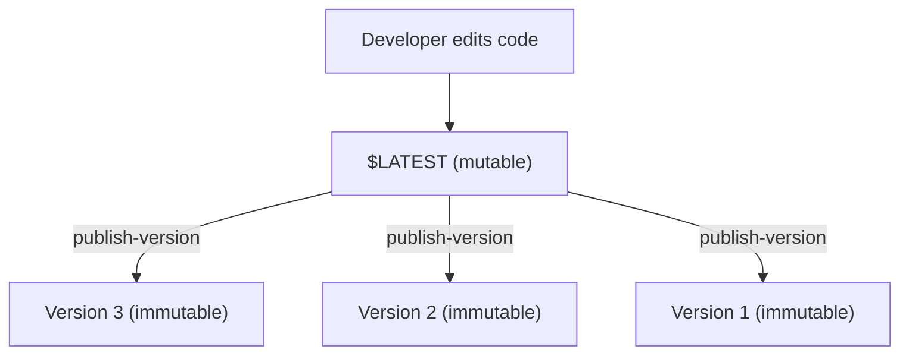

### AWS CLI

```bash
# Update code on $LATEST
aws lambda update-function-code \
  --function-name order-processor \
  --zip-file fileb://order-processor-v2.zip

aws lambda wait function-updated --function-name order-processor

# Publish immutable version
aws lambda publish-version \
  --function-name order-processor \
  --description "Fix duplicate charge bug - git abc123"
```

**Production rule:** Triggers and API Gateway integrations should point to an **alias**, not `$LATEST`.

---

## Aliases

An **alias** is a stable pointer (`prod`, `staging`) to a specific version.

### Why Aliases Matter

```
Without alias:  API Gateway → order-processor:5   (update API on every deploy)
With alias:     API Gateway → order-processor:prod  (alias points to v5, then v6)
```

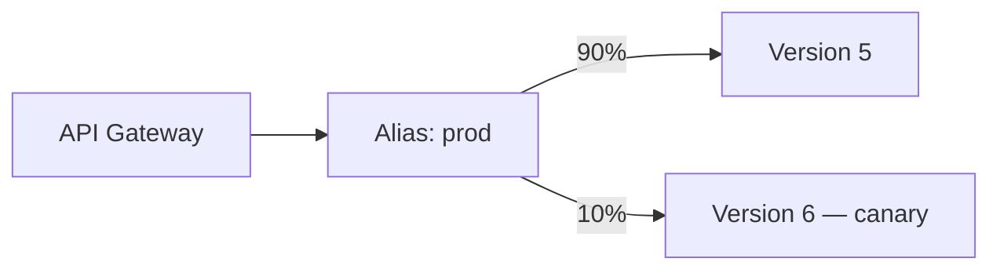

### Canary Deployment

```bash
# Route 90% to v5, 10% to v6
aws lambda update-alias \
  --function-name order-processor \
  --name prod \
  --function-version 5 \
  --routing-config AdditionalVersionWeights={"6"=0.1}

# Shift 100% to new version after monitoring
aws lambda update-alias \
  --function-name order-processor \
  --name prod \
  --function-version 6

# Rollback
aws lambda update-alias \
  --function-name order-processor \
  --name prod \
  --function-version 5
```

### Common Alias Setup

| Alias | Points To | Used By |
|-------|-----------|---------|
| `dev` | `$LATEST` or Version N | Developers |
| `staging` | Published version | QA, integration tests |
| `prod` | Published version | API Gateway, production triggers |

**CodeDeploy** can automate canary/linear deployments with CloudWatch alarm-based rollback.

---

## Layers

A **Lambda Layer** is a ZIP archive of libraries or shared code mounted at `/opt`.

### Architecture

```
┌─────────────────────────────────────────────┐
│              Lambda Function                │
│  ┌─────────────────────────────────────┐   │
│  │  Your handler code (small ZIP)       │   │
│  └─────────────────────────────────────┘   │
│  ┌──────────────┐ ┌──────────────┐         │
│  │  Layer 2     │ │  Layer 1     │         │
│  │  pandas      │ │  company-utils│        │
│  └──────────────┘ └──────────────┘         │
└─────────────────────────────────────────────┘
         Mounted at /opt in execution environment
```

### Layer Limits

| Limit | Value |
|-------|-------|
| Layers per function | 5 |
| Unzipped layer size | 250 MB |
| Total unzipped (function + layers) | 250 MB (zip) / 10 GB (container) |

### Python Layer Directory Structure

```
python/
└── lib/
    └── python3.12/
        └── site-packages/
            ├── pandas/
            └── requests/
```

### AWS CLI — Build and Attach Layer

```bash
# Build layer
mkdir -p layer/python/lib/python3.12/site-packages
pip install requests pydantic -t layer/python/lib/python3.12/site-packages/
cd layer && zip -r ../company-utils-layer.zip .

# Publish layer
aws lambda publish-layer-version \
  --layer-name company-utils \
  --zip-file fileb://company-utils-layer.zip \
  --compatible-runtimes python3.12

# Attach to function
aws lambda update-function-configuration \
  --function-name order-api \
  --layers arn:aws:lambda:us-east-1:123456789012:layer:company-utils:3
```

### When to Use Layers

| Use Layer | Don't Use Layer |
|-----------|-----------------|
| Large dependencies (pandas, Pillow) | Tiny functions with no shared deps |
| Shared internal libraries | Single one-off function |
| Separate security patching of deps | When using container images anyway |

---

## Triggers

Lambda is **event-driven**. Event sources (triggers) invoke your function in three patterns: **synchronous**, **asynchronous**, and **poll-based**.

### Invocation Types Overview

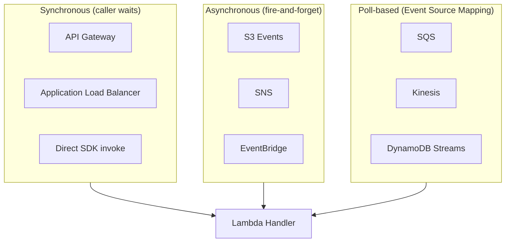

### Integration Summary

| Service | Direction | Invocation | Batch? | Retry on Failure |
|---------|-----------|------------|--------|-----------------|
| **API Gateway** | Trigger | Sync | No | Client handles |
| **S3** | Trigger | Async | No | 2 retries → discard/DLQ |
| **SQS** | Trigger | Poll | Yes (up to 10) | Visibility timeout → DLQ |
| **SNS** | Trigger | Async | No | 3 retries → discard |
| **EventBridge** | Trigger | Async | No | 24h retry → DLQ |
| **DynamoDB Streams** | Trigger | Poll | Yes | Retry until data expires |
| **Kinesis** | Trigger | Poll | Yes | Bisect batch on error |
| **RDS / Aurora** | Target | Lambda calls DB | N/A | App-level retry |

### Decision Guide

```
HTTP API?           → API Gateway + Lambda (sync)
File upload?        → S3 + Lambda (async)
Buffer/decouple?    → SQS + Lambda (poll)
Notify many?        → SNS fan-out + Lambda
Event routing?      → EventBridge + Lambda
DB change react?    → DynamoDB Streams + Lambda
Real-time stream?   → Kinesis + Lambda
Relational data?    → Lambda (VPC) + RDS Proxy + RDS
```

### API Gateway (Sync) — Example Flow

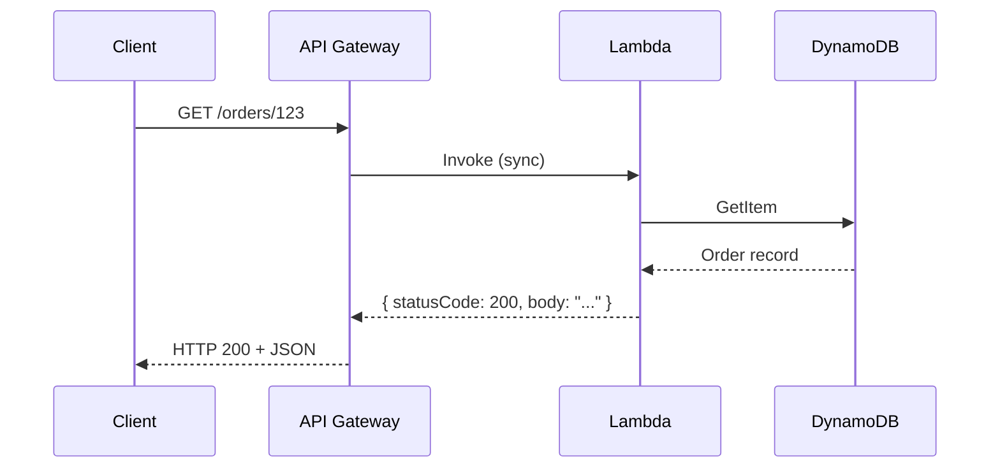

```python
# Lambda response for API Gateway
return {
    "statusCode": 200,
    "headers": {"Content-Type": "application/json"},
    "body": json.dumps({"order_id": "123", "status": "shipped"})
}
```

### SQS Event Source Mapping (CLI)

```bash
aws lambda create-event-source-mapping \
  --function-name order-processor \
  --event-source-arn arn:aws:sqs:us-east-1:123456789012:order-queue \
  --batch-size 10 \
  --maximum-batching-window-in-seconds 5
```

### EventBridge Schedule (Cron)

```bash
aws events put-rule \
  --name daily-report \
  --schedule-expression "cron(0 8 * * ? *)"

aws events put-targets \
  --rule daily-report \
  --targets "Id"="1","Arn"="arn:aws:lambda:us-east-1:123456789012:function:report-generator"
```

---

## Destinations

**Lambda destinations** route the **result** of asynchronous invocations to other AWS services — on **success** or **failure**.

Destinations replace or complement traditional **Dead Letter Queues (DLQ)** for async invokes.

### Architecture

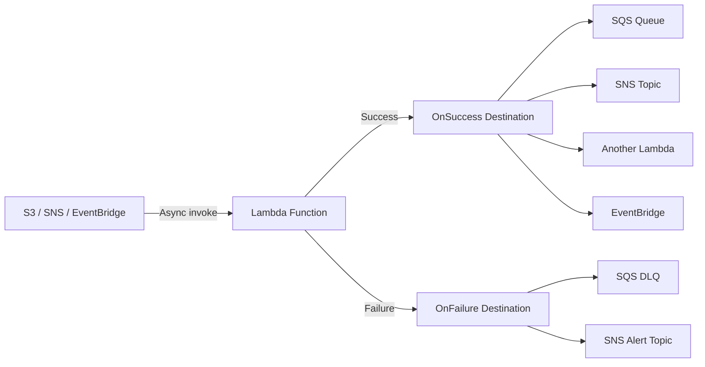

### Supported Destination Targets

| Target | OnSuccess | OnFailure |
|--------|-----------|-----------|
| SQS | ✅ | ✅ |
| SNS | ✅ | ✅ |
| Lambda | ✅ | ✅ |
| EventBridge | ✅ | ✅ |

### Destinations vs DLQ

| Feature | DLQ | Destinations |
|---------|-----|-------------|
| Failed events only | ✅ | OnFailure only |
| Success routing | ❌ | ✅ OnSuccess |
| Payload | Original event | Invocation record with status + response/error |
| Async invokes | ✅ | ✅ |

### AWS CLI — Configure Destinations

```bash
aws lambda put-function-event-invoke-config \
  --function-name image-processor \
  --destination-config '{
    "OnSuccess": {
      "Destination": "arn:aws:sqs:us-east-1:123456789012:processing-success-queue"
    },
    "OnFailure": {
      "Destination": "arn:aws:sqs:us-east-1:123456789012:processing-dlq"
    }
  }'
```

### Terraform Example

```hcl
resource "aws_lambda_function_event_invoke_config" "image_processor" {
  function_name = aws_lambda_function.image_processor.function_name

  destination_config {
    on_success {
      destination = aws_sqs_queue.success_queue.arn
    }
    on_failure {
      destination = aws_sqs_queue.dlq.arn
    }
  }
}
```

---

## Concurrency

**Concurrency** is the number of Lambda instances processing events **at the same time** in a region.

### Concurrency Model

```
Each concurrent execution = 1 dedicated instance handling 1 request at a time

100 simultaneous API requests → up to 100 concurrent executions
```

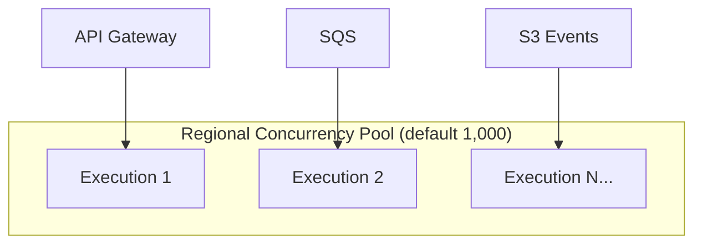

### Concurrency Controls

| Type | Purpose | Cost |
|------|---------|------|
| **Default (unreserved)** | Auto-scale on demand | Standard invoke pricing |
| **Reserved concurrency** | Cap AND guarantee capacity per function | Standard invoke pricing |
| **Provisioned concurrency** | Pre-warm environments — eliminate cold starts | Hourly PC charge + invokes |

| Setting | Reserved = 0 | Reserved = 100 | Provisioned = 20 |
|---------|-------------|----------------|------------------|
| Effect | Function disabled | Max 100, guaranteed 100 | 20 warm instances always ready |
| Cold starts | Yes (on demand) | Yes (on demand) | No (for PC capacity) |

### Throttling Behavior

| Invocation Type | When Limit Exceeded |
|----------------|---------------------|
| **Synchronous** (API Gateway) | `429 TooManyRequestsException` |
| **Asynchronous** (S3, SNS) | Retries with backoff (up to 6 hours) |
| **SQS trigger** | Messages stay in queue until capacity frees |
| **Streams** (Kinesis, DynamoDB) | Iterator age increases (processing lag) |

### AWS CLI

```bash
# Reserved concurrency — guarantee 100 slots for payment-api
aws lambda put-function-concurrency \
  --function-name payment-api \
  --reserved-concurrent-executions 100

# Provisioned concurrency — 20 warm instances on prod alias
aws lambda put-provisioned-concurrency-config \
  --function-name auth-api \
  --qualifier prod \
  --provisioned-concurrent-executions 20

# Emergency disable — set reserved to 0
aws lambda put-function-concurrency \
  --function-name legacy-import \
  --reserved-concurrent-executions 0
```

### Cold Starts (Related to Concurrency)

| Runtime | Typical Cold Start |
|---------|-------------------|
| Python / Node.js | 100–400 ms |
| Go | 50–200 ms |
| Java | 1–3+ seconds (use SnapStart) |
| VPC Lambda | +1–10 sec (ENI creation) |

**Mitigation:** Smaller package → Layers → Lazy imports → More memory → arm64 → Provisioned Concurrency → Avoid VPC unless required

---

## Monitoring

Lambda integrates with **Amazon CloudWatch** and **AWS X-Ray** for observability.

### Observability Stack

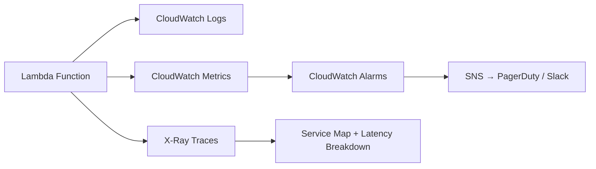

### Built-in CloudWatch Metrics

| Metric | Description | Alarm? |
|--------|-------------|--------|
| **Invocations** | Total invocation count | Info |
| **Errors** | Failed invocations | ✅ Critical |
| **Throttles** | Throttled invocations | ✅ Critical |
| **Duration** | Execution time (p50, p99) | ✅ SLA |
| **ConcurrentExecutions** | Active concurrent instances | ⚠️ Capacity |
| **IteratorAge** | Stream processing lag | ✅ Stream lag |
| **DeadLetterErrors** | Failed DLQ deliveries | ✅ Critical |

### AWS CLI — Query Metrics

```bash
aws cloudwatch get-metric-statistics \
  --namespace AWS/Lambda \
  --metric-name Errors \
  --dimensions Name=FunctionName,Value=order-api \
  --start-time 2026-06-20T00:00:00Z \
  --end-time 2026-06-20T23:59:59Z \
  --period 300 \
  --statistics Sum
```

### X-Ray Tracing

```bash
aws lambda update-function-configuration \
  --function-name order-api \
  --tracing-config Mode=Active
```

X-Ray shows:

- End-to-end latency across services
- Cold starts (INIT segment)
- Custom subsegments for business logic bottlenecks

### Recommended Alarms

```
Errors > 0 for 3 min          → Critical → Page on-call
Throttles > 0                 → Critical
Duration p99 > 3000 ms        → Warning
IteratorAge > 60000 ms        → Warning (stream lag)
```

**Production tip:** Alarm on the **alias** (`payment-api:prod`), not `$LATEST`. Tie alarms to **CodeDeploy rollback** during canary deployments.

---

## Logging

Lambda automatically sends **stdout**, **stderr**, and runtime logs to **Amazon CloudWatch Logs**.

### Log Group

- Auto-created: `/aws/lambda/<function-name>`
- Requires `AWSLambdaBasicExecutionRole` on the execution role

### AWS CLI — Tail Logs

```bash
# Live tail
aws logs tail /aws/lambda/order-api --follow

# Filter errors
aws logs filter-log-events \
  --log-group-name /aws/lambda/order-api \
  --filter-pattern "ERROR"
```

### Structured Logging Best Practice

```python
import json
import logging

logger = logging.getLogger()
logger.setLevel(logging.INFO)

def lambda_handler(event, context):
    logger.info(json.dumps({
        "message": "Processing order",
        "request_id": context.aws_request_id,
        "order_id": event.get("order_id")
    }))
    # ...
```

### Logging Best Practices

| Do | Don't |
|----|-------|
| Use structured JSON logs with `request_id` | Log passwords, tokens, or PII |
| Set log retention (14–90 days) | Leave retention infinite (cost + compliance risk) |
| Use log levels (`INFO`, `ERROR`) | Print unstructured debug dumps in prod |
| Correlate with X-Ray trace ID | Log full event payloads with sensitive data |

```bash
# Set retention to 30 days
aws logs put-retention-policy \
  --log-group-name /aws/lambda/order-api \
  --retention-in-days 30
```

---

## Security

Lambda security has three layers: **who can invoke** (inbound), **what the function can access** (outbound), and **how data is protected** (encryption + secrets).

### Security Architecture

```
INBOUND  → Resource Policy (who can invoke Lambda?)
OUTBOUND → Execution Role (what can Lambda access?)
SECRETS  → Secrets Manager / Parameter Store SecureString
ENCRYPT  → KMS (env vars, logs, secrets)
```

### Resource Policies (Inbound)

Attached **to the function** — controls who can invoke it (S3, SNS, API Gateway, cross-account).

```json
{
  "Version": "2012-10-17",
  "Statement": [{
    "Effect": "Allow",
    "Principal": { "Service": "s3.amazonaws.com" },
    "Action": "lambda:InvokeFunction",
    "Resource": "arn:aws:lambda:us-east-1:123456789012:function:image-processor",
    "Condition": {
      "StringEquals": { "AWS:SourceAccount": "123456789012" },
      "ArnLike": { "AWS:SourceArn": "arn:aws:s3:::my-uploads" }
    }
  }]
}
```

### KMS Encryption

- Encrypt environment variables: set `KMSKeyArn` on the function
- Encrypt log groups: `aws logs associate-kms-key`
- Lambda execution role needs `kms:Decrypt`

### Secrets Manager vs Parameter Store

| | Secrets Manager | Parameter Store |
|--|----------------|-----------------|
| Best for | Rotating credentials | Hierarchical config |
| Rotation | Automatic | Manual |
| Cost | Per secret/month | Free (Standard tier) |
| Example | DB password | `/app/prod/table-name` |

### Security Checklist

```
✓ Least-privilege IAM execution role (no admin)
✓ Resource policy with SourceArn / SourceAccount conditions
✓ Secrets in Secrets Manager (not env vars)
✓ KMS for env vars + logs (compliance)
✓ VPC only when accessing private resources
✓ Enable AWS Lambda code signing (optional, high security)
✓ No secrets in Git or logs
```

---

## Networking

By default, Lambda runs in an **AWS-managed VPC** with internet access. Attach your function to a **customer VPC** only when it must reach private resources (RDS, ElastiCache, internal APIs).

### Default vs VPC Lambda

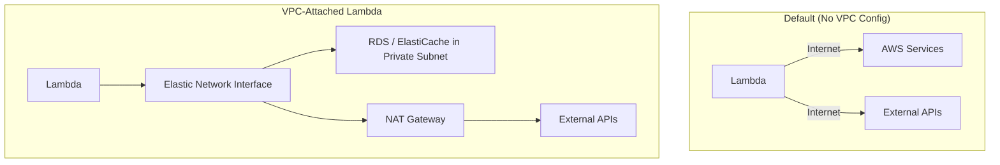

### VPC Considerations

| Topic | Detail |
|-------|--------|
| **Cold start penalty** | ENI creation adds 1–10+ seconds |
| **Subnets** | Use private subnets; NAT Gateway for outbound internet |
| **Security groups** | Control inbound/outbound traffic for the ENI |
| **IAM policy** | Attach `AWSLambdaVPCAccessExecutionRole` |
| **RDS connections** | Use **RDS Proxy** to pool connections at scale |
| **Hyperplane ENIs** | Newer ENI model reduces (but doesn't eliminate) VPC cold start penalty |

### AWS CLI — VPC Configuration

```bash
aws lambda update-function-configuration \
  --function-name order-api \
  --vpc-config SubnetIds=subnet-abc123,subnet-def456,SecurityGroupIds=sg-789012
```

### Terraform — VPC Lambda

```hcl
resource "aws_lambda_function" "order_api" {
  function_name = "order-api"
  # ... other config ...

  vpc_config {
    subnet_ids         = var.private_subnet_ids
    security_group_ids = [aws_security_group.lambda.id]
  }
}
```

### Networking Decision Guide

```
Need to access public AWS services only?     → No VPC (faster cold starts)
Need RDS in private subnet?                → VPC + RDS Proxy
Need ElastiCache in VPC?                   → VPC
Need outbound internet from VPC Lambda?    → NAT Gateway (cost consideration)
```

---

## Deployment Methods

Deploying Lambda means packaging code, configuring runtime/handler/memory/timeout, attaching IAM roles, wiring triggers, and promoting safely across environments.

### Deployment Lifecycle

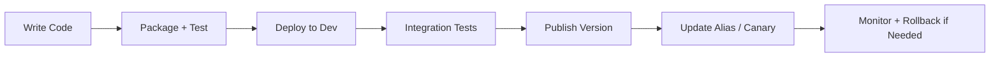

### Methods Comparison

| Method | Type | Best For | Underlying Engine |
|--------|------|----------|-------------------|
| **AWS Console** | Manual UI | Learning only | Direct API |
| **AWS CLI** | Script | CI scripts, quick updates | Direct API |
| **SAM** | AWS IaC | Serverless-first apps | CloudFormation |
| **CDK** | Code → CFN | Python/TypeScript teams | CloudFormation |
| **Terraform** | HCL IaC | Multi-cloud shops | Terraform + AWS API |
| **CloudFormation** | AWS IaC | Full control | CloudFormation |
| **Serverless Framework** | Third-party | Fast prototyping | CloudFormation |

### AWS CLI — Full Deploy Script

```bash
#!/bin/bash
set -euo pipefail

FUNCTION_NAME="hello-api"
ROLE_ARN="arn:aws:iam::123456789012:role/lambda-basic-execution"
RUNTIME="python3.12"
HANDLER="lambda_function.lambda_handler"

# Package
rm -rf package function.zip
pip install -r requirements.txt -t package/ --quiet
cp lambda_function.py package/
cd package && zip -r ../function.zip . && cd ..

# Create or update
if aws lambda get-function --function-name "$FUNCTION_NAME" 2>/dev/null; then
  aws lambda update-function-code \
    --function-name "$FUNCTION_NAME" \
    --zip-file fileb://function.zip
  aws lambda wait function-updated --function-name "$FUNCTION_NAME"
else
  aws lambda create-function \
    --function-name "$FUNCTION_NAME" \
    --runtime "$RUNTIME" \
    --handler "$HANDLER" \
    --role "$ROLE_ARN" \
    --zip-file fileb://function.zip \
    --architectures arm64 \
    --timeout 30 \
    --memory-size 256
fi

# Publish and update alias
VERSION=$(aws lambda publish-version --function-name "$FUNCTION_NAME" --query Version --output text)
aws lambda update-alias --function-name "$FUNCTION_NAME" --name prod --function-version "$VERSION" 2>/dev/null || \
  aws lambda create-alias --function-name "$FUNCTION_NAME" --name prod --function-version "$VERSION"
```

### Terraform — Complete Example

```hcl
terraform {
  required_version = ">= 1.5"
  required_providers {
    aws = {
      source  = "hashicorp/aws"
      version = "~> 5.0"
    }
    archive = {
      source  = "hashicorp/archive"
      version = "~> 2.4"
    }
  }
}

provider "aws" {
  region = var.aws_region
}

data "archive_file" "lambda_zip" {
  type        = "zip"
  source_dir  = "${path.module}/src"
  output_path = "${path.module}/build/function.zip"
}

resource "aws_iam_role" "lambda_role" {
  name = "order-api-lambda-role"
  assume_role_policy = jsonencode({
    Version = "2012-10-17"
    Statement = [{
      Action    = "sts:AssumeRole"
      Effect    = "Allow"
      Principal = { Service = "lambda.amazonaws.com" }
    }]
  })
}

resource "aws_iam_role_policy_attachment" "lambda_basic" {
  role       = aws_iam_role.lambda_role.name
  policy_arn = "arn:aws:iam::aws:policy/service-role/AWSLambdaBasicExecutionRole"
}

resource "aws_lambda_function" "order_api" {
  function_name    = "order-api"
  role             = aws_iam_role.lambda_role.arn
  handler          = "lambda_function.lambda_handler"
  runtime          = "python3.12"
  architectures    = ["arm64"]
  filename         = data.archive_file.lambda_zip.output_path
  source_code_hash = data.archive_file.lambda_zip.output_base64sha256
  timeout          = 30
  memory_size      = 512

  environment {
    variables = {
      TABLE_NAME = aws_dynamodb_table.orders.name
    }
  }

  tracing_config {
    mode = "Active"
  }
}

resource "aws_lambda_alias" "prod" {
  name             = "prod"
  function_name    = aws_lambda_function.order_api.function_name
  function_version = aws_lambda_function.order_api.version
}

resource "aws_lambda_permission" "apigw" {
  statement_id  = "AllowAPIGatewayInvoke"
  action        = "lambda:InvokeFunction"
  function_name = aws_lambda_function.order_api.function_name
  qualifier     = aws_lambda_alias.prod.name
  principal     = "apigateway.amazonaws.com"
  source_arn    = "${aws_apigatewayv2_api.order_api.execution_arn}/*/*"
}
```

```bash
terraform init
terraform plan
terraform apply
```

### Production Deployment Flow

```
1. Write code + unit tests
2. Package (pip install -t, zip, or sam build)
3. Deploy to dev (SAM / CDK / Terraform)
4. Integration tests
5. Publish version
6. Update alias (canary 5% → 100%)
7. Smoke test + monitor alarms
8. Rollback alias on error
```

### CI/CD Essentials

- **OIDC / IAM roles** — no static AWS keys in GitHub Actions
- Separate **environments** (dev / staging / prod)
- **Manual approval** gate for prod
- Deploy to **alias**, not `$LATEST`
- **Canary** with CloudWatch alarm rollback

---

## Best Practices

### Code and Performance

| Practice | Why |
|----------|-----|
| Keep deployment packages small | Faster cold starts, lower cost |
| Use layers for heavy dependencies | Smaller function ZIP, shared caching |
| Lazy-load expensive imports | Reduce INIT phase time |
| Right-size memory with load tests | Balance duration vs cost |
| Use arm64 (Graviton) where possible | ~20% cost savings |
| Make handlers **idempotent** | Required for SQS, streams (at-least-once delivery) |
| Reuse SDK clients at module level | Avoid re-creating clients per invoke |

### Operations and Reliability

| Practice | Why |
|----------|-----|
| Never use `$LATEST` in production | Unpredictable behavior on every code push |
| Use versions + aliases + canary | Safe rollback, zero-downtime deploys |
| Configure DLQ or destinations | Capture failed async events |
| Set reserved concurrency on critical functions | Prevent starvation by noisy neighbors |
| Use Provisioned Concurrency sparingly | Only for latency-critical, steady-traffic APIs |
| Alarm on Errors, Throttles, IteratorAge | Catch issues before users do |
| Set CloudWatch log retention | Control cost and meet compliance |

### Security

| Practice | Why |
|----------|-----|
| Least-privilege IAM per function | Limit blast radius |
| Secrets Manager for credentials | Rotation, audit, no plaintext in env vars |
| Resource policies with SourceArn conditions | Prevent confused deputy attacks |
| VPC only when necessary | Avoid cold start and NAT costs |
| Structured logging without PII | Debuggable and compliant |

### Cost Optimization

```
Cost = (Requests × $0.20/1M) + (GB-seconds × $0.0000166667)
GB-seconds = (Memory GB) × (Duration seconds)
```

- Use SQS to buffer spikes instead of over-provisioning concurrency
- Prefer arm64 architecture
- Right-size memory — sometimes 512 MB is cheaper than 128 MB
- Avoid Provisioned Concurrency unless SLA requires it
- Use Step Functions for long workflows instead of maxing timeout

---

## Common Mistakes

| Mistake | Impact | Fix |
|---------|--------|-----|
| Pointing prod triggers at `$LATEST` | Unstable production | Use aliases pointing to published versions |
| Storing secrets in env vars | Credential exposure | Use Secrets Manager |
| No DLQ or destinations on async functions | Silent data loss | Configure OnFailure destination or DLQ |
| Ignoring idempotency for SQS/streams | Duplicate processing | Idempotent handlers + deduplication keys |
| VPC on every function | Slow cold starts, NAT costs | VPC only for private resource access |
| `AdministratorAccess` on execution role | Over-privileged, audit failures | Least privilege per resource ARN |
| Infinite log retention | Runaway CloudWatch costs | Set 14–90 day retention |
| No timeout tuning (default 3 sec) | Unexpected timeouts in prod | Set timeout = expected duration + buffer |
| Opening DB connection per invoke without proxy | Connection exhaustion | Module-level pool + RDS Proxy |
| Writing S3 output to same trigger prefix | Infinite loop | Separate input/output prefixes |
| Not handling partial batch failures (SQS) | Duplicate or lost messages | Use `ReportBatchItemFailures` |
| Heavy imports at module level | Slow cold starts | Lazy load or use layers |
| No alarms on Throttles | Hidden capacity issues | Alarm + request limit increase |
| Deploying via Console in prod | No reproducibility, no rollback | IaC + CI/CD pipeline |

---

## Real-World Use Cases

### 1. REST API Backend (E-Commerce)

```
Mobile/Web App → API Gateway → Lambda (Python + Boto3) → DynamoDB
```

**Why Lambda:** Auto-scales during flash sales. Near-zero cost when idle. No servers to manage.

### 2. Image Processing Pipeline

```
User upload → S3 → ObjectCreated event → Lambda (resize/watermark) → S3 (processed bucket)
```

**Why Lambda:** Uploads are unpredictable. One event per object. Scales per upload.

### 3. Async Order Fulfillment

```
API Gateway → Lambda (validate order) → DynamoDB
DynamoDB Stream → Lambda (analytics) → OpenSearch
EventBridge → Lambda (scheduled reconciliation)
SQS → Lambda (fulfillment worker) → SNS (notification)
```

**Why Lambda:** Event-driven microservices without managing containers.

### 4. Log Processing and Alerting

```
Application → CloudWatch Logs → Lambda (filter/anonymize) → S3 / Elasticsearch
EventBridge → Lambda (daily report) → SES email
```

**Why Lambda:** Runs only when logs arrive or on schedule.

### 5. Authentication API (Latency-Sensitive)

```
Mobile App → API Gateway → Lambda (auth-api:prod alias)
                              ↳ Provisioned Concurrency: 20
                              ↳ Cognito token validation
                              ↳ DynamoDB session store
```

**Why Lambda + PC:** Sub-200 ms SLA with no cold starts on critical path.

### 6. Data Stream Processing

```
IoT devices → Kinesis → Lambda (per shard) → DynamoDB + S3 data lake
```

**Why Lambda:** Real-time processing at scale. Monitor **IteratorAge** for lag.

### Architecture: Full Production Stack

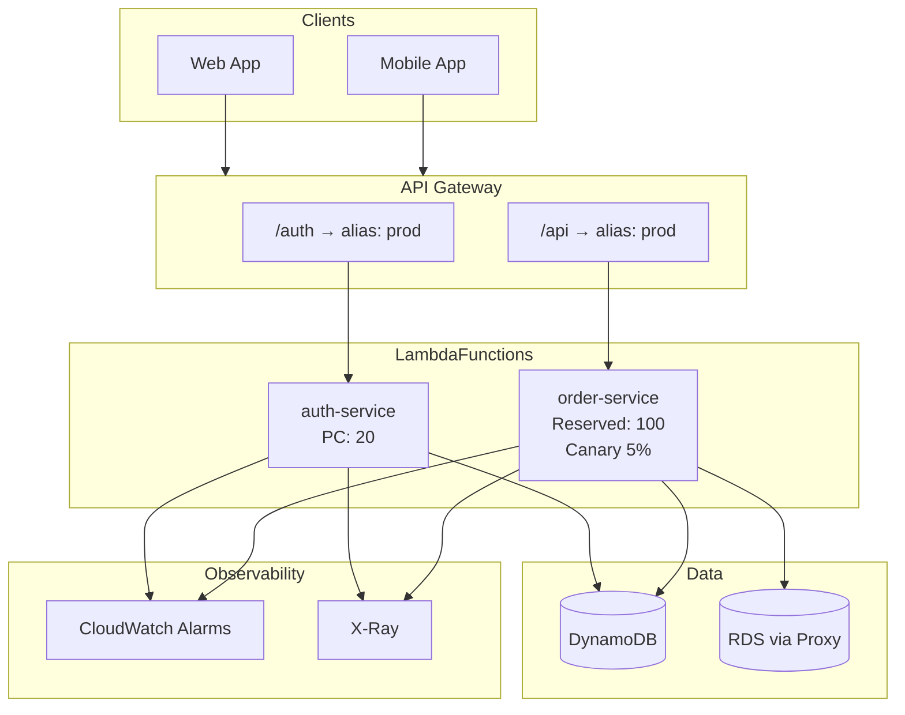

---

## Interview Questions

### Core Concepts

**Q: What is AWS Lambda?**
> Serverless, event-driven compute. Run code without managing servers. Pay per request and duration (GB-seconds).

**Q: What is serverless computing?**
> You don't manage servers — AWS handles provisioning, scaling, patching, and maintenance. You focus on code only.

**Q: Sync vs async invocation?**
> Sync: caller waits (API Gateway). Async: fire-and-forget with retries (S3, SNS, EventBridge).

**Q: Max timeout?**
> 15 minutes (900 sec). Use Step Functions for longer workflows.

**Q: How is Lambda billed?**
> Requests ($0.20/1M) + GB-seconds + Provisioned Concurrency hourly charge if configured. Free tier: 1M requests + 400K GB-sec/month.

**Q: Lambda vs EC2?**
> Lambda: event-driven, variable traffic, short tasks, no ops. EC2: long-running, OS control, steady load, GPU.

### Advanced

**Q: `$LATEST` vs published version?**
> `$LATEST` is mutable. Published versions are immutable. Production uses versions via aliases.

**Q: Reserved vs Provisioned concurrency?**
> Reserved: cap/guarantee capacity. Provisioned: pre-warm environments to eliminate cold starts.

**Q: What causes cold starts?**
> New execution environment — INIT phase loads runtime, code, layers. Mitigate with smaller packages, PC, faster runtimes.

**Q: What persists between invocations?**
> Global variables and `/tmp` in the same warm environment — not across cold starts or different environments.

**Q: Why does VPC increase cold start time?**
> Lambda creates an Elastic Network Interface (ENI) to connect to VPC resources.

### Integrations

**Q: What is an event source mapping?**
> Lambda polls SQS, Kinesis, and DynamoDB Streams and invokes your function with batches.

**Q: SQS vs SNS vs EventBridge?**
> SQS: queue/buffer. SNS: fan-out pub/sub. EventBridge: event bus with routing rules and scheduling.

**Q: Why RDS Proxy with Lambda?**
> Lambda scales to many concurrent instances — each could open a DB connection. Proxy pools connections.

**Q: DynamoDB Streams exactly-once?**
> No — at-least-once. Handlers must be idempotent.

### Security & Monitoring

**Q: Execution role vs resource policy?**
> Role: outbound (Lambda → AWS). Resource policy: inbound (who invokes Lambda).

**Q: Where to store DB passwords?**
> Secrets Manager with rotation — not environment variables.

**Q: Metrics to alarm on?**
> Errors, Throttles, Duration p99, IteratorAge, DeadLetterErrors.

### Deployment

**Q: SAM vs CDK vs Terraform?**
> SAM: serverless YAML → CloudFormation. CDK: code → CloudFormation. Terraform: HCL, multi-cloud.

**Q: CI/CD without AWS access keys?**
> GitHub Actions OIDC → assume IAM role with short-lived credentials.

**Q: Canary deployment?**
> Alias weighted routing (10% new version) + CloudWatch alarms + CodeDeploy auto-rollback.

### System Design

**Q: Design serverless order processing.**
> API Gateway → Lambda (validate) → DynamoDB → Stream → analytics Lambda + EventBridge → SNS (notify) + SQS → fulfillment Lambda.

**Q: 10,000 S3 uploads — how does Lambda scale?**
> One event per object. Lambda scales concurrently up to account limit (1,000 default). Use SQS if you need buffering.

---

## Quick Revision Cheat Sheet

### Lambda at a Glance

| Item | Value |
|------|-------|
| Model | Serverless, event-driven, FaaS |
| Max timeout | **900 sec (15 min)** |
| Memory | **128 MB – 10,240 MB** (more memory = more CPU) |
| Env vars limit | **4 KB** total |
| Package (zip) | 50 MB zipped / 250 MB unzipped |
| Container image | Up to **10 GB** |
| Layers | Max **5** per function |
| Concurrency default | **1,000/region** (soft limit) |
| Free tier | 1M req + 400K GB-sec/month |
| Billing | Requests + GB-seconds + PC hourly |

### Handler (Python)

```python
def lambda_handler(event, context):
    # event = trigger payload | context = request_id, memory, time left
    return {"statusCode": 200, "body": json.dumps({})}  # API GW format
```

**Handler string:** `file.function` → `lambda_function.lambda_handler`

### Invocation Types

| Trigger | Type | Retry |
|---------|------|-------|
| API Gateway | **Sync** | Client handles |
| S3, SNS, EventBridge | **Async** | 2–3 retries → DLQ/Destinations |
| SQS, Kinesis, DDB Streams | **Poll (batch)** | Queue/stream retry → DLQ |

### Integrations — Pick One

| Need | Use |
|------|-----|
| REST API | API Gateway |
| File upload event | S3 |
| Queue / buffer | SQS |
| Fan-out notify | SNS |
| Event routing / cron | EventBridge |
| DB change capture | DynamoDB Streams |
| Real-time stream | Kinesis |
| SQL database | Lambda (VPC) + RDS Proxy |
| Failed async events | Destinations or DLQ |
| Eliminate cold start | Provisioned Concurrency |
| Safe prod deployment | Version + Alias + Canary |

### Advanced Controls

| Feature | Purpose |
|---------|---------|
| **Version** | Immutable snapshot for rollback |
| **Alias** | Stable prod pointer; canary weights |
| **Layer** | Shared deps at `/opt` (max 5) |
| **Reserved concurrency** | Cap/guarantee per function (=0 disables) |
| **Provisioned concurrency** | Pre-warmed — no cold start |
| **Destinations** | Route async success/failure to SQS/SNS/Lambda/EventBridge |

### Security Checklist

```
✓ Least-privilege IAM execution role
✓ Resource policy with SourceArn conditions
✓ Secrets in Secrets Manager (not env vars)
✓ KMS for env vars + logs
✓ VPC only when accessing private resources
✓ No secrets in Git or logs
```

### Monitoring Checklist

```
✓ CloudWatch Logs — JSON + request_id + retention set
✓ Alarm: Errors, Throttles, Duration p99
✓ Alarm: IteratorAge (streams), DeadLetterErrors
✓ X-Ray Active on user-facing functions
✓ Alarm on alias (prod), not $LATEST
```

### Deploy Quick Commands

```bash
aws lambda update-function-code --function-name FN --zip-file fileb://fn.zip
aws lambda publish-version --function-name FN
aws lambda update-alias --function-name FN --name prod --function-version N
sam build && sam deploy --config-env prod
terraform apply
aws logs tail /aws/lambda/FN --follow
```

### Cold Start Fixes

`Smaller package → Layers → Lazy imports → More memory → arm64 → Provisioned Concurrency → Avoid VPC`

### When NOT to Use Lambda

`>15 min runtime · 24/7 steady load · GPU · full OS control · WebSocket long-lived · huge monolith`

### Cost Formula

```
Cost = (Requests × $0.20/1M) + (GB-seconds × $0.0000166667)
GB-seconds = (Memory GB) × (Duration seconds)
```

### Exam Triggers → Services

| Scenario | Answer |
|----------|--------|
| HTTP request-response | API Gateway + Lambda (sync) |
| Decouple microservices | SQS + Lambda |
| One event, many actions | SNS fan-out |
| Schedule daily job | EventBridge cron rule |
| React to DynamoDB insert | DynamoDB Streams |
| High-volume ordered stream | Kinesis |
| Too many DB connections | RDS Proxy |
| Eliminate cold start latency | Provisioned Concurrency |
| Safe prod deployment | Version + Alias + Canary |
| At-least-once stream processing | Idempotent handler + IteratorAge alarm |
| Route failed async invocations | Destinations (OnFailure) or DLQ |

### Certification Focus

| Role / Exam | Priority Topics |
|-------------|-----------------|
| **Developer Associate** | Handler, integrations, deployment, IAM, CloudWatch |
| **Solutions Architect Associate** | When to use Lambda, integrations, limits, cost, security |
| **DevOps Engineer** | Deployment, CI/CD, monitoring, alarms, concurrency |
| **Backend Developer** | All topics + system design + idempotency |

---

## Further Reading

- [AWS Lambda Developer Guide](https://docs.aws.amazon.com/lambda/latest/dg/welcome.html)
- [AWS Lambda Pricing](https://aws.amazon.com/lambda/pricing/)
- [Lambda Runtimes](https://docs.aws.amazon.com/lambda/latest/dg/lambda-runtimes.html)
- [Lambda Quotas](https://docs.aws.amazon.com/lambda/latest/dg/gettingstarted-limits.html)
- [Lambda Destinations](https://docs.aws.amazon.com/lambda/latest/dg/invocation-async.html#invocation-async-destinations)
- [Boto3 Documentation](https://boto3.amazonaws.com/v1/documentation/api/latest/index.html)

---

*AWS Lambda documentation · CloudDevops repository · Suitable for AWS certifications, DevOps, and backend engineering interviews.*
